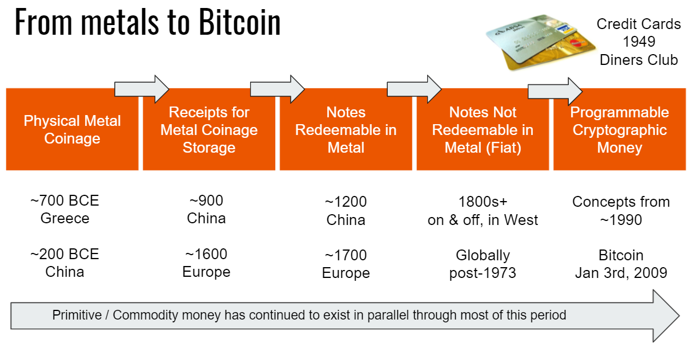

# Die Evolution des Geldes

Am 3. Januar 2009 wurde Bitcoin geboren. Seither hat das Bitcoin Peer-zu-Peer Protokoll etwa alle 10 Minuten einen neuen Datenblock mit Transaktionen an eine Kette von Datenblöcken angehängt. Regelmäßig wie unser Herzschlag. Die Bitcoin-Blockchain speichert alle Transaktionen in der korrekten, chronologischen Abfolge, die nachträglich nicht verändert werden kann. Unveränderbar wie der Zeitablauf von Geschehnissen. Dieser Prozess ist selbstregulierend. Dies ist durch ein System möglich, das auf Kryptographie, Spieltheorie, IT und dezentralen Netzwerken aufbaut.

Dieses System hat die folgenden Eigenschaften:

-   Bitcoin-Transaktionen sind zensurresistent.
-   Bitcoin ist unveränderbar.
-   Bitcoin kann nicht gefälscht werden.
-   Bitcoin-Transaktionen sind ohne Intermediäre wie Banken hochsicher.
-   Bitcoin-Transaktionen sind transparent, öffentlich einsehbar und können von allen geprüft werden.

 [^1]
Bei einer traditionellen Zahlung gibt es bis zu sieben Intermediäre, bis die Zahlung das Ziel erreicht. Bei Bitcoin gibt es keine.

-   Bitcoin ist ein neutrales Netzwerk: Es moralisiert und beurteilt nicht, ob eine Zahlung aus einer subjektiven Sicht "gut" oder "schlecht" ist.
-   Bitcoin ist erlaubnisfrei: Es muss niemand um Erlaubnis gebeten werden, um es zu nutzen.
-   Bitcoin ist grenzenlos: Es kann global verwendet werden.
-   Bitcoin, das Internet Protokoll, ist Allgemeingut: Es gehört der Öffentlichkeit, jeder und jedem Einzelnen von uns, nicht einer juristischen Einheit wie einem Unternehmen.
-   Die Regeln des Bitcoin-Netzwerks werden durch den programmatisch gesicherten Konsens aller Beteiligten bestimmt.

Bitcoin ist das Geld der Menschen. Bitcoin ist die Evolution des Geldes. Es ist Ergebnis der ständigen Weiterentwicklung des Geldes, welche Teil der Menschheitsgeschichte ist. Über die Jahrtausende sind neue Formen des Geldes entstanden und genutzt worden. Von direktem Tausch zwischen Menschen über das Kreditsystem zum Goldstandard, bis zum heutigen, ungedeckten, inflationären Fiat-Geldsystem. Das Banken- und Währungssystem, wie wir es heute kennen, ist vor etwa 300 Jahren entstanden. Es ist nur logisch, dass sich mit der Verbreitung völlig neuer Kommunikationsformen über das Internet auch neue Ökonomien gebildet haben, denen letztlich ein Internet-natives Geld entsprungen ist.

 [^2]

Programmiertes Krypto-Geld oder das "Internet des Geldes", wie es Andreas M. Antonopoulos bezeichnet, ist unaufhaltbar. Wir befinden uns am Beginn einer neuen Ära in der Geschichte der Menschheit.

## Rai, Steingeld von Yap

Falls Sie Bitcoin verwirrend und eine Blockchain als Kontobuch, das von allen kontrolliert werden kann, unvorstellbar finden, könnte das Steingeld von Yap als Anschauungsbeispiel dienen. 

Das Steingeld sind große Steinscheiben, die auf der Insel Yap im westlichen Pazifik (Mikronesien) genutzt wurden. Sie wurden aus den Kalksteinvorkommen der Insel Palau abgebaut und bis ins 20. Jahrhundert als Währung verwendet.

 [^3] 

Rai Steine wurden mit dem Boot von Palau nach Yap gebracht. Aufgrund ihrer Größe und ihres Gewichts wurde ihre Lage nach der Ankunft nicht mehr verändert, sondern die Bezahlung erfolgte durch Besitzwechsel. Jede Transaktion wurde in der kleinen Gemeinschaft mündlich "gespeichert". Der Besitzstand einzelner Steine wurde zu Allgemeinwissen. Es war also nicht wichtig, dass die Steine ausgetauscht und transportiert wurden, ausschließlich das gemeinsam geführte Gedächtnisbuch zählte. Jedes Mitglied der Gemeinschaft wusste Bescheid. Ein großer Stein fiel bei der Überfahrt nach Yap von Bord und sank. Obwohl niemand ihn sehen oder angreifen konnte, galt der Stein am Grund des Meeres liegend nach wie vor als Geld.

Dieses Beispiel ist bedeutend, weil es die Nutzung eines gemeinsamen Kontobuches in einer frühen Kultur demonstriert. Das Wissen über den Eigentumsstand wurde unter den dort Lebenden ausschließlich mündlich weitergegeben, ohne einen einzigen Stein zu bewegen. Alle waren sich einig, wem welcher Stein gehört und jede einzelne Person konnte dies kontrollieren. Ein Konsens wurde gefunden. Genauso können Sie sich die Funktion der Bitcoin-Blockchain vorstellen. Es ist ein öffentliches Kontobuch aller Transaktionen, die gleichzeitig und synchron auf tausenden Computern (Knoten/Nodes) weltweit gespeichert sind. [^4]

Eine weitere Ähnlichkeit zu Bitcoin ist die Gewinnung der Rai Steine, die arbeitsintensiv war und eine Form eines Arbeitsnachweises (Proof-of-Work) darstellt. Die Steine wurden mit der Hand aus dem Fels geschlagen, wogen bis zu 5 Tonnen und wurden mit Kanus 400 km über das Meer auf die Insel Yap gebracht. Als es durch neue Technologien und Werkzeuge einfacher wurde, die Steine herzustellen, verloren sie ihre Bedeutung als Geld, weil sie kein verlässlicher Indikator für investierte Energie mehr waren.

Das Rai Steingeld wird von zeitgenössischen Ökonom*innen als primitive Form des Geldes gesehen. Es dient oft als Beispiel, um die These zu veranschaulichen, dass der Wert mancher Geldarten ausschließlich auf gemeinsamem Glauben an dessen Wert fußt.[^5] Das heutige Geld wird ebenfalls durch nichts gedeckt. Es wurde durch staatliche Verordnung etabliert und zum gesetzlichen Zahlungsmittel erklärt. Nur deswegen wird staatliches Geld verwendet und als wertvoll angesehen.

## Wie Geld entsteht

>"Man muss der Zentralbank vertrauen, dass sie die Währung nicht entwertet, aber die Geschichte der Fiat-Währungen ist voll von solchen Vertrauensbrüchen." - Satoshi Nakamoto

Bitcoin hat mir die Augen geöffnet. Es gibt zwei unterschiedliche Perioden meines Lebens. Die vor Bitcoin und die danach. Ich sehe vieles ganz anders als zuvor. Mein Ziel war, Bitcoin zu verstehen. Zuallererst musste ich unser aktuelles Geld verstehen. Was sind die Unterschiede zwischen dem Euro, dem US-Dollar oder Bitcoin? Was ist Inflation? Welche Rolle spielen die Nationalbanken und so weiter. Wieso lernen wir nichts darüber in der Schule oder ist diese Lücke gar Absicht?

In 195 Ländern der Welt werden 180 verschiedene Währungen verwendet. Eine Währung ist Geld, das allgemein genutzt und vom Staat ausgegeben wird. Viele Jurisdiktionen setzen ihre Währung auch als gesetzliches Zahlungsmittel fest; dies ist Geld, das per Gesetz für die Bezahlung von Schulden verwendet werden kann und als Form der Bezahlung nicht abgelehnt werden darf.

Alle diese 180 Währungen – unter anderem US-Dollar, Euro, Yen und das Pfund Sterling – fallen unter die Definition von Fiat-Geld. Seit 1971 ist keine dieser Währungen durch Gold oder einen anderen materiellen Vermögenswert gedeckt. Geld hat seinen Wert, weil wir daran glauben. Geld ist eine Sprache, die es uns ermöglicht im sozialen Kontext einer Sache Wert zuzuschreiben. Das Wort Fiat stammt aus dem Lateinischen und bedeutet "es geschehe". Unser Geld wird durch einen Eintrag in eine Datenbank erzeugt. Es ist eine Ziffer in einem Buchhaltungssystem. Es steht keine geschaffene Produktivität oder Wert dahinter. 

Wer ist für die Schaffung des Geldes zuständig? Es sind Zentralbanken, Regierungen und das Bankensystem gemeinsam. Es ist ein zentralisiertes, hierarchisches System mit Eintrittsbarrieren. Es gibt keine Vereinbarung über eine maximale Geldmenge oder die Emissionsrate.

Fiat ist "Geld per Verordnung". Es wird uns durch die implizite Androhung von Gewalt durch den Staat aufgezwungen. Der Wert des Geldes wird durch lebenslange Steuerschuld, die ausschließlich in Fiat-Geld bezahlt werden kann, durch staatliche Wertpapiermärkte als auch gesetzliche Bestimmungen und Steuerpolitik aufrecht erhalten.

* Geld wird von den Zentralbanken in Form von Banknoten und Münzen erzeugt.
* Zentralbanken kaufen Vermögenswerte und Anleihen auf dem freien Markt, Geld fließt ins System. 
* Geld wird durch staatliche Anreize wie Förderungen, Zuschüsse und Rettungsmaßnahmen ("Bail-out") geschaffen. 
* Geld wird von den Banken durch Kredite geschaffen.

### Geld entsteht durch Schulden
Den letztgenannten Punkt kennen wir alle. Mittels Kredite finanzieren wir Wohnungseigentum, Unternehmensgründungen oder kaufen ein Auto. Der Prozess ist einfach für jene, die privilegiert sind. Wer keine Sicherheiten vorweisen kann, ein Kleinunternehmen startet, kein fixes Einkommen hat oder eine Frau in einem Land ist, in dem Frauen kein Recht auf Eigentum besitzen, wird aller Voraussicht nach keinen Kredit erhalten.

Angenommen Ihnen wird ein Kredit gewährt. Die Bank fügt einen Eintrag in ihrem System hinzu und addiert die Kreditsumme zu ihrem Kontenbuch. Sie schulden der Bank die Kreditsumme plus Zinsen. Sie müssen jetzt das Geld erwirtschaften und samt Zinsen zurückzahlen. Das ist ein großartiges Geschäft für die Bank. Sie leistet nichts, außer einem Eintrag in einer Datenbank, verdient aber an den Zinsen und Gebühren, die Sie für das Kreditgeschäft zahlen müssen. 

Dazu kommt das sogenannte Mindestreserve-System der Banken. Es erlaubt den Banken mehr Geld zu verleihen als sie selbst und bei der Zentralbank in Reserve halten. Die Minimalmenge, der Mindestreserve-Satz, den die Banken in flüssigen Mitteln halten müssen, wird von der Zentralbank des jeweiligen Landes festgelegt. Diese Rate variiert von Land zu Land. In der Eurozone müssen Banken derzeit mindestens 1 % der verliehenen Geldmenge in Reserve halten. Im März 2020 hob die FED (die US-Zentralbank) diese Mindestreservepflicht aufgrund der COVID-19-Pandemie auf. Kanada, Großbritannien, Neuseeland, Australien, Schweden und Hongkong schreiben gar keine Mindestreserven vor.

Wenn wir alle beschließen, am selben Tag unsere Bankguthaben abzuheben, würde das Bankensystem zusammenbrechen. Die Banken verleihen viel mehr Geld als sie selbst besitzen, weshalb sie nicht in der Lage wären uns unser Geld zurückzugeben.

Im Jahr 2020 stieg die weltweite Verschuldung um unglaubliche 24 Billionen auf 281 Billionen USD oder 355 % des weltweiten BIP (Bruttoinlandsprodukt). [^6]

### Zentralbanken als Kreditgeber der letzten Instanz
Banken können um die Hilfe der Zentralbank als letzte Refinanzierungsquelle bitten. 2008/2009 haben die Bankinstitute, die für die globale Finanzkrise verantwortlich waren, Rettungsgelder in Milliardenhöhe erhalten. Sie wurden gerettet, weil sie "too big to fail" waren; also zu groß, um zu scheitern. Was taten die Banken mit diesem Geld? Sie kauften Anteile an ihren eigenen Unternehmen zurück. Nichts sickerte hinab in die Realwirtschaft. Die Kluft zwischen Arm und Reich wurde zwangsläufig immer größer.

Zentralbanken werden als Kreditgeber der letzten Instanz bezeichnet. Sie sind das Rettungsboot der Banken. Ihr Ziel ist es, wirtschaftliche Zusammenbrüche als Folge von Finanzpaniken und einen Sturm auf die Banken aufgrund mangelnder Zahlungsfähigkeit, zu verhindern. Große Finanzakteure wissen, dass die Zentralbank sie retten muss. Dies führt zu fahrlässigem Verhalten und übermäßiger Risikobereitschaft bei Bankern und Investoren. 

Die Schöpfung von zusätzlichem Geld durch die Zentralbanken überdeckt Marktstörungen. Durch die Überflutung und Manipulation des Geldsystems mit billigem Geld existiert kein rationaler Preisfindungsmechanismus mehr. Üblicherweise bestimmen Angebot und Nachfrage den Wert von Waren und Gütern, aber auf einem verzerrten und manipulierten Markt gibt es keinen Raum für eine faire Preisfindung. Die globale Mittelschicht zahlt für die Gier der Finanzeliten, die erst durch das korrupte System der Geldschaffung möglich ist.

Wurden Sie als Individuum jemals für Ihr gescheitertes finanzielles Abenteuer "gerettet"? Falls doch, würden Sie wieder und wieder dasselbe Risiko eingehen, um das System auszunützen, weil Sie wissen, dass es keine Alternative zu Ihrer Rettung gibt?
Das ist genau das, was Banken, Wall Street, Hedgefonds und ihre Lobbying-Industrie permanent machen, assistiert von den Zentralbanken aller Länder. 

"Klassischerweise halten die Zentralbanken Reserven für Notfälle, sie bestimmen Zinssätze und stellen Mittel bereit, um die Wirtschaft nach Disruptionen wie Paniken und Krieg anzukurbeln. Neuerdings haben sie die Rolle übernommen, das gesamte Finanzsystem sichern zu wollen und die ökonomische Entwicklung ganzer souveräner Staaten zu beeinflussen. Das ist das Gegenteil von demokratischer Führung. Eine solche monetäre Oligarchie agiert jenseits demokratischer Normen und Grenzen." [^7]

Das Buch von Naomi Prins "Collusion" ergründet die Psyche der Wall Street. Sie zeigt auf, wie die Struktur des Finanzsystems davon abhängt, dass die Börsenhändler ohne Rücksicht auf Verluste auf die nächste große Wette setzen.

"Außerdem tauchten immer wieder die _gleichen_ Personen und Familien auf, sie rotierten durch die Wall Street und Washington. Von ihrem hohen Status, ihrem Geld und ihren öffentlichen Ämtern aus, beeinflussten sie die Wirtschaft unterhalb von ihnen, durch die Abschaffung von Gesetzen, die ihnen im Weg standen und die Suche nach Schlupflöchern in anderen. Die Banken haben die Marktmanipulation normalisiert. Die Zentralbanken haben sie zu einer Kunstform gemacht, die keine Grenzen kennt." [^8] 

### Geldmengeninflation

Nehmen wir den US-Dollar als Beispiel für alle Fiat-Währungen. Aufgrund der Geldmengeninflation, die mehr US-Dollar auf den Markt spült, sinkt der Wert des US-Dollars. Stellen Sie sich eine Banknote als ein Gut wie Kupfer vor. Existiert mehr Kupfer am Markt als Bedarf besteht, sinkt der Preis von Kupfer, sein Wert fällt. Dasselbe gilt für Ihre Banknote. Der Wert des Fiat-Geldes wird ebenfalls durch Angebot und Nachfrage bestimmt. Wird die Menge erhöht, während der Bedarf gleich bleibt, sinkt der Wert einer einzelnen Banknote. 

Die Geldmenge besteht aus verschiedenen Arten von Geld, die generell als "M" klassifiziert werden. Beispielsweise steht M0 für die Geldbasis, weiters gibt es M1, M2 und M3. Die folgenden Definitionen können sich je nach Land unterscheiden.

Die Geldbasis (M0) ist die gesamte Menge einer Währung in Form physischer Banknoten und Münzen, die sich in öffentlichem Umlauf befinden oder von Geschäftsbankeinlagen in den Reserven der Zentralbank gehalten werden. [^9] 

Solange Sie Geld als Bargeld halten, ist es ein Asset in ihrer direkten Verfügungsmacht; Sie haben darauf unmittelbar Zugriff wie auf Bitcoin über Ihren privaten Schlüssel. Sobald Sie Ihr Bargeld zur Bank tragen und auf Ihr Konto einzahlen, wird es zu einem Anspruch, den Sie gegenüber der Bank haben. Aber Sie haben keinen direkten Zugriff mehr auf das Geld. Ähnlich verhält es sich, wenn Sie Ihre Bitcoin bei einer Exchange halten. 

Jede andere Fiat-Geldmenge (M1, M2, M3) besteht aus Ansprüchen auf die Geldbasis. [^10]

M1 inkludiert M0, Sichteinlagen, Reiseschecks und andere überprüfbare Einlagen, die leicht in Bargeld umgewandelt werden können.

M2 inkludiert M0, M1, Geldmarktpapiere, Investmentfonds und sonstige Termineinlagen. Diese Vermögenswerte sind weniger schnell verfügbar als M1 und eignen sich nicht so gut als Tauschmittel, können aber schnell in Bargeld oder Geldeinlagen umgewandelt werden. M2 wird als Indikator für die Geldmenge und die künftige Inflation sowie als Zielgröße für die Geldpolitik der Zentralbank herangezogen.

Die im Umlauf befindliche Menge an M2 Währung in den USA betrug im Februar 2021  **19,7 Billionen USD**. [^11] Sehen Sie sich das Wachstum im Jahr 2020 an.

"Wir akzeptieren das als normal, weil wir davon ausgehen, dass es niemals enden wird. Das Mindestreserve-System hat ein paar hundert Jahre weltweit funktioniert (zuerst durch Gold gedeckt und dann komplett Fiat-basierend), wenngleich gelegentliche inflationäre Ereignisse, die Situation teilweise rücksetzten. 

Jede einzelne Fiat-Währungseinheit hat im Laufe der Jahrzehnte etwa 99 % ihres Wertes eingebüßt. Das bedeutet, dass Investoren entweder Zinsen, die höher sind als die reale Inflation erhalten müssen (was derzeit nicht passiert) oder sie müssen ihr Geld in Investments anlegen, was den Wert von Aktien und Immobilien im Vergleich zu ihren Cashflows aufbläht und die Preise für knappe Güter wie Kunst in die Höhe treibt." [^12]

Zur Geldmengeninflation kommt hinzu, dass die Einwohnerzahlen in den USA und anderen westlichen Nationen nicht im selben Verhältnis wachsen wie die Geldmenge.
"Die US-Bevölkerung wuchs früher etwa um 1,5 % pro Jahr, jetzt sind es eher 0,5 %. Das ist sehr bedeutend. Zwischenzeitlich ist die Geldmenge im Jahresvergleich um 25 % gestiegen und wird in einem rollierenden 5-Jahres-Zeitraum voraussichtlich um mehr als 75 % zunehmen." [^13]

Streng genommen entsteht Inflation, wenn die Geldmenge das nominale BIP-Wachstum übersteigt, das sich aus dem Bevölkerungs- und Produktivitätswachstum zusammensetzt. Der Verbraucherpreisindex der USA zeigt, dass die Preise für Waren gestiegen sind, da der Wert des Geldes gesunken ist.
 [^14]

### Ponzi-System

> Ponzi-System (auch Ponzi-Schema oder Ponzi-Spiel; englisch Ponzi-scheme) : "Eine Betrugsform, bei der der Glaube an den Erfolg eines fiktiven Unternehmens durch schnelle Gewinne der Erstinvestoren aus den Investitionen der Nachfolgenden geschürt wird." - **Oxford English Dictionary**

Bitcoin-Gegner nennen Bitcoin oft ein Ponzi-System. Wer so etwas behauptet, hat allerdings weder Bitcoin noch Ponzi-Systeme verstanden. Vielleicht haben die Gegner aber auch einfach ein persönliches Interesse daran, dass Bitcoin nicht erfolgreich ist. Charles Ponzi wurde 1920 in den USA festgenommen, nachdem er zehntausende Opfer um 20 Millionen Dollar erleichtert hatte. Sein Versprechen war, dass er ihr Geld innerhalb von drei Monaten verdoppeln würde. Für das eingelegte Geld erhielten die "Investoren" Schuldscheine, die das ursprüngliche Investment plus 50 Prozent Zinsen garantierten. Diese Schuldscheine wurden "Ponzi-Noten" genannt, da sie Charles Ponzis Stempel trugen.

> "Mein Geschäft war einfach. Es war das alte Spiel, Peter zu berauben, um Paul zu bezahlen. Sie gaben mir hundert Dollar und ich gab Ihnen einen Schuldschein, um Ihnen in drei Monaten hundertfünfzig Dollar zu zahlen... Meine Schuldscheine wurden wertvoller als amerikanisches Geld... Dann kam der Ärger. Die Operation war gescheitert." - **Charles Ponzi**

Falls Sie mehr darüber erfahren möchten, hören Sie sich meinen Podcast über das Leben und die Geschichte von Charles Ponzi an. Sie finden es unter https://anita.link/ponzi (Englisch).

**Eigenschaften eines Ponzi-Systems**

* Ein Ponzi-System hat einen zentralen Akteur, einen Anführer oder eine Organisation, die bekannt ist, Geld einsammelt - und sich letztlich mit dem Geld absetzt.
* Ponzi-Systeme sind nicht überprüfbar oder transparent. Niemand außer dem zentralen Akteur weiß, was mit dem eingesammelten Geld passiert. 
* Bei einem Ponzi-System werden so lange Schuldscheine ausgegeben, bis es zusammenstürzt - es gibt keine maximale Ausgabemenge.
* Die Schwierigkeit, die Investoren auszubezahlen: je mehr Geld in das System fließt, desto schwieriger wird es, das Geld zurückzuzahlen - und für den Initiator die Maschine zu stoppen.  
* Das System muss eines Tages zusammenbrechen, es gibt keinen anderen Ausweg.
* Die Betrüger verdienen Geld für das Verleihen von Vermögen, ohne etwas real zur wirtschaftlichen Leistung der Gesellschaft beizutragen. 
* Gier ist der Motor des Ponzi-Systems. Privatanleger, die früh in das System einsteigen, erhalten Gewinne und erzählen es anderen, die auch schnell reich werden wollen. 

Vergleichen wir dieses System mit der heutigen Schaffung von Geld. 

**Eigenschaften der Schaffung von Fiat-Geld**

* Zentrale Akteure wie Regierungen, Nationalbanken und Geschäftsbanken schaffen Geld. 
* Das Geldsystem ist weder überprüfbar noch transparent.
* Es gibt keine Geldmengenbegrenzung.
* Die Schwierigkeit, die Investoren auszubezahlen: durch das Mindestreserve-System würde eine Bank in große Schwierigkeiten geraten, wenn nur 20 % der Kunden gleichzeitig ihr Guthaben verlangen. Die Bank würde die Herausgabe verweigern. Das passiert laufend weltweit. Einige US-Banken konnten im Frühjahr 2020 während der Pandemie keine Auszahlungen tätigen. 
* Das System muss eines Tages zusammenbrechen, es gibt keinen anderen Ausweg.
* Die Banken verdienen Geld für das Verleihen von Vermögen, ohne etwas real zur wirtschaftlichen Leistung der Gesellschaft beizutragen. 
* Gier ist der Motor des Fiat-Systems. Die Finanzelite erhält billige Kredite, weil sie genug Sicherheiten besitzt, um mehr Sicherheiten zu kaufen, die ihren Reichtum und Macht wieder vergrößern. 

### Das wahre Ponzi-System

* Die einzige Gemeinsamkeit zwischen Bitcoin und einem Ponzi-System ist der Netzwerkeffekt durch Gier. Im Unterschied zum Ponzi können Sie über Bitcoin mittels Ihrer privaten Schlüssel aber selbst verfügen. Es gibt keine Bank und keinen zentralen Akteur, der Ihre Bitcoin kontrollieren kann. 

* Die Bitcoin Menge ist beschränkt. Es wird nur 21 Millionen geben. Bitcoin ist endlich, Fiat-Währung ist unendlich. Es kann keine Geldmengeninflation bei Bitcoin geben.

* Die Bitcoin-Ausgaberate ist durch einen Algorithmus vorbestimmt, auf den sich alle Akteure im Bitcoin-Netzwerk geeinigt haben und der von ihnen auch via Netzwerkknoten überwacht wird. Die Rate kann ohne den Konsens aller Beteiligten in der globalen Bitcoin-Gemeinschaft nicht geändert werden. Nachdem das 21 Millionen Limit eine der wichtigsten Eigenschaften von Bitcoin ist, ist eine Änderung sehr schwierig bis unmöglich.

* Die Zentralbanker bestimmen das finanzielle Schicksal aller Länder der Welt. Sie wurden nicht gewählt, dennoch agieren sie wie Regierungen, die den gesamten Finanzmarkt zu kontrollieren versuchen.

* Der Cantillon-Effekt wurde vom irisch-französischen Ökonomen Richard Cantillon etwa im Jahr 1730 beschrieben. Er zeigte auf, dass sich Inflation nicht gleichmäßig unter der Bevölkerung ausbreitet. Durch das von den Banken neu geschaffene Geld profitieren zuerst die Banker und die ihnen nahestehenden Firmen oder politisch begünstigte Gruppen, während das Geld erst später oder gar nicht zum der Rest der Volkswirtschaft fließt. Die weniger privilegierten Teile der Bevölkerung sind die Verlierer in diesem Prozess, da wegen der kreditschöpfungsbedingten Inflation, die Preise bereits gestiegen sind, bis das neue Geld bei Ihnen ankommt.

> "Die Krisen- und post-Krisenpolitik der FED, die von anderen großen Zentralbanken übernommen wurde, sollte durch den "Trickle-Down" Effekt auch die Massen erreichen. Das ist nicht geschehen. Die globale Elite wusste das damals und sie weiß es jetzt. Im Januar 2017 gab das Weltwirtschaftsforum zu, dass die steigende Ungleichheit die Weltwirtschaft gefährdet. Die Drahtzieher fördern die Ungleichheit, weil sie ihnen und der Aufrechterhaltung ihrer globalen Machthierarchien zugute kommt, die zum Nachteil für alle anderen ist." - **Nomi Prins** [^15]

### Das Ende dieser Art von Wachstum

Die Wohlstandsunterschiede haben in den letzten Jahrhunderten gleichzeitig mit der Kommerzialisierung und Monetarisierung der natürlichen Ressourcen zugenommen. Nichts kann mehr monetarisiert werden. Wir leben in einem Kampf um Ressourcen und Chancengleichheit gegen das Establishment und die Eliten, die sich durch Korruption und finanzielle Vorteile bereichern.

"Ein weiteres Nebenprodukt der Finanzkrise und der geheimen Absprachen der Zentralbanken waren die zunehmenden wirtschaftlichen Ängste, die zu einer Hinwendung zum Nationalismus führten, von Brasilien über Großbritannien bis in die USA. Der Schock des Brexits in Großbritannien hallte in der ganzen Welt nach, während sich die Wählenden von der amtierenden Regierung und ihrer gescheiterten Wirtschaftspolitik abwandten. Der Wahlsieg Donald Trumps, dem milliardenschweren "Anti-Establishment"-Präsidenten, in den USA war eine weitere Demonstration dieses Trends. Diese richtungsweisenden Wahlen wurden nicht direkt durch die Zentralbankpolitik verursacht, sondern waren deren Auswirkungen." [^16]

Der wachsende Unterschied zwischen Reich und Arm basiert auf unserem aktuellen Geldsystem, welches das wahre Ponzi-System ist. Zentralbanker werden nicht demokratisch gewählt, dennoch entscheiden sie über das wirtschaftliche Schicksal der Welt. Banker und ihre Freunde profitieren von diesem System. Es ist Zeit für eine Alternative: eine dezentrale, für alle offen stehende, neutrale, transparente, unveränderbare, nicht inflationierende, gemeinschaftlich organisierte Form des Geldes für die Menschen: Bitcoin.

### Das heutige Petrodollar-System

Nachdem wir der Schaffung von Geld nachgegangen sind, tauchen wir ein in die Welt der Währungskriege und wie dieses exklusive System nationaler Währungen im Laufe der Geschichte von verschiedenen Imperien dominiert wurde. 

Die Geschichte der Währungskriege ist lang. "Im Laufe des vergangenen Jahrhunderts wechselte die Welt vom Goldstandard über das Bretton-Woods-System zum Petrodollar-System. Jedes dieser Systeme wurde eher von innen heraus aufgelöst, als dass es von außen zu Fall gebracht wurde und jedes Mal, wenn ein System in ein anderes überging, kam es zu einer erheblichen und weitreichenden Währungsabwertung."[^17] 

Die britische Währungsvorherrschaft dauerte von 1871 bis zum Ersten Weltkrieg. Damals waren nationale Währungen an Gold gebunden. In der Zwischenkriegszeit begann die  Geldmacht der Briten zu zerfallen. Nach dem Sieg der Alliierten im Zweiten Weltkrieg entwickelte sich die USA zur zentralen Finanzmacht. Das 1944 in Kraft getretene Bretton-Woods-System war das erste Beispiel einer auf Verhandlungsbasis entstandenen Währungsordnung, mit dem Ziel, die monetären Beziehungen zwischen unabhängigen Staaten zu regeln. Es führte ein Bündel an Regeln, Verfahren und Institutionen zur Regulierung des internationalen Währungssystems ein, wie etwa den Internationalen Währungsfonds (IMF). Die USA, die zwei Drittel des Weltgoldes kontrollierten, bestanden darauf, dass das Bretton-Woods-System sowohl auf Gold als auch auf dem US-Dollar beruht. Vertreter der Sowjetunion nahmen an der Konferenz teil, lehnten es aber später ab, die endgültigen Vereinbarungen zu ratifizieren. Sie bezeichneten die neu geschaffenen Institutionen als "Filialen der Wall Street". Dies kann als Beginn des Kalten Krieges interpretiert werden. 

Am 15. August 1971 hoben die USA unter Präsident Richard Nixon die Bindung des US-Dollars an Gold einseitig auf. Das Bretton-Woods-System war damit beendet und der US-Dollar wurde zur Fiat-Währung. Viele andere Gold gebundene Währungen (wie das Pfund Sterling) wurden ebenfalls auf einen freien Wechselkurs umgestellt. 

Unser heutiges Währungssystem basiert auf dem Petrodollar. Lyn Alden beschreibt dies in Detail in ihrem Artikel "The Structure of the Global Monetary System":

"Nach dem Zusammenbruch des Bretton-Woods-Systems 1971 wurden alle Währungen der Welt zu Fiat-Währungen und das globale Währungssystem wurde ungeordneter. Dies war das erste Mal in der Geschichte der Menschheit, dass alle Währungen der Welt gleichzeitig zu ungedecktem Papier wurden.

Fiat-Währung ist ein Geldsystem, bei dem die Währung selbst keinen Wert hat; es ist nur Papier, billige Metallmünzen oder digitale Informationseinheiten. Es hat einen Wert, weil die Regierung erklärt, dass es einen Wert hat und dass es gesetzliches Zahlungsmittel ist, mit dem alles, einschließlich Steuern, zu bezahlen ist. 

Ein Land kann die Verwendung einer Fiat-Währung als Tauschmittel und Rechnungseinheit im eigenen Land durchsetzen, indem alle Steuern nur in dieser Währung zu zahlen sind, oder indem andere Gesetze erlassen werden, die die Nutzung anderer Tauschmittel und Rechnungseinheiten erschweren oder in einigen Fällen sogar verbieten. Wenn die nationale Währung jedoch in großen Problemen steckt, wie es in vielen Schwellenländern der Fall ist, entwickelt sich ein Schwarzmarkt für andere Tauschmittel, wie Devisen oder harte Vermögenswerte.

Eine ungedeckte Währung kann auf verschiedene Probleme stoßen, wenn sie außerhalb ihres Ursprungslandes verwendet werden soll. Wieso sollten Unternehmen und Regierungen anderer Länder Papier als Zahlung für ihre wertvollen Güter und Dienstleistungen akzeptieren, das von einem anderen Land endlos gedruckt werden kann und keine sichere Deckung hat? Was ist es wert ohne Deckung? Wieso sollte jemand Öl gegen Papier an Ausländer verkaufen?

In den frühen 1970er-Jahren gab es eine Reihe geopolitischer Konflikte wie den Jom-Kippur-Krieg und das OPEC-Öl-Embargo. 1974 erreichten die USA und Saudi-Arabien eine Einigung. Von da an war die Welt auf das Petrodollar-System eingestellt. Ein kluger Weg, um ein globales Fiat-Währungssystem einigermaßen sinnvoll zu gestalten … Im Petrodollar-System verkaufen Saudi-Arabien und andere OPEC-Länder ihr Öl ausschließlich gegen US-Dollar. Dafür erhalten sie Schutz und Kooperation der USA. Im Fall, dass beispielsweise Frankreich Öl von Saudi-Arabien kaufen will, dann tun sie das ebenfalls in US-Dollar…Im Gegenzug setzen die USA ihre beispiellose Hochseekriegsflotte ein, um die weltweiten Schifffahrtswege zu schützen und den geopolitischen Status quo bei Bedarf durch militärische Maßnahmen oder die Androhung solcher Maßnahmen aufrechtzuerhalten....Einige von uns, insbesondere die oberen Einkommensschichten, profitieren direkt oder indirekt von diesem System. Amerikaner, die im Finanzwesen, in der Regierung, im Gesundheitswesen und in der Technologiebranche arbeiten, genießen viele der Vorteile eines Lebens in der Hegemonialmacht, ohne die Nachteile. Andererseits haben die Amerikaner, die Sachgüter herstellen, in der Regel nicht davon profitiert, weil sie ihren Arbeitsplatz verloren haben oder ihr Gehalt gekürzt wurde, sodass sie nicht von den Gewinnen profitiert haben. Und außerhalb der USA profitieren Exportländer von diesem System, während Länder, denen die Struktur des globalen Währungssystems nicht gefällt, kaum etwas dagegen unternehmen können, es sei denn, sie werden groß genug, wie Russland und China."[^18]

Wir befinden uns seit vielen Jahrzehnten in Währungskriegen. Welche Währung dominiert? Welches Land zieht aus der Manipulation seiner Währung mehr Nutzen? Der Euro, der US-Dollar, der chinesische Yuan? Oder sogar Facebooks Diem? Von Unternehmen aufgelegtes Geld ist der neue, starke Player am Markt. Um ihre Macht zu erhalten, haben Zentralbanken begonnen an ihrer eigenen Variante, dem digitalen Zentralbankgeld, zu arbeiten (CBDCs).

 [^19]

Bitcoin ist eine Alternative zu diesem System. Es schützt unsere Privatsphäre im digitalen Zeitalter. Es gibt uns eine Stimme gegen den Missbrauch monopolistischer Macht des aktuellen Systems und ermöglicht Menschen, unter korrupten Machthabern  in autoritären Staaten, die Teilnahme am wirtschaftlichen Leben. Bitcoin ist digitale Verteidigung, ein Werkzeug, mit dem wir das Recht auf Transaktionsfreiheit und Privatsphäre sichern können.

[^1]: [Illustration von NetGuardians abgerufen im April 2017](https://www.netguardians.ch/ngfintechblog/2016/11/17/blockchain-explained-part-1)

[^2]: Anita Posch, Quelle: University of Nicosia, MOOC Digital Currency, “A brief history of money” mit Bild: Lotus Head, CC BY-SA 3.0, wikimedia.org

[^3]: Bild: "Stone Money of Uap, Western Caroline Islands." - Augenommen von Dr. Caroline Furness Jayne während eines Aufenthalts auf Yap 1903, Public domain, via Wikimedia Commons

[^4]: [Wikipedia Rai stones](https://en.wikipedia.org/wiki/Rai_stones)

[^5]: [University of Nicosia, Introduction to Digital Currencies, Session 1, S. 15]

[^6]: [Verhältnis der Schulden zum BIP, JS Blokland](https://twitter.com/jsblokland/status/1362138620665221122?s=20)

[^7]: Collusion, von Nomi Prins, Bold Type Books, 2019, S. 7.

[^8]: Collusion, von Nomi Prins, Bold Type Books, 2019, S. xvii

[^9]: [Geldbasis](https://www.investopedia.com/terms/m/monetarybase.asp)

[^10]: [Global Monetary Base, Crypto Voices](https://cryptovoices.com/basemoney)

[^11]: [FRED, M2 Money Stock](https://fred.stlouisfed.org/graph/?graph_id=248494)

[^12]: [Lyn Alden, Ponzi scheme](https://www.lynalden.com/bitcoin-ponzi-scheme/)

[^13]: [Lyn Alden](https://twitter.com/LynAldenContact/status/1362912907659522049?s=20)

[^14]: [US Consumer Price Index](https://fred.stlouisfed.org/series/CPIAUCSL)

[^15]: Collusion, von Nomi Prins, Bold Type Books, 2019, S. 253.

[^16]: Collusion, von Nomi Prins, Bold Type Books, 2019, S. 249.

[^17]: [Lyn Alden, The Structure of the Global Monetary System](https://www.lynalden.com/fraying-petrodollar-system/)

[^18]: [Lyn Alden, Petrodollar System (1974-Present)](https://www.lynalden.com/fraying-petrodollar-system/)

[^19]: Anita Posch
