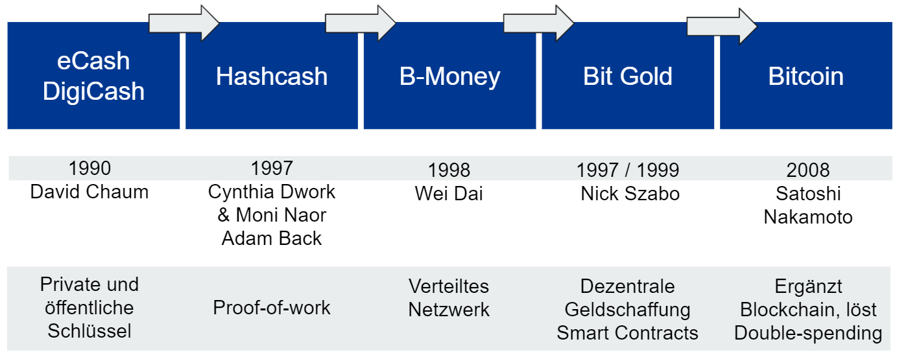

## The History of Bitcoin
>"The 2007-2008 US financial crisis was the consequence of a loosely regulated banking system in which power was concentrated in the hands of too limited a cast of speculators." [^20]

>"The 2007-2008 financial crisis that ravaged the global economy was ignited by a rapacious banking system in the United States. In response, herded by the Fed, the central banks of the G7 nations careened down an endless money-manufacturing trail - in broad day light." [^21]

On October 31 2008, in the advent of the biggest financial crises the world has ever seen, someone going by the pseudonym Satoshi Nakamoto published a white paper called "Bitcoin: A Peer-to-Peer Electronic Cash System" on the domain bitcoin.org and proposed a new digital form of money.

On Jan 3 2009, the first public block of Bitcoin, the so-called Genesis Block, was mined. Satoshi left a message in it: "Chancellor on brink of second bailout for banks", which was the headline of the daily newspaper, The Times, in the UK on that same day. It's a timestamp that marks the beginning of Bitcoin and shows the intention that it should be an alternative to the current banking and financial system, in which you needed to trust intermediaries when you want to process electronic payments.

On June 9 2021, bitcoin became legal tender in El Salvador.

Since the 1990s, computer experts, mathematicians and cryptographers - including some women - have been working on concepts of creating digital money. Bitcoin could be created because it was built on the key technologies of its predecessors.

### Cryptocurrency Projects Before Bitcoin
Parts of the following concepts were incorporated into Satoshi Nakamoto's Bitcoin white paper. 

[^22]

**Public and Private Key Pairs**
In 1990 David Chaum was concerned with the public nature and open access to online payments and personal information. He founded "Digicash", a corporation and electronic money of the same name, which used cryptographic protocols as well as private and public keys to anonymize transactions. The use of signatures - public and private key pairs - became essential in the further development of electronic money and Bitcoin.

**Proof-of-Work**
> The pyramids of Egypt are proof of work. They are a manifest of Egyptian culture, wealth and organization.

With the advent of the internet and email came the problem of spam. To combat the growing problem of spam, in their 1992 paper "Pricing via Processing or Combatting Junk Mail", Cynthia Dwork and Moni Naor proposed the idea "...to require a user to compute a moderately hard, but not intractable function..." before they are technically able to send out emails. It meant that, if someone wants to send a large number of emails at the same time, the computer would need to solve a mathematical problem. This process takes time and effort and kept the spammers from sending messages in quick succession.

In 1997 Adam Back proposed a similar idea called "Hashcash". Satoshi Nakamoto implemented Hashcash as the proof-of-work system used in Bitcoin. Adam Back's work is cited in the Bitcoin white paper. Listen to my interview with Adam Back from 2019 where we discuss his idea for Hashcash and the evolution of his work up to Bitcoin. Find it at https://anita.link/12

The term "proof-of-work" was first coined and formalized in a 1999 paper by Markus Jakobsson and Ari Juels.

**Decentralization**
Hashcash was followed by "B-Money" by Wei Dai in 1998. His concept was the first to be based on a decentralized network of computers. This is baked into Bitcoin's peer-to-peer network with computers running the Bitcoin software as full nodes or miners. Peer-to-peer means a system of equally privileged, equipotent participants without a hierarchy on the network.

A short time later, Nick Szabo published a paper on "BitGold", the first digital money system that was able to run without a central entity issuing the money. He is also the first person to present a paper on "Smart Contracts".

### Solving the Double-Spending Problem
These predecessor money technologies had a major unresolved problem. The "double spending" problem means that already spent digital money could be used a second time. Imagine a PDF file that you can copy, modify and send endlessly at zero cost, claiming that each copy is the original. Such a digital file would be worthless as money.

Satoshi Nakamoto's ingenious idea was to add a ledger to the system with blocks that contain transactions. These blocks are chained together through "proof-of-work" mining, hence the term blockchain. This chaining of transactions in the correct timely order makes bitcoin unforgeable and immutable.

As soon as an actor in the Bitcoin network cheats, the network will detect and ban it temporarily. This means you don't need to trust anyone, there is no need for an intermediary like a bank or PayPal. This doesn't mean that there are no scammers out there or that you can stop verifying what is true or false, or stop learning about how to use Bitcoin. Knowledge is power.

Bitcoin's motto is "Don't trust, verify." This was a little bit confusing to me at the beginning. On the one hand, you learn that you don't have to trust an intermediary yet, on the other, you could verify your transactions. What it means is: if you want to verify bitcoin transactions yourself, you can do so. You even should, if you have the technical knowledge to set up your own full node.

This is revolutionary - as soon as you start to verify your own bitcoin transactions, you essentially become a bank. This is what banks do - they verify your transactions in their ledgers. However, you need to trust them to do a good job. That might be working very well in developed countries, but the banking experience is much worse for most parts of the world. Now imagine you do not have a reliable banking situation or an ID, but you do have a mobile phone and access to the internet. There is only one option for you to store and use money. It's either mobile money like M-Pesa or EcoCash in Africa or cryptocurrencies, where you do not need to identify yourself.

All people worldwide with an internet-enabled mobile phone have access to Bitcoin. The banks as we know them are not required for the use of Bitcoin. You don't have to ask anyone for permission to own or use Bitcoin. All you need to get started is a smartphone, an internet connection and a bitcoin wallet app.

[^20]: Collusion, by Nomi Prins, Bold Type Books, 2019, p. 1.
[^21]: Collusion, by Nomi Prins, Bold Type Books, 2019, p. 247.
[^22]: Anita Posch, Source [The Merkle](https://themerkle.com/top-4-cryptocurrency-projects-created-ahead-of-bitcoin/), [Hashcash.org](http://www.hashcash.org/bitcoin/)
