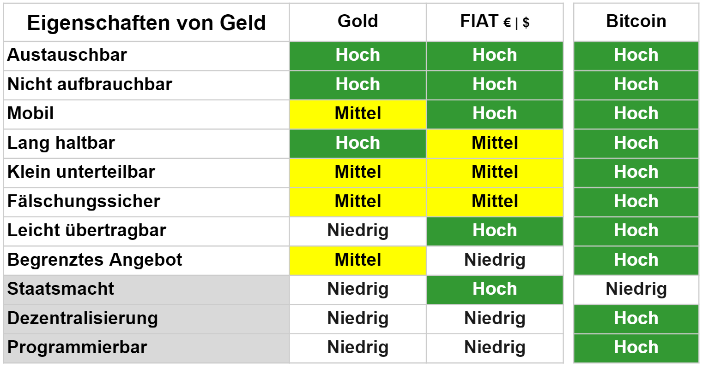

## Argumente für Bitcoin
> "Bitcoin ist ein Opt-in-System. Sie entscheiden, ob sie es nutzen. Sie entscheiden, welche Apps Sie dafür verwenden wollen. Sie entscheiden, mit wem Sie damit interagieren wollen. Sie entscheiden nach welchen Spielregeln Sie interagieren wollen. Deshalb wird Bitcoin sich durchsetzen. Es bietet Innovationen, die die Menschen wollen und brauchen." - **Andreas M. Antonopoulos**

### Paradigmenwechsel
Ich gehöre zur Generation X und bin trotzdem ein "digital native". Ich kann mich an ein Leben ohne Internet erinnern, sogar ohne Videorecorder. Wir hatten damals in Österreicheinen einzigen Fernsehsender mit zwei Kanälen, mehr gab es nicht. Das erste Telefon kam in mein Elternhaus als ich 12 war. Mit 14 benutzte ich meinen ersten Computer, 1997 installierte ich meinen ersten Internetanschluss und E-Mail zu Hause. Im selben Jahr gab es weltweit nur 1 Million Websites und Google und Amazon existierten international noch nicht.

Viele Leute taten das Internet als einen Trend ab, der wieder verschwinden würde. 1995 schrieb der US-Astronom und Autor Clifford Stoll einen Artikel für Newsweek mit dem Titel "The Internet? Bah!"

>"Dann ist da noch das Online-Geschäft. Man verspricht uns das sofortige Einkaufen in Katalogen - ein Mausklick genügt, um tolle Angebote zu erhalten. Wir werden Flugtickets über das Netz bestellen, Restaurantreservierungen vornehmen und Kaufverträge aushandeln. Läden werden überflüssig werden. Aber wie kommt es dann, dass mein örtliches Einkaufszentrum an einem Nachmittag mehr Umsatz macht als das gesamte Internet in einem Monat? Selbst wenn es eine vertrauenswürdige Möglichkeit gäbe, Geld über das Internet zu verschicken - was nicht der Fall ist -, fehlt dem Netzwerk eine wesentliche Zutat des Kapitalismus: Verkäufer*innen." - **Clifford Stoll** [^56]

Spulen Sie vor, ins Jahr 2019 und Amazon ist unter den zehn größten Unternehmen der Welt, Google und YouTube sind die größten Suchmaschinen und es gibt 1,8 Milliarden aktive Websites. Mein erster Kontakt mit Bitcoin und Blockchains war im April 2017, als ich einen Vortrag von Shermin Voshmgir hörte. Es hat sofort Klick gemacht. 20 Jahre nachdem ich meinen Beruf als Stadtplanerin an den Nagel gehängt hatte, um Internetunternehmerin zu werden, erkannte ich das immense Potential von Bitcoin genauso wie die Anfänge des Internets im Jahr 1997.

Die Entdeckung von Bitcoin war der Startschuss einer neuen Technologie, die auf dem Internet aufsetzt, das wir für Medien und Kommunikation nutzen. Das Internet des Geldes ermöglicht uns, Werte weltweit grenzenlos auszutauschen. Die Kommunikation über das Internet hat die Welt in den letzten Jahrzehnten massiv verändert. Was glauben Sie, welche Auswirkungen der freie Verkehr von Werten haben wird? Bitcoin und andere offene, öffentliche, digitale Vermögenswerte werden die Machtdynamik zwischen den Nationen verändern, da es plötzlich möglich ist, immense Geldbeträge schnell und ohne große Schwierigkeiten zu bewegen, unabhängig vom derzeitigen Finanzsystem.

Bitcoin ist eine neue Technologie. Wenn wir seine Entwicklung, mit der des Internets vergleichen, sind wir ziemlich genau da, wo das Internet 1997 war.

### Sozialer Wandel
Menschen in entwickelten Ländern mit funktionierenden demokratischen Systemen tun Bitcoin oft als Spekulationsinstrument und Gefahr für den Nationalstaat ab. Daher halten viele den Stromverbrauch für unverantwortlich für die Umwelt. Einige plädieren sogar für ein Verbot. Ich bin sicher, dass diese Art von Kritik in den kommenden Jahren zunehmen wird.

Die Weltbevölkerung beläuft sich auf 7,8 Milliarden Menschen. Nur 8,4% davon leben in vollwertigen Demokratien. 41% leben in mangelhaften Demokratien, 15% in hybriden Regimen und 35,6% müssen unter autoritären Regimen leiden.

Über 50% der Weltbevölkerung leben in Ländern, die weit von freien und fairen Demokratien entfernt sind! 1,7 Milliarden Menschen haben kein Bankkonto und werden es auch nie haben. Sie benötigen Bitcoin am meisten. [^57]

Es sind die Menschen in Regionen wie Afrika und Südamerika, die die Verbreitung von Bitcoin vorantreiben werden. Die wichtigsten Anwendungsfälle dort sind:

**Schutz vor Inflation**
Diese Tabelle des Internationalen Währungsfonds zeigt die jährliche Veränderung der Verbraucherpreise in Prozent.
 [^58]

* In Venezuela stiegen die Preise um 5.500%. Das Leid der Menschen ist einfach unvorstellbar.
* Im Sudan stiegen die Preise allein im Jahr 2021 um 200%.
* Die Bevölkerung von Simbabwe mussten von 2020 bis 2021 eine Verdoppelung der Preise bei einer Inflation von 100% hinnehmen.
* Für Argentinien lagen dem IWF keine Daten vor, aber mein argentinischer Interviewpartner Franco Amati teilte mir mit, dass die jährliche Inflationsrate 50% beträgt.
* Nigeria verzeichnete im Jahr 2020 eine Inflationsrate von 16%.
* Die Inflationsrate der Türkei lag 2020 bei 13,6%.

Von Mai 2020 bis April 2021 stieg das Bitcoin-Handelsvolumen in Nigeria um 40% von 287 Millionen Dollar auf 399 Millionen Dollar. Eine Umfrage aus dem Jahr 2020 zeigt, dass 32% der befragten Nigerianer Kryptowährungen verwendet oder besessen haben. In den entwickelten demokratischen Ländern wie Deutschland und den USA haben dagegen nur 5-6% Kryptowährungen genutzt oder besessen.

 [^59]

Angesichts dieser jährlichen Inflationsraten wissen die Menschen, dass sie ihr Vermögen in härterem Geld wie USD oder besser noch Bitcoin anlegen müssen. 
Als ich auf meiner Simbabwe-Reise 2020 die Unterschiede zwischen lokaler Währung und Bitcoin erklärte, haben die Menschen sofort den Sinn und Nutzen von Bitcoin verstanden.

**Fremdwährungskontrollen**
Länder mit schwachen Volkswirtschaften und mangelhaften Demokratien setzen Devisenkontrollen ein, um die - wie sie es nennen - Spekulation gegen ihre schwachen Währungen zu begrenzen. Autoritäre Führer wollen ihre Untertanen darin einschränken ihr dysfunktionales Währungssystem zu umgehen. Daher wenden sie Regelungen wie die Folgenden an:

* Die argentinischen Kapitalverkehrskontrollen erlauben es den Menschen nur einen Höchstbetrag von 200 Dollar pro Monat von argentinischen Pesos in USD zu tauschen.
* In Simbabwe gelten ähnliche strenge Vorschriften. Wenn Sie ein Unternehmen führen und Waren importieren wollen, müssen Sie die Zentralbank um Erlaubnis bitten, USD ins Ausland zu schicken. "Angenommen, ich bin in der Solarbranche tätig und möchte 20 Paneele kaufen, um sie hier zu verkaufen. Ich habe 30 Tage Zeit, die Rechnung durch die Bank zu begleichen, bevor meine USD zwangsweise in wertlose Lokalwährung umgewandelt wird. Die Zentralbank kann sich aber mit der Entscheidung so lange Zeit lassen, dass die Frist verfällt. Das ist ein weiterer Grund, warum USD-Bargeld, in Simbabwe so viel mehr Wert hat.", sagte mir ein simbabwischer Interviewpartner im März 2020.

**Das Bankensystem funktioniert nicht**
* Lokale Unternehmen in Simbabwe dürfen USD verwenden, um Rechnungen an einen lokalen Lieferanten zu stellen. Die eingenommenen US-Dollar müssen innerhalb von 30 Tagen wieder ausgeben werden oder das Geld wird zwangsweise zum Bankkurs in RTGS gewechselt, also in jenen simbabwischen Dollar, der diese ungewöhnlich hohen Inflationsraten aufweist. Damit wird es unmöglich in USD zu sparen, um der Inflation zu entkommen.
* Wenn Sie bei einer argentinischen Bank Devisen kaufen, wird der offizielle Bankwechselkurs verwendet (der für die Bank günstig ist, aber nicht für den Kunden) und zusätzlich eine 65%ige Steuer abgezogen.
* Die Nutzung des Bankensystems ist auch in westlichen Ländern mit viel Bürokratie verbunden, aber in diesen Ländern ist es in vielerlei Hinsicht erheblich schlimmer.

**Geldsendungen**
* Wenn Sie in Argentinien Geld aus dem Ausland über das traditionelle Bankensystem erhalten, wird es zum offiziellen Bankkurs in argentinische Pesos umgerechnet. Dies bedeutet im Grunde eine Beschlagnahmung von 30% des Wertes.
* Im Jahr 2020 wurden bis zu 1 Milliarde USD als Überweisungen nach Simbabwe geschickt. Mehr als ein Drittel der Bevölkerung ist auf Überweisungen von Verwandten im Ausland angewiesen. Viele Simbabwer*innen leben in Südafrika und von dem Geld, das sie zu ihren Familien schicken, gehen bis zu 20-30% durch Bankgebühren und offizielle Wechselkurse verloren. [^60]

**Hürden für Frauen**
Die Nutzung eines einfachen Bankkontos ist für fast eine Milliarde Frauen weltweit unmöglich. In vielen Ländern wird den Frauen die volle finanzielle Teilhabe verwehrt, weil die Ungleichbehandlung der Geschlechter in unterschiedlichem Maße gesetzlich erlaubt oder sogar vorgeschrieben ist. 
Je nach Land werden Frauen im Erbrecht diskriminiert und müssen die Erlaubnis ihres Ehemannes einholen, um legal zu arbeiten, ein Bankkonto zu erhalten, ein Unternehmen anzumelden oder einen Vertrag zu unterzeichnen; vielen Frauen ist der Zugang zu bestimmten Berufen untersagt. Für Frauen kann es aufgrund bestehender Gesetze oder restriktiver Meldevorschriften auch schwieriger sein, einen gültigen Ausweis zu erhalten, der für die Nutzung von Finanzprodukten und -dienstleistungen in der Regel erforderlich ist

Weitere Hürden, die Frauen vom Zugang zu Finanzdienstleistungen abhalten, sind unter anderem lange Anfahrtswege, das Risiko, beim Geldabheben ausgeraubt zu werden, sowie fehlende Privatsphäre, um ihre Ersparnisse vor anderen zu schützen.

"Mehr als 80 Prozent der von Frauen im Pazifikraum betriebenen Kleinunternehmen werden auf kleineren Märkten abgewickelt", sagte Dr. Sharman Stone, Australiens Botschafterin für Frauen. "Als sie nur Bargeld hatten, war es für sie extrem gefährlich, dieses Bargeld nach Hause zu bringen und es dort zu verwahren." [^61] Mit Bitcoin und Kryptowährungen sind sie physisch sicherer, können die Inflation umgehen und ihr eigenes Geld besitzen.

> Frauen sind die Mehrheit der kenianischen Bevölkerung; sie verrichten 70% der landwirtschaftlichen Arbeit, doch sie besitzen weniger als 1% des Bodens und haben kaum Kontrolle über das durch ihre Arbeit erzielte Einkommen. [^62]

56% aller Erwachsenen ohne Bankverbindung weltweit sind Frauen. In den meisten Wirtschaftsräumen sind Frauen unter den Banklosen überrepräsentiert. Dies gilt selbst in Räumen, die erfolgreich die Zahl der Kontobesitzer erhöht haben und in denen der Anteil der Erwachsenen ohne Bankverbindung relativ gering ist. In den Vereinigten Staaten, im Nahen Osten und in Nordafrika sind zwei Drittel der Menschen ohne Bankkonto Frauen[^63].[^64]

Eine Studie in Kenia ergab, dass der Zugang zu mobilen Zahlungsdiensten große Vorteile bringt, insbesondere für Frauen. Es ermöglichte frauengeführten Haushalten, ihre Ersparnisse um mehr als ein Fünftel zu erhöhen, gab 185.000 Frauen die Möglichkeit, aus der Landwirtschaft auszusteigen, um stattdessen ein Geschäft oder einen Einzelhandel aufzubauen, und trug dazu bei, die extreme Armut von frauengeführten Haushalten um 22% zu verringern.

Mobile Zahlungsdienste wie M-Pesa in Kenia oder EcoCash in Simbabwe haben den Zugang zu Finanzinstrumenten verbessert. Das Problem: Es handelt sich um Dienste von zentralisierten, privaten Unternehmen. Die Regierung kann sich einmischen, Transaktionen können zensiert oder Konten geschlossen werden. So hat die simbabwische Regierung im Juli 2020 Auszahlungen von EcoCash-Konten auf Bankkonten oder als Bargeld gesperrt.

Finanzdienstleistungen tragen auch dazu bei, dass die Menschen Rücklagen bilden und ihre Ausgaben für den täglichen Bedarf erhöhen können. Nach der Einrichtung von Bankkonten sparten Markthändler*innen in Kenia, vor allem Frauen, mehr und investierten 60 Prozent mehr in ihre Unternehmen. Von Frauen geführte Haushalte in Nepal gaben 15% mehr für nahrhafte Lebensmittel (Fleisch und Fisch) und 20% mehr für Bildung aus, nachdem sie kostenlose Sparkonten erhalten hatten. Bauern in Malawi, die ihr Einkommen auf Sparkonten einzahlen ließen, gaben 13% mehr für landwirtschaftliche Geräte aus und steigerten den Wert ihrer Ernte um 15%. [^65]

Bitcoin senkt die Kosten für den Erhalt von Zahlungen, sodass die Menschen mehr von ihrem Geld haben. Während traditionelle Finanzinstrumente einen Identitäts- und Adressnachweis erfordern, steht die Nutzung von Bitcoin allen offen. Daher kann Bitcoin Frauen dabei unterstützen, mehr Freiheit und Selbstbestimmung zu erlangen.

Weitere Einblicke in die Lebensbedingungen der Menschen in Simbabwe und ihre konkrete Nutzung von Bitcoin in Venezuela, Argentinien, Afghanistan, Nigeria und anderen Ländern erhalten Sie [in meinen Podcast-Interviews] (https://anita.link/show). Betreffend der Vorteile für Frauen wählen Sie den Punkt "Women in Bitcoin".

### Langsam, dafür sicher
Eine Kritik an Bitcoin ist, dass die Entwicklung langsam und schwerfällig ist. Tatsächlich ist Bitcoin die am längsten existierende und technisch sicherste Blockchain. Sie wurde noch nie gehacked oder von außen verändert. 

Grund dafür ist die Community unabhängiger Open-Source-Entwickler*innen, deren oberstes Ziel es ist, einen Beitrag zum allgemeinen gesellschaftlichen Wohl zu leisten. Hören Sie [Adam Back](https://anita.link/12), [Gloria Zhao](https://anita.link/82), [Tim Akinbo](https://anita.link/63), [Amiti Uttawar](https://anita.link/62) oder [Matt Corrallo](https://anita.link/19) um zu verstehen, wie sorgfältig und engagiert sie sich für ihre Aufgabe einsetzen. Darüber hinaus ist das Entwicklungstempo absichtlich langsam. Das Silicon-Valley-Mantra "Beweg dich schnell und mach was kaputt" ist das Gegenteil von dem, was man sich für ein 600 Milliarden USD schweres digitales Asset wünscht, das gleichzeitig eine Live-Software ist.

### Internet der Dinge
Internetbasiertes Geld wie Bitcoin kann auch von Maschinen verwendet werden. Selbstfahrende Elektroautos wie Robotaxis werden sich an Ladestationen aufladen und automatisch mit Bitcoin bezahlen können. Das ist keine Science-Fiction, das ist nahe Zukunft. Andy Schroder aus Kentucky [lädt seinen Tesla bereits mit Echtzeit-Maschine-zu-Maschine-Mikropayments über das Bitcoin Lightning-Netzwerk](http://andyschroder.com/DistributedCharge/). Dies wird nicht die einzige Innovation sein, die sich aus der Verknüpfung von neuer Technologie, Geld und Kommunikation ergeben wird.

### Bitcoin, das Rettungsboot
Wie ich in Kapitel 1 dargelegt habe, stellt sich nicht die Frage, ob das derzeitige Finanzsystem fallen wird, sondern wann. Schon bevor sich die COVID-19-Pandemie im Frühjahr 2020 weltweit ausbreitete, waren die Nationalstaaten hoch verschuldet; die verheerenden Auswirkungen waren an den globalen und regionalen Vermögensunterschieden abzulesen. Seit vielen Jahren haben Expert*innen die Öffentlichkeit davor gewarnt. Simon Dixon hatte bereits 2011 die Große Depression der 2020er-Jahre ausgerufen. Nomi Prins erklärte die Machenschaften der Zentralbanken in ihrem 2018 erschienenen Buch "Collusion". Satoshi Nakamoto wies im Whitepaper auf die Gefahren eines auf Schulden und der Finanzkrise aufgebauten Geldsystems hin.

Bitcoin ist Geld, das nicht durch Kredit und Schuld entsteht. Niemand kann die Anzahl der Bitcoin einfach erhöhen. Es ist die perfekte Alternative, um aus dem Fiat-System auszusteigen. Um sich gegen die drohende Krise abzusichern, ist es sinnvoll, Investitionen auf verschiedene Vermögenswerte zu verteilen und so das Systemrisiko zu reduzieren. Gold, Aktien, Anleihen, Immobilien, Uhren und Oldtimer sind klassische Wertanlagen. Bitcoin kommt nun als digitale Wertanlage hinzu.

Als die CEOs börsennotierter Unternehmen wie Elon Musk und Michael Saylor anfingen, ihre USD-Bargeldbestände in Bitcoin zu investieren, sicherten sie sich bereits ihren Platz auf dem Bitcoin-Rettungsboot. Bitcoin wurde für Menschen geschaffen. Für Sie und mich. Jetzt ist Ihre Chance, vom sinkenden Boot der Fiat-Währungen auf das Rettungsboot zu springen. Es ist noch nicht zu spät, Sie sind noch früh dran. Überlassen Sie das Rettungsboot nicht alleine den CEOs und ihren Unternehmen.

### Bitcoin ist Allgemeingut
Das Bitcoin-Netzwerk ist eine öffentliche Infrastruktur; ein dezentrales Kommunikationsnetz, das direkt vor unseren Augen entsteht. Wir als Privatpersonen konnten uns finanziell nicht direkt am Aufbau des Internets beteiligen. Die meisten von uns besaßen keine Aktien von Apple, Google oder Facebook. Viele Hürden schließen Milliarden Menschen davon aus, in Start-ups zu investieren. Bitcoin ist für alle offen, die in seine Infrastruktur investieren möchten. Sie können Bitcoin auch als digitales Eigentum betrachten; angenommen es gibt 21 Millionen Häuser weltweit. Sie können mehrere Häuser, den Bruchteil eines Hauses, bis hin zu einer Türklinke kaufen.

### Bitcoin regt zum Sparen an
Bitcoin ist ideal für langfristiges Sparen. Wenn Sie annehmen, dass sein Wert in Zukunft steigen wird, werden Sie eher Ihre Bitcoin halten als sie für Dinge auszugeben, die nicht wirklich notwendig sind.

### Sie können sich Bitcoin leisten
Sie müssen nicht gleich einen ganzen Bitcoin kaufen. Ein Bitcoin ist in hundert Millionen Einheiten teilbar. Die kleinste Einheit wird als "Satoshi" bezeichnet - nach der pseudonymen Gründerfigur Satoshi Nakamoto. Sie können Teile eines Bitcoins kaufen und zum Beispiel mit nur 20 Euro beginnen.

### Bitcoin und die Funktionen des Geldes
Viele Lehrbuch-Ökonomen beharren darauf, dass Bitcoin kein Geld ist, weil es die drei funktionalen Kriterien, die Geld haben muss, nicht erfüllt. Diese Funktionen wurden 1875 von William Stanley Jevons[^66] definiert und seine Analyse ist seitdem in makroökonomischen Lehrbüchern weitverbreitet.

Nach Jevons wäre Bitcoin Geld, wenn es diese Funktionen erfüllt:
1. Wertaufbewahrungsmittel - der Wert muss im Laufe der Zeit stabil bleiben
2. Tauschmittel - es wird weithin im Tausch gegen Waren und Dienstleistungen akzeptiert
3. Rechnungseinheit - es wird als Maßstab für Preise, Kosten und Gewinne verwendet
Quelle: https://en.wikipedia.org/wiki/Money

**1. Wertaufbewahrungsmittel**
Kritiker sagen, dass Bitcoin aufgrund der Volatilität und des Potenzials für kurzfristige Verluste nicht als Wertaufbewahrungsmittel geeignet ist. Nun, wie ich in Kapitel 3.1 dargelegt habe, ist dies auf lange Sicht nicht wirklich der Fall. Außerdem stelle ich die Definition von "langfristig stabil" infrage. Was ist der Zeitrahmen? Die Inflation des Euro betrug in Österreich über die letzten zehn Jahre gesamt 20%. Alle anderen Fiat-Währungen sind ähnlich unzuverlässige oder noch schlechtere Wertaufbewahrungsmittel.

**2. Tauschmittel**
Sie können Bitcoin als Tauschmittel verwenden, wenn Sie das wollen. Zugegeben zum Zeitpunkt der Erstellung dieses Buchs gab es nur eine kleine Anzahl von Unternehmen, Dienstleistungen und Restaurants, die Bitcoin als Zahlungsmittel akzeptieren. Aber Sie könnten z.B. eine Kreditkarte mit Bitcoin aufladen und damit in Euro bezahlen. Darüber hinaus gibt es viele Unternehmen im Bitcoin-Sektor, die es als Zahlungsmittel akzeptieren und ihre Mitarbeiter*innen und Dienstleister, wenn gewünscht, in Bitcoin bezahlen.

**3. Rechnungseinheit**
Der Euro ist in weiten Teile Europas als gesetzliches Zahlungsmittel und damit als Rechnungseinheit vorgeschrieben. Wir müssen ihn verwenden. Bitcoin basiert auf Freiwilligkeit, es ist ein Opt-in; wenn wir darauf spekulieren, dass der Wert steigt, werden wir es nicht ausgeben. Die Volatilität von Bitcoin ist mit der Zeit abnehmend, eines Tages wird der Wert ein Plateau erreichen und wir werden anfangen, Bitcoin als Zahlungsmittel zu verwenden. Schon davor werden mehr und mehr Unternehmen Bitcoin akzeptieren, da sie darauf vertrauen, dass es nicht an Wert verliert, sondern an Wert gewinnt.

Eine neue Geldform, die uns nicht aufgezwungen wird, sondern für die wir uns freiwillig entscheiden können, muss bestimmte Stufen in dieser Reihenfolge durchlaufen: Zuerst ist es Wertaufbewahrungsmittel, in der Zeit danach muss Vertrauen in die Stabilität wachsen, danach werden Menschen Bitcoin als Tauschmittel verwenden. Erst in dieser Phase kann es als Rechnungseinheit dienen.

Bitcoin abzutun, weil es noch nicht alle Funktionen von Geld erfüllt, greift zu kurz.

### Die Eigenschaften des Geldes im Vergleich

Im Jahr 2014 hat Ryan Walker die Konzepte von Darwins Theorie der natürlichen Selektion genutzt, um die Evolution der verschiedenen Geldformen zu vergleichen. Die folgende Tabelle zeigt, inwieweit Gold, Fiat-Geld und Bitcoin die traditionell anerkannten Eigenschaften von Geld erfüllen (Zeile 1 - 8). Die Zeile 9 zeigt den Grad der Kontrolle durch staatliche Stellen an (Zeile 9).

> Das Aufkommen von Kryptowährungen hat wichtige neue Eigenschaften ermöglicht, die bei herkömmlichen Geldformen nicht möglich waren. Darüber hinaus wird die Anwendung dieser Eigenschaften wahrscheinlich einen dramatischen Einfluss auf das Umfeld haben, in dem diese Währungen konkurrieren. In den Zeilen 10 und 11 wird die Besonderheit von Kryptowährungen im Vergleich zu den traditionellen und neu realisierten Eigenschaften von Geld bewertet." - **Ryan Walker**

[^67]
Diese Tabelle zeigt, in welchem Maß Gold, Fiat- und Kryptowährungen die traditionell anerkannten Eigenschaften von Geld, sowie die neuen Eigenschaften, die durch die Erfindung von Bitcoin möglich wurden, erfüllen.

Wie Sie sehen, sprengt Bitcoin den traditionellen Rahmen und entwickelt völlig neue Dimensionen dessen, was Geld leisten kann und worauf zukünftige Anwendungen aufbauen können.

[^56]: [Clifford Stoll](https://www.newsweek.com/clifford-stoll-why-web-wont-be-nirvana-185306)

[^57]: [Wikipedia, Demokratie-Index](https://en.wikipedia.org/wiki/Democracy_Index)

[^58]: [Internationaler Währungsfonds, Inflationsrate](https://www.imf.org/external/datamapper/PCPIPCH@WEO/OEMDC/ADVEC/WEOWORLD), abgerufen am 26. April 2021

[^59]: [Handelsvolumen auf P2P Bitcoin-Börsen in Ländern südlich der Sahara von Mai 2020 bis April 2021](https://www.usefultulips.org/combined_Sub%20Saharan%20Africa_Page.html), abgerufen am 26. April 2021

[^60]: [Weltbank, Geldüberweisungen von Südafrika nach Simbabwe](https://remittanceprices.worldbank.org/en/corridor/South-Africa/Zimbabwe), abgerufen am 26. April 2021

[^61]: [BNY Mellon unterstützt globalen Vorstoß für finanzielle Gleichstellung der Geschlechter](https://www.bnymellon.com/us/en/about-us/newsroom/company-news/bny_mellon_supports_a_global_push_for_financial_gender_equality.html)

[^62]: [Georgetown Journal of International Law](https://www.law.georgetown.edu/international-law-journal/wp-content/uploads/sites/21/2018/08/4-Kenya-Report-508.pdf)

[^63]: [Weltbank, Global ID Coverage, Barriers, and Use by the Numbers : An In-Depth Look at the 2017 ID4D-Findex Survey](https://globalfindex.worldbank.org/sites/globalfindex/files/chapters/2017%20Findex%20full%20report_chapter2.pdf)

[^64]: [Weltbank, Das kleine Datenbuch zur finanziellen Eingliederung 2018](https://openknowledge.worldbank.org/bitstream/handle/10986/29654/LDB-FinInclusion2018.pdf)

[^65]: [Weltbank, The Global Findex Database Measuring Financial Inclusion and the Fintech Revolution 2017](https://www.notion.so/Financial-Inclusion-feb3e3913cb042b9bc0ef525ad0f8272#f24c9e8d868e49fe9052c61ead55e080)

[^66]: [William Stanley Jevons](https://en.wikipedia.org/wiki/William_Stanley_Jevons)

[^67]: [Ryan Walker](https://www.coindesk.com/origins-money-darwin-evolution-cryptocurrency)
