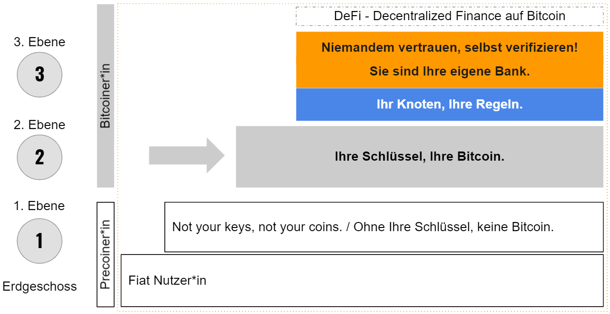

# Die Treppe zu finanzieller Unabhängigkeit

> "Keine eigenen Schlüssel, keine Bitcoin." - **Andreas M. Antonopoulos**

Wie Sie in den vorangegangenen Kapiteln gelesen haben, liegt die Hauptstärke von Bitcoin in seiner Unzensierbarkeit, die Ihnen finanzielle Souveränität verleiht. Das ist - neben der fixen Menge von 21 Millionen - das Hauptunterscheidungsmerkmal zu allen anderen Formen von Geld. Es schützt Sie vor Bail-Ins wie in Zypern 2014 und vor der Inflation, die Ihr Geld entwertet. Halten Sie die Schlüssel selbst, können sie verhindern, dass Dritte Ihr Geld für ihre eigenen Zwecke verwenden, wie beispielsweise Banken Einlagen regelmäßig für eigene Geschäfte verwenden. Es gibt Ihnen die volle Kontrolle über Ihr Geld und ermöglicht weltweit mobil zu sein und dabei Ihr Geld mitzunehmen. Es ist eine Alternative, ein Ausstieg aus dem Fiat-System - alles, was Sie brauchen, sind zwölf Wörter: Ihre Seed-Phrase.

> "Die wichtigsten Eigenschaften Bitcoins sind die Unzensurierbarkeit und die fixe Menge." - **Anita Posch**

Ohne Seed-Phrase haben Sie die oben genannten Privilegien und Freiheiten nicht.

**Risiken bei Krypto-Verwahrern**

Es ist wichtig zu wissen, dass es einen großen Unterschied gibt zwischen Wallets, bei denen Sie die privaten Schlüssel selbst haben, und treuhändischen Wallets, bei denen jemand Ihre Kryptos für Sie verwahrt. Sie erhalten nur dann die Kontrolle über die Seed-Phrase, wenn Sie ein Non-Custodial (selbst gehostetes) Wallet verwenden. Börsen wie Coinbase, Kraken, Binance, Bitpanda usw. geben Ihnen nicht die privaten Schlüssel für Ihre Bitcoin. Es mag zwar bequemer sein, Bitcoin treuhändisch auf einer zentralen Börse zu halten, aber das ist nichts anderes als Ihr Bankkonto. Die Bitcoin im Börsenkonto stehen Ihnen nicht direkt zur Verfügung. Das ist immer dann ein großes Problem, wenn die Börse gehacked wird, was tatsächlich schon oft passiert ist. Ich erinnere an Mt. Gox, den bisher größten Hack, der 2014 stattfand. Es vergeht kein Tag, an dem nicht Konten eingefroren oder Bitcoin Konten gesperrt werden. Manchmal wird der Handel von den Behörden gestoppt. Außerdem müssen Sie sich bei diesen Börsen registrieren lassen und alle KYC-Identifizierungsanforderungen erfüllen (Know-Your-Customer- und Anti-Geldwäsche-Bestimmungen), was für Milliarden Menschen eine Hürde darstellt und sie vom Bankgeschäft und nun auch von der Nutzung von Krypto Börsen ausschließt. Hinzu kommt, dass diese KYC-Vorschriften massiv in Ihre Privatsphäre eingreifen. Glücklicherweise ist Bitcoin für alle nutzbar. Um die Risiken durch Intermediäre bei treuhändischen Wallets zu verringern, sollten Sie diese zentralisierten Bitcoin-Händler  überspringen und von Anfang an eine Wallet verwenden, die Ihnen die Seed-Phrase zur Verfügung stellt.

> Die Illusion, dass Geld auf der Bank sicherer ist als unter der Matratze, resultiert aus einer sehr privilegierten Perspektive. - **Andreas M. Antonopoulos**

Für Menschen außerhalb der "westlichen, entwickelten Welt" gibt es so etwas wie ein sicheres Bankkonto nicht. Das ist ein Privileg. Sie denken vielleicht, dass Sie Ihr Geld lieber an der Börse lassen, weil Sie sich den Ärger und die Verantwortung ersparen wollen, Ihr eigenes Geld zu verwahren. Das können Sie tun, aber es ist nicht das, was Satoshi Nakamoto beabsichtigt hat, und es macht Sie verwundbar.

Sobald Sie die Schritte zur finanziellen Freiheit gelernt und ausgeführt haben, werden Sie sehen, dass es nicht so schwierig ist, wie es zunächst scheint.

## 3 Schritte zur finanziellen Souveränität

>"Mit großer Freiheit kommt große Verantwortung." - **Dr. Stephanie Murphy**

Stephanie Murphy, Co-Moderatorin des Podcasts "Speaking of Bitcoin", stellt das Modell der finanziellen Freiheit als eine Treppe mit verschiedenen Stufen der Souveränität dar. Da Bitcoin eine Technologie in der Entwicklung ist, ändert sich der Grad der Freiheit, den man erreichen kann, ständig. Dieses Buch gibt Ihnen eine Anleitung, um Stufe 2 zu erreichen: die Stufe "Ihre Schlüssel, Ihre Coin". Das Erreichen der Stufe "Niemandem vertrauen, selbst verifizieren" wird in den kommenden Jahren viel einfacher werden. Im Moment erfordert sie noch technisches Know-how und einen größeren Aufwand an Zeit und Ressourcen, aber im Prinzip kann sie jeder erreichen.

 [^68]

**Erdgeschoss** Sie sind vielleicht ein Pre-Coiner. Sie lesen mein Buch, sind wohl an Bitcoin schon interessiert, aber Sie besitzen vielleicht noch keinen.

**1. Stock** Sie lernen BTC mit einer Depotlösung an einer zentralen Börse kennen, aber Sie haben keine Kontrolle über die Schlüssel. Sie haben eine gewisse Unabhängigkeit, weil Sie in eine Kryptowährung investiert sind und nicht mehr ausschließlich in Fiat. Aber es ist keine große Unabhängigkeit, denn Sie verlassen sich auf einen Dritten, was die oben erwähnten Risiken für die Gegenpartei mit sich bringt. Sie befinden sich auf der Ebene **"Ohne Ihre Schlüssel, keine Bitcoin "**.

Im Idealfall überspringen Sie die erste Etage und gehen so schnell wie möglich in die 2.

**2. Stock** Sie übernehmen die Kontrolle über Ihre Schlüssel und verwahren sie selbst sicher mit einer Wallet, die Ihnen Ihren Seed zur Verfügung stellt. Das ist ein viel höheres Maß an finanzieller Souveränität. Sie können dies mit einer mobilen Wallet auf Ihrem Smartphone für kleine Beträge tun oder - der beste Weg und sehr empfehlenswert - mit einer Hardware-Wallet für größere Beträge. Damit ist das Niveau **"Ihre Schlüssel, Ihre Bitcoin"** erreicht. Somit haben Sie eine sehr hohe Stufe der Unabhängigkeit erlangt.

Von hier an sind die Schritte für erfahrene Benutzer. Sie geben Ihnen noch mehr Souveränität, Privatsphäre und Kontrolle über Ihre Bitcoin.

**3. Stufe** Sie erhalten die volle Souveränität über Ihre Gelder, indem Sie Ihre Hardware-Wallet mit Ihrem eigenen Full Node verbinden. Mit diesem können Sie nicht nur Informationen über Ihre Transaktionen einsehen und erhalten, sondern auch geminte Blöcke und Transaktionen verifizieren, ohne sich auf Dritte verlassen zu müssen. Sie brauchen niemandem mehr zu vertrauen und haben ein hohes Maß an Privatsphäre und Kontrolle. **"Sie sind Ihre eigene Bank "** und haben nun die **"Niemandem vertrauen, selbst verifizieren "** Stufe erreicht.

Sie können diese Sicherheits- und Unabhängigkeitsmaßnahmen mit Air-Gapped-Lösungen, Multi-Sig-Setups und mehr noch weiter ausbauen.

Auf dieser Treppe entstehen dezentrale Finanzlösungen wie das Leihen und Verleihen von Bitcoin.

Wenn Sie sich letztlich nur gegen die Inflation absichern und Bitcoin als Wertaufbewahrungsmittel nutzen wollen, ist **das Erreichen der 2. Etage, "Ihre Schlüssel, Ihre Bitcoin" das Ziel**. Ich werde Ihnen in den nächsten Kapiteln zeigen, wie Sie diese Stufe der Souveränität erreichen können.

[^68]: Anita Posch
