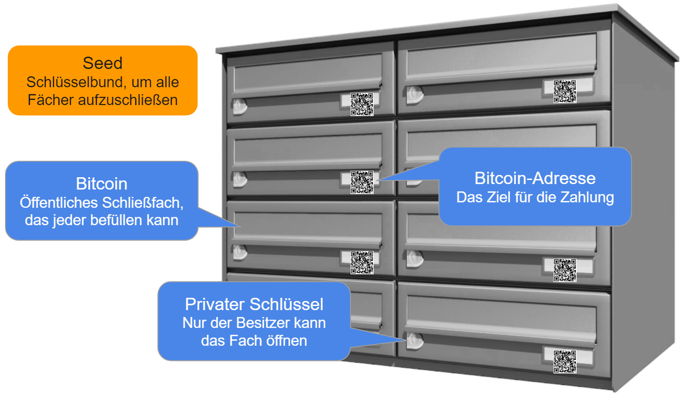

## Securing your funds

As mentioned in the previous chapter, our goal is to reach the "Your keys, your coins" level. 

To buy, use and store bitcoin, you will need:

* Bitcoin wallet = your digital money deposit box. A more precise analogy is a digital key-chain for your moneyboxes.
* Bitcoin addresses = one or more unique addresses for your funds on the blockchain, your receiving addresses (more precisely an unspent transaction output UTXO) 
* Seed = the recovery data for your Bitcoin wallet. 

### Bitcoin Wallet
Think of a wallet like a public lock-box with multiple sections. Anyone can deposit money in each of the sections. Only the owner of the private keys can unlock a section and move the money it holds. Your Bitcoin wallet consists of all the sections and holds all the private keys to unlock them. Private keys and Bitcoin addresses are generated from the seed. The seed is the root of all keys and addresses, it's like a bucket in which all your private keys are stored. 

 [^^C3-2]

The wallet is an app on your phone or software on your computer, which handles all of that in the background. Your private keys, your addresses, sending and receiving bitcoin. 

Bitcoin wallets contain keys, not coins. Each user has a wallet containing keys. Wallets are really key-chains containing pairs of private/public keys. Your funds are recorded on the Bitcoin blockchain.

### Bitcoin address
To receive bitcoin, you need a Bitcoin address to which someone can send you bitcoin. The Bitcoin address consists of a long series of digits and letters.

An example of a bitcoin address: 346n4apJCQPg2XAXU3bfNQTogz4PyTkrEf

Typing 34 digits is of course very impractical, therefore QR codes of the addresses are used that are created automatically by your wallet.

Bitcoin is pseudonymous, meaning there is no requirement for you to connect your email address or personal identification with a wallet. However, the Bitcoin blockchain is transparent, which means that your Bitcoin addresses are publicly viewable on the internet. For example, you can search for it at Blockcypher and see all current transactions and values. Here is an example link: [https://live.blockcypher.com/btc/address/1BbKXjaFvZ3aaVCSmkvN3stv2tc5uB79W4/](https://live.blockcypher.com/btc/address/1BbKXjaFvZ3aaVCSmkvN3stv2tc5uB79W4/)

Therefore, do not share your Bitcoin addresses in connection with your identity on the internet for privacy reasons. Privacy is also the reason why you should not re-use addresses. Most Bitcoin wallets provide you with fresh addresses for each transaction automatically. 

Let's get to the most important part to secure your bitcoin: the seed.

### Seed and private keys

Since the seed is the root of all private keys, no one else must have access to it. The person who knows the seed has ultimate control over the funds.

The seed (sometimes called mnemonic phrase or backup phrase) is a sequence of 12 or 24 English words that gives you access to the private keys of your wallet addresses, and therefore access to your coins. This means that this order of words must remain secret. Anyone who knows the seed can access and take over your coins. Why?

Your coins are not inside your digital wallet as they are inside your regular physical wallet, instead they are recorded on the blockchain. Compare this to email and a letter. You can access your email account from anywhere in the world, because your emails are stored online, while your letterbox is stationery. This applies similarly to Bitcoin.

Worldwide access to your assets is always possible with the seed, regardless of your wallet manufacturer. When selecting your wallet, pay attention to the designation HD wallet (hierarchical determination), in between those you can transfer the seed.  

Suppose your smartphone gets corrupted, you can't access your Bitcoin wallet app anymore and need to switch to a new phone. You install a fresh version of your Bitcoin wallet and import the seed from your first wallet. Access to your funds is restored. 

The seed is generated by the wallet app during first setup. Most wallets guide you through the set up and instruct you to write down the seed words on a sheet of paper. If your wallet doesn't offer it right away, look for the "Create Backup" or "Backup" feature and follow the steps. The creation of the seed works in the opposite way to the creation of a password as you know it from websites. It is not you who determines the password, but the wallet itself.

The order of words is IMPORTANT! You must write down the words exactly in the order in which they appear.

> Example seed: cruise item paper slim vocal power like video snap museum mirror sun  

Write the seed by hand on a piece of paper and store it safely. Do not take a screenshot, do not store it on your phone or computer that is connected to the internet as all those places can get hacked. More about security in chapter 6.

Since your funds are not inside your wallet, but stored on the blockchain you can move globally and take your bitcoin funds wherever you go. You just need to remember the 12-24 seed words in the correct order. After passing customs without a mobile phone, you get yourself a new wallet and import the seed. Magic.