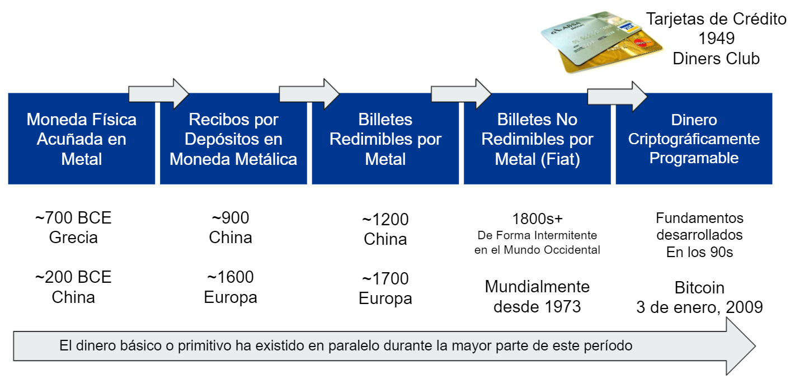
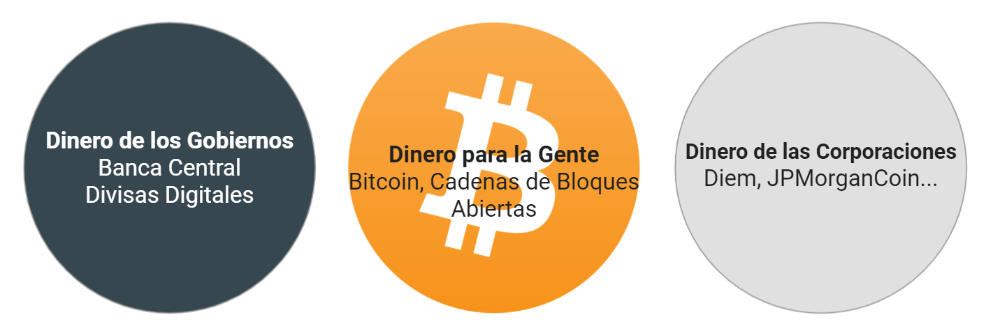

# La Evolución del Dinero

El 3 de enero de 2009 nació Bitcoin. Desde su creación, el Protocolo de Internet (PI) de la red P2P de Bitcoin ha concatenado un nuevo bloque de datos a una cadena de transacciones, aproximadamente cada 10 minutos. La cadena de bloques de Bitcoin almacena las transacciones en el orden cronológico correcto, un orden que no se puede modificar posteriormente, tan inmutable como el tiempo mismo. Así como el latido de nuestro corazón preserva nuestros cuerpos, este proceso es preservado por un sistema que tienen sus fundamentos en la criptografía, la teoría de juegos, las tecnologías de la información y las redes descentralizadas, mantienéndose en equilibrio a sí mismo.

Este sistema autorregulado, tiene las siguientes características:

- Las transacciones de Bitcoin son resistentes a la censura.
- Bitcoin es inmutable.
- Bitcoin no se puede falsificar.
- Las transacciones de Bitcoin son altamente seguras sin necesidad de intermediarios, tales como los bancos.
- Las transacciones de Bitcoin son transparentes, visibles públicamente y pueden ser auditadas por cualquier persona.

 [^1]
En un pago tradicional hay hasta siete intermediarios hasta que el pago llega finalmente al destinatario. Bitcoin no tiene ningún intermediario.

- Bitcoin es una red neutral: no moraliza ni distingue entre pagos "buenos" o "malos".
- Bitcoin no exige permisos: no hay guardianes que nos puedan impedir su uso.
- Bitcoin es libre de fronteras: se puede utilizar en todo el mundo.
- Bitcoin, el Protocolo de Internet, es un bien común: pertenece a todos, no a una sola entidad como una empresa.
- Las reglas de Bitcoin se hacen cumplir mediante el consenso de todas las partes involucradas, asegurado programáticamente.

Bitcoin es el dinero de la gente. Bitcoin es resultado de la evolución del dinero. Es una continuación del proceso perpetuo de descubrimiento de nuevas formas de dinero que siempre ha sido parte de la historia de la humanidad. A lo largo de los milenios, se han encontrado y utilizado varias formas nuevas de dinero, desde un intercambio directo entre personas hasta un sistema de crédito con un patrón oro, pasando por una moneda fiduciaria y el actual sistema inflacionario sin respaldo actual. El sistema bancario y monetario tal como lo conocemos hoy existe y evoluciona desde hace unos 300 años. Es natural que, con la aparición de una nueva forma de comunicación a través de Internet, surja una nueva forma de economía y un nuevo tipo de dinero, a saber, el dinero nativo de Internet.

 [^2]

El dinero criptográfico programable o la "Internet del dinero", como dice Andreas M. Antonopoulos, es dinero imparable. Estamos en el comienzo de una nueva era en la historia de la humanidad.

## Las Piedras Rai de Yap
Si Bitcoin suena alucinante y no nos es posible comprender el concepto de una cadena de bloques como la expresión de un libro compartido de registros de hechos verídicos, el Rai de la Isla de Yap es un buen ejemplo para introducirnos hacia algunos conceptos superpuestos.

Los Rai son grandes discos de piedra que se usaron en la isla Yap en el Pacífico occidental (Micronesia). Fueron "acuñados" de los depósitos de piedra caliza de la isla de Palau y se utilizaron como moneda hasta el siglo XX.

 [^3]

Las piedras Rai se llevaron a Yap en barco y, debido a su tamaño y peso, no se movían cuando se gastaban, sino que simplemente cambiaban de dueño. Cada transacción se "registraba" oralmente dentro de la pequeña comunidad, y el historial de propiedad de la piedra se convertía en parte del conocimiento común. Finalmente, el "historial" o "libro mayor contable" de transacciones se terminó convirtiendo en la única parte que importaba. Una vez, a una canoa se le cayó una piedra que era transferida a Yap y se hundió. Se consideró que la piedra seguía siendo dinero, ya que todavía existía, a pesar de que nadie la ha visto ni ha tenido acceso a ella desde entonces.

Esto es particularmente importante porque demuestra un uso natural de un libro mayor contable de transacciones. El libro mayor se compartía oralmente entre los habitantes y se reconocía la propiedad y la delegación de esta propiedad, sin que se moviera una sola piedra; todos estuvieron de acuerdo y se formó un consenso. Así es como podemos hacer una comparación con las funciones de la cadena de bloques de Bitcoin; es un libro mayor de registros compartido de todas las transacciones, almacenado simultáneamente en miles de computadoras (nodos) a nivel mundial. [^4]

Otra similitud con Bitcoin está en la creación de las piedras Rai, que resultaba de un trabajo intenso y una forma de prueba de trabajo. Las piedras se tallaron con herramientas manuales, se extrajeron en costas foráneas y se llevaron a la isla en canoa. Una vez que las piedras Rai se volvieron fáciles de fabricar con técnicas modernas, se volvieron menos útiles como dinero, porque ya no eran un indicador confiable del gasto de energía.

Los economistas modernos han considerado las piedras Rai como una forma primitiva de dinero, y a menudo se utilizan como ejemplo para respaldar la tesis de que el valor de algunas formas de dinero puede asignarse simplemente a través de una creencia compartida en dicho valor.[^5] El dinero de hoy día tampoco está respaldado por nada. De hecho, solo está establecido y declarado como moneda de curso legal por reglamentación gubernamental. Por eso, es referencia de valor que utilizamos y, por lo tanto, se percibe como valioso.

## Cómo se Crea el Dinero

> "Se debe confiar en que el banco central no devaluará la moneda, pero la historia de las monedas fiduciarias está llena de violaciones a esta confianza". - Satoshi Nakamoto

Aprender sobre Bitcoin fue una revelación para mí. Hay dos períodos distintos de mi vida, uno antes de Bitcoin y otro después de Bitcoin. Hoy veo las cosas de manera completamente diferente. En mi objetivo de comprender Bitcoin, primero tuve que comprender el sistema monetario actual. ¿Cuáles son las diferencias entre sistemas de divisas como el dólar o el euro, y el Bitcoin? ¿Qué es la inflación? ¿Qué papel juegan los bancos centrales, etc.? Es desconcertante que no aprendamos estos conceptos en la escuela, pero esta falta específica de educación puede, desafortunadamente, ser intencional.

Se utilizan 180 divisas en 195 países de todo el mundo. Una divisa es un sistema monetario de uso común, definido por los gobiernos. Muchas jurisdicciones definen su divisa nacional como moneda de curso legal; es dinero declarado por ley, válido para el pago de deudas y que no puede ser rechazado como forma de pago.

Las 180 divisas (el dólar estadounidense, el euro, el yen y la libra esterlina, por ejemplo) se pueden definir dentro de una categoría llamada "dinero fiduciario". Desde 1971, ninguna de estas monedas fiduciarias ha sido respaldada por oro ni por ningún otro activo tangible. El dinero tiene valor porque creemos en él. El dinero es un lenguaje para expresar cuán valioso es algo socialmente. La palabra fiat proviene del latín y significa “permítase que se realice”. El dinero de nuestros días se crea a través del registro de una entrada en un libro de cuentas mayor en formato digital y es solo un número en un sistema de contabilidad. No hay ningún acto de productividad en el mundo real detrás de este registro.

¿Quién está a cargo de la creación del dinero? Es una combinación de gobiernos y bancos centrales, junto con bancos comerciales. Es un sistema jerárquico centralizado con guardias en la entrada. No hay acuerdo alguno sobre el límite del suministro monetario o su tasa de emisión.

Fiat es "dinero por decreto"; se maneja coercitivamente a través de la amenaza implícita de la violencia del estado. El valor de este dinero se mantiene mediante la creación de una obligación tributaria interminable que solo puede satisfacerse con el mismo dinero fiduciario y los mercados de valores administrados por el estado, así como las leyes de curso legal y la política fiscal.

* El dinero puede ser creado por los bancos centrales en forma de papel moneda y monedas metálicas.
* Los bancos centrales pueden comprar activos y bonos del mercado abierto, haciendo que el dinero fluya hacia el sistema.
* El dinero puede ser creado a través de estímulos gubernamentales, a través de beneficios, subvenciones y rescates.
* El dinero puede ser creado por los bancos comerciales a través de préstamos.

### El Dinero se Crea a Través de la Deuda
El último punto es uno que todos conocemos. Es el modo en que sacamos un préstamo para comprar una casa, poner en marcha un negocio o comprar un coche. El proceso es fácil, pero solo para aquellos que ya son privilegiados. Si no podemos ofrecer alguna garantía como colateral, si no somos propietarios de una pequeña empresa, o no tenemos un trabajo regular de ingresos fijos o se es una mujer en un país donde las mujeres todavía tienen prohibido poseer propiedades, entonces probablemente no vamos a calificar para un crédito en nuestro banco. Pero si obtenemos ese préstamo, el banco editará su libro de contabilidad digital y agregará la suma del crédito a favor de nuestra cuenta. Luego le deberemos al banco el préstamo más la tasa de interés. Ahora debemos salir a trabajar o vender algo para poder devolver el préstamo más la tasa de interés. Es un gran negocio para los bancos. No agregan nada, pero ganan las comisiones de nuestros contratos de préstamos y los intereses de nuestro reembolso.

Además de todo esto, hay algo llamado banca de reserva fraccionaria. Esto permite a los bancos prestar más dinero del que tienen en reservas o como saldos en su cuenta en el banco central. El banco central determina el monto mínimo que los bancos deben mantener en activos líquidos, llamado "coeficiente de reserva" o "encaje legal". Esta tasa varía de un país a otro. En la zona del euro, los bancos deben mantener un mínimo del 1% en el momento de redactar este escrito. En marzo de 2020, la Reserva Federal (el Banco Central de EE.UU.) abolió este requisito de reserva mínima debido a la pandemia del COVID-19. Canadá, el Reino Unido, Nueva Zelanda, Australia, Suecia y Hong Kong no tienen requisitos de reserva. Si cada uno de nosotros fuera al banco hoy día y solicitase retirar su respectivo dinero, el sistema bancario se derrumbaría. Debido a que los bancos han prestado más dinero del que poseen, no podrían devolvernos nuestro propio dinero.

En 2020, la deuda global aumentó de ser unos 24 billones de dólares a la cifra de unos 281 billones de dólares, es decir, aumentó un 355% del PIB mundial. [^6]

### Los Bancos Centrales como Prestamistas de Última Instancia
Los bancos comerciales pueden y han pedido la ayuda de sus Bancos Centrales como prestamistas de última instancia. En 2008/2009, los bancos, responsables de la crisis financiera mundial, recibieron su dinero de rescate. Fueron rescatados porque eran "demasiado grandes para fracasar". ¿Y qué hicieron con ese dinero? Recompraron acciones de sus propias empresas. Nada "se filtró" hacia la economía. La brecha entre ricos y pobres inevitablemente se hizo cada vez más grande.

Los bancos centrales se denominan prestamistas de última instancia. El objetivo es evitar perturbaciones económicas como resultado de los pánicos financieros y que las corridas bancarias se extiendan de un banco a otro debido a la falta de liquidez. Los actores financieros como los bancos saben que los bancos centrales tendrán que rescatarlos, lo que conduce a un riesgo moral: la toma excesiva de riesgos tanto por parte de los banqueros como de los inversores.

La creación de dinero artificial a través de los bancos centrales eclipsó la distorsión del mercado. Debido a la inundación y manipulación del sistema monetario con dinero barato, ya no existe un mecanismo racional para la determinación de precios. Por lo general, la oferta y la demanda determinan el valor de los bienes y productos básicos pero, en un mercado distorsionado y manipulado, no hay lugar para el descubrimiento de precios justos. La clase media global está pagando por la codicia de las élites financieras que, a su vez, está siendo alimentada por un sistema corrupto de creación de dinero.

¿Alguna vez, como individuo, has sido rescatado? Y si te han rescatado, ¿harías lo mismo una y otra vez, manipulando el sistema a sabiendas que hay un último recurso, que siempre te sacará de apuros? Esto es exactamente lo que hacen constantemente los bancos, Wall Street, los Hedge Funds y sus abogados de cabildeo, asistidos por los bancos centrales de todo el mundo.

"Clásicamente, los bancos centrales mantienen reservas en caso de emergencias, establecen tasas de interés y asignan fondos para estimular o desacelerar las economías después de eventos disruptivos como pánicos o guerras. El papel más reciente que han asumido es el de asegurar todo el sistema financiero e influir en la trayectoria económica de naciones soberanas enteras. Esta es la antítesis del gobierno democrático. Tal oligarquía monetaria opera más allá de las normas y límites democráticos". [^7]

El libro de Naomi Prins sondea la psique de Wall Street, revelando cómo la estructura misma del sistema financiero dependía de que los operadores acudieran en masa a la próxima gran apuesta, independientemente de los riesgos. Además, las _mismas_ personas y familias seguían apareciéndose, de manera cíclica por Wall Street y Washington. Influyeron en la economía por debajo de ellos desde sus alturas más elevadas de estatus, dinero privado y cargos públicos, desmantelando las leyes que se interponían en su camino y encontrando lagunas a través de otras. Los bancos privados normalizaron la manipulación del mercado. Los bancos centrales lo convirtieron en una forma de arte, sin límites". [^8]

### Inflación en la Oferta Monetaria

Tomemos el dólar estadounidense como ejemplo para todas las monedas fiduciarias. Debido a la inflación de la oferta monetaria, cuantos más dólares estén disponibles, menos valor tendrá cada billete. Imagine un billete de banco como una mercancía como el cobre. Si hay más cobre en el mercado que demanda, el precio del cobre está bajando; su valor está disminuyendo. Lo mismo ocurre con nuestros billetes. El valor de las monedas fiduciarias también está determinado por la oferta y la demanda. Si aumenta la oferta y la demanda permanece igual, el valor de una unidad disminuye.

La oferta monetaria consta de varios tipos de dinero que generalmente se clasifican con letras "M": por ejemplo, M0 (correspondiente a la base monetaria), M1, M2 y M3. Las definiciones pueden variar ligeramente en diferentes países.

La base monetaria (M0) es la cantidad total de divisa en papel físico y moneda metálica que está en circulación en manos del público o en forma de depósitos de la banca comercial resguardados en las reservas del banco central. [^9]

Mientras tengamos efectivo, se tratará de un activo como tal como el bitcoin, es decir, una propiedad de poseemos. Si tomamos nuestro efectivo y lo metemos en el banco, tendremos entonces un pagaré, pero ya no seremos más los dueño de nuestro dinero. Lo mismo que pasa con nuestros bitcoins cuando los metemos a un "exchange" o a una casa de cambio.

Cualquier otra forma de oferta de dinero fiduciario (formas del tipo M1, M2, M3) se va a componer de "pagarés" respaldados por la base monetaria. [^10]

M1 incluye a M0, pero también cuentas corrientes, cheques de viajero y otros depósitos a la vista, que se pueden convertir fácilmente en efectivo.

M2 incluye a M0 y a M1, y además a diversos valores del mercado monetario, fondos mutuales y otros depósitos a plazo. Estos activos son menos líquidos que M1 y no tan adecuados como medios de intercambio, pero pueden convertirse rápidamente en efectivo o depósitos de cuentas corrientes. M2 se observa de cerca como un indicador de la oferta monetaria y la inflación futura, y como un objetivo para la política monetaria del Banco Central.

La cantidad de dinero tipo M2 en circulación en los EE. UU. Fue de **19,7 billones de dólares** en febrero de 2021. [^11] Obsérvese el crecimiento en 2020:

"Aceptamos esto como normal porque asumimos que nunca terminará. El sistema bancario de reserva fraccionaria ha funcionado en todo el mundo durante cientos de años (primero respaldado por oro y luego totalmente basado en moneda fiduciaria), aunque con eventos inflacionarios ocasionales en el camino para restablecer parcialmente las cosas.

Cada unidad individual de moneda fiduciaria se ha degradado aproximadamente en un 99% de su valor o más durante una línea de tiempo de varias décadas. Esto significa que los inversionistas necesitan ganar una tasa de interés que exceda a la tasa de inflación real (que no está sucediendo actualmente), o necesitan comprar activos de inversión en su lugar, lo que infla el valor de las acciones y de los bienes raíces en comparación con sus flujos de caja e insta a subir los precios de objetos escasos como los de las bellas artes". [^12]

A la inflación de la oferta monetaria se le suma el hecho de que la población en los EE. UU. Y otras naciones occidentales no está creciendo al mismo ritmo que la oferta monetaria. "La población de los EE. UU. Solía crecer tal vez a un 1,5% anual, y ahora crece alrededor del 0,5% anual. Eso es bastante importante. Mientras tanto, la oferta monetaria amplia ha aumentado en un 25% año tras año, y está en camino de crecer a un 75% adicional durante un período continuo de 5 años en el futuro". [^13]

Estrictamente hablando, la inflación se produce cuando la oferta monetaria supera el crecimiento del PIB nominal, que consiste en el crecimiento de la población y de la productividad. El Índice de Precios al Consumidor de los EE. UU. muestra que los precios de los bienes subieron porque el valor del dinero disminuyó.
 [^14]

### Esquema Ponzi

> Esquema Ponzi: "Una forma de fraude en la que la creencia en el éxito de una empresa ficticia se fomenta mediante el pago de rendimientos rápidos a los primeros inversores a partir del dinero invertido por otros". - **Diccionario de Ingles de Oxford**

Los enemigos de Bitcoin lo identifican como un esquema Ponzi. Y yo digo que, o no entienden al Bitcoin o no entienden cuál es el verdadero sistema Ponzi, o bien, tienen un interés personal en que Bitcoin no tenga éxito. Charles Ponzi fue arrestado en los Estados Unidos en 1920 por tomar $ 20 millones de dólares de decenas de miles de víctimas. Su promesa era duplicar su dinero en tres meses. A cambio de efectivo, los inversores recibieron pagarés que garantizaban la inversión original más el 50 por ciento de interés. Estas notas llevaban la firma de Ponzi estampada con tinta. Muchos se refirieron a ellos como "notas Ponzi".

> "Mi negocio era simple. Era el viejo juego de robarle a Peter para pagarle a Paul. Tu me dabas cien dólares y yo te daría una nota para pagarte ciento cincuenta dólares en tres meses… Mis notas se volvieron más valiosas que el dinero estadounidense… Luego vinieron los problemas. Todo se resquebrajó". - **Charles Ponzi**

Si quieres saber más, [escucha mi episodio de podcast sobre la vida y la historia de Charles Ponzi, nacido en Italia](https://anita.link/ponzi). Puedes encontrarlo en https://anita.link/ponzi.

**Características de un Esquema Ponzi**

* Un esquema Ponzi posee un actor, líder u organización centralizada que recolecta inversiones y finalmente que puede salir huyendo.
* Los esquemas Ponzi no son auditables ni transparentes. Nadie, excepto su creador, sabe qué está sucediendo con los fondos.
* Un esquema Ponzi emite dinero hasta que se desmorona el esquema; no hay límites en la oferta.
* Tiene dificultades para rembolsar a los inversionistas: cuanto más dinero ingresa al esquema, más dinero tiene que devolverse y más difícil es para el creador detener la máquina.
* El sistema tiene que romperse un día, no hay alternativa.
* Los estafadores ganan dinero por el préstamo de fondos que no realizan una contribución real al desempeño económico de un país.
* La codicia impulsa el esquema Ponzi. Los inversionistas minoristas que ingresan temprano, ganan intereses y se lo dicen a otros, que también quieren enriquecerse rápidamente.

Vamos a comparemos estas características con el sistema actual de emisión monetaria.

**Características de la Emisión de Dinero Fiat**

* Existen unos actores centralizados, tales como gobiernos, Bancos Centrales y banca comercial, que son quienes crean el dinero.
* El sistema monetario no es auditable ni transparente.
* No hay límites en la oferta monetaria.
* Habrán dificultades para pagar a los inversionistas: debido al sistema bancario de reserva fraccionaria, si solo el 20% de los clientes de un banco solicitase un pago al mismo tiempo, el banco se mete en problemas y dirá "no hay" a los retiros. Esto sucede regularmente en todo el mundo y les sucedió a algunos bancos estadounidenses a principios de 2020 durante el cierre de la pandemia.
* El sistema tiene que romperse algún día, no hay alternativa.
* Los bancos ganan dinero por prestar fondos que no son destinados a una contribución real del desempeño económico de sus países.
* La codicia está impulsando el sistema fiat. Las élites financieras reciben préstamos baratos porque poseen valores para comprar más valores y hacer crecer su riqueza y poder.

### El Verdadero Esquema Ponzi

* La única similitud entre Bitcoin y un esquema Ponzi es el efecto de red de la codicia. Pero a diferencia de un Ponzi, usted mismo puede tener las llaves sus bitcoins. No hay ningún banco o actor centralizado que controle sus bitcoins. 

* Bitcoin tiene una oferta limitada. Solo se podrán crear 21 millones de ellos. Bitcoin es finito, la moneda fiduciaria es infinita. No puede haber inflación basada en la oferta monetaria de Bitcoin.

* La emisión de Bitcoin está predeterminada por un algoritmo que todos los actores de Bitcoin han acordado y asegurado a través de nodos operativos. No se puede modificar sin el consentimiento de la comunidad global de Bitcoin. Dado que el límite de 21 millones de bitcoins es una de las características más importantes de Bitcoin, un acuerdo para cambiarlo será muy difícil o incluso imposible de lograr.

* Los directivos de los bancos centrales están determinando el destino financiero de todos los países del mundo. No son elegidos, pero actúan como gobiernos que intentan controlar todo el mercado financiero.

* El efecto Cantillon fue descrito por el economista irlandés-francés Richard Cantillon alrededor de 1730. Sugirió que la inflación ocurre gradualmente y que la nueva oferta de dinero creada por los bancos tiene un efecto localizado sobre la inflación, recompensando a los banqueros y actores cercanos al crear dinero artificialmente, beneficiando a los más cercanos al origen del dinero.

> "Se suponía que la crisis de la Reserva Federal y las políticas monetarias posteriores a la crisis, adoptadas por otros grandes bancos centrales, se "filtrarían" a las masas. Pero esto no sucedió. Las élites mundiales lo sabían entonces, y son más conscientes de ello ahora. En enero de 2017, el Foro Económico Mundial admitió que la creciente desigualdad amenaza la economía mundial. Estos actos de colusión provocan la desigualdad porque los beneficia a ellos y la preservación de sus jerarquías de poder global en detrimento de todo y de todos los demás". - **Nomi Prins** [^15]

### El Final de Este Tipo de Crecimiento

La desigualdad de la riqueza ha aumentado en los últimos siglos junto con la mercantilización y monetización de los recursos naturales. No queda nada para ser consumido. Estamos viviendo una lucha por los recursos, por la igualdad de oportunidades contra el establishment y las élites que se enriquecen a través de la corrupción y las ventajas financieras.

"Otro subproducto de la crisis financiera y la colusión del Banco Central fue el aumento de la ansiedad económica que generó un giro hacia el nacionalismo, desde Brasil hasta Gran Bretaña y Estados Unidos. El impacto del Brexit en el Reino Unido repercutió en todo el mundo cuando los votantes se alejaron del liderazgo en ejercicio y sus políticas económicas fallidas. En Estados Unidos, la victoria electoral de Donald Trump, el presidente multimillonario 'antisistema', fue otra manifestación de esta tendencia. Estos votos históricos no fueron causados directamente por la política del Banco Central, sino que fueron sus efectos.". [^16]

La creciente división entre ricos y pobres se basa en nuestro sistema monetario actual, que es el verdadero esquema Ponzi. Los directivos de la banca central no son elegidos democráticamente, pero ellos deciden el destino financiero del mundo. Los banqueros y sus amigos se están beneficiando de este sistema. Es hora de una alternativa: una forma de dinero descentralizada, abierta, neutral, transparente, inmutable, no inflable y colaborativa para la gente: Bitcoin.

### El Sistema del Petrodólar de la Actualidad

Ahora que ya hemos discutido cómo se crea el dinero, vamos a profundizar en el mundo de las guerras de divisas y cómo este sistema de monedas nacionales es exclusivo e históricamente ha estado dominado por diferentes imperios.

La historia de las guerras de divisas es larga. "Durante el siglo pasado, el mundo pasó de un sistema de patrón oro, al sistema de Bretton Woods, al sistema del Petrodólar. Cada sistema se deshizo en su mayor parte desde adentro en lugar de ser derribado externamente, y cada vez que un sistema pasaba a otro, se produjo una devaluación de la moneda significativa y generalizada".[^17]

La hegemonía monetaria británica duró desde 1871 hasta la Primera Guerra Mundial. En ese entonces, las divisas de las naciones estaban vinculadas al oro. Después del período de entreguerras, cuando el poder monetario comenzó a descentralizarse, Estados Unidos emergió como la potencia monetaria central después de la victoria aliada en la Segunda Guerra Mundial. El sistema de Bretton Woods, fundado en 1944, fue el primer ejemplo de un orden monetario totalmente negociado, destinado a gobernar las relaciones monetarias entre estados independientes. Estableció un sistema de reglas, instituciones y procedimientos para regular el sistema monetario internacional, como el Fondo Monetario Internacional (FMI). Estados Unidos, que controlaba dos tercios del oro mundial, insistió en que el sistema de Bretton Woods se basara tanto en el oro como en el dólar estadounidense. Los representantes soviéticos asistieron a la conferencia, pero luego se negaron a ratificar los acuerdos finales, insistiendo en que las instituciones que habían creado eran "sucursales de Wall Street". Esto puede interpretarse como el punto de partida de la Guerra Fría.

El 15 de agosto de 1971, Estados Unidos, liderado por el presidente Richard Nixon, suspendió unilateralmente a la convertibilidad del dólar estadounidense en oro, poniendo fin al sistema de Bretton Woods y convirtiendo al dólar en una moneda fiat. Al mismo tiempo, muchas monedas fijas (como la libra esterlina) también pasaron a flotar libremente.

El sistema monetario actual se basa en el Petrodólar. Lyn Alden describe esto en su artículo "La estructura del sistema monetario global":

"A partir de 1971, después del colapso del sistema de Bretton Woods, las monedas de todo el mundo se convirtieron en monedas fiduciarias, y el sistema monetario global se volvió menos ordenado. Esta fue la primera vez en la historia de la humanidad que esto sucedió, donde todas las divisas del mundo al mismo tiempo se convirtieron en papel sin respaldo alguno.

La divisa fiduciaria es un sistema monetario por el cual no hay nada de valor en la moneda misma; es solo papel, monedas de metal baratas o bits de información digital. Tiene valor porque el gobierno declara que tiene valor y que es de curso legal para pagar todas las cosas, incluidos los impuestos.

Un país puede imponer el uso de una divisa fiduciaria como medio de intercambio y unidad de cuenta dentro de su país al hacer que todos los impuestos se paguen solo en esa moneda, o al promulgar otras leyes para agregar fricción o, en algunos casos, prohibir completamente otras medios de intercambio y unidades de cuenta. Sin embargo, si su moneda tiene un problema lo suficientemente grande, como es el caso de muchos mercados emergentes, se desarrollará un mercado negro para otros medios de intercambio, tales como divisas extranjeras o activos duros.

Una moneda fiduciaria puede enfrentar problemas particulares cuando se intenta usar fuera de su país de origen. ¿Por qué las empresas y los gobiernos de otros países deberían aceptar trozos de papel, que un gobierno extranjero puede imprimir sin cesar y que no tienen un respaldo firme, como forma de pago por sus valiosos bienes y servicios? Sin un respaldo real, ¿cuánto vale esa divisa? ¿Por qué venderías petróleo a extranjeros a cambio de papel?

A principios de la década de 1970, hubo una variedad de conflictos geopolíticos, incluida la Guerra de Yom Kippur y el embargo petrolero de la OPEP. En 1974, sin embargo, Estados Unidos y Arabia Saudita llegaron a un acuerdo y, a partir de ahí, el mundo fue anclado al sistema del petrodólar; una forma inteligente de hacer que un sistema global de moneda fiduciaria funcione de manera bastante decente… Con el sistema del petrodólar, Arabia Saudita (y otros países de la OPEP) venden su petróleo exclusivamente en dólares a cambio de la protección y cooperación de Estados Unidos. Incluso si Francia quiere comprar petróleo de Arabia Saudita, por ejemplo, lo hacen en dólares… A cambio, Estados Unidos utiliza su incontestable flota militar de alta mar para proteger las rutas marítimas globales y preservar el status quo geopolítico mediante la respuesta o amenaza militar según sea necesario… Algunos de nosotros, particularmente cercanos de la cima de la escala de ingresos, nos beneficiamos directa o indirectamente de este sistema. Los estadounidenses que trabajan en torno a las finanzas, el gobierno, la atención médica y la tecnología obtienen muchos de los beneficios de vivir en el poder hegemónico, sin los inconvenientes. Por otro lado, los estadounidenses que fabrican productos físicos tienden a no beneficiarse, porque perdieron sus trabajos o se vieron suprimidos sus ingresos y, por lo tanto, no se han beneficiado de las ganancias. Y fuera de Estados Unidos, los países exportadores se benefician del sistema, mientras que los países a los que no les gusta cómo está estructurado el sistema monetario global no tienen muchos recursos para hacer nada al respecto, a menos que crezcan lo suficiente como Rusia y China."[^18]

Hemos estado en guerras de divisas durante muchas décadas. ¿Qué moneda es más fuerte? ¿Qué país puede obtener más beneficios manipulando su moneda? ¿El euro, el dólar estadounidense, el yuan chino? ¿O incluso el Diem de Facebook? El dinero de las corporaciones es el nuevo jugador fuerte del mercado. Para conservar sus poderes, los bancos centrales comenzaron a trabajar en sus propias monedas digitales (CBDC).

 [^19]

Bitcoin es nuestra alternativa a este sistema. Proteger nuestra privacidad en esta era digital, votar contra el abuso del poder monopolístico en el sistema actual y brindar a las personas que viven en estados autoritarios con gobernantes corruptos las mismas oportunidades de participar en el sistema económico. Bitcoin es una estrategia de defensa, una herramienta con la que podemos preservar el derecho humano a la libertad y privacidad en el comercio.

[^1]: [Ilustración NetGuardians recuperada en abril de 2017](https://www.netguardians.ch/ngfintechblog/2016/11/17/blockchain-explained-part-1)  
[^2]: Anita Posch, créditos: Universidad de Nicosia, MOOC en moneda digital, “Una breve historia del dinero” con imagen: Lotus Head, CC BY-SA 3.0, wikimedia.org  
[^3]: Imagen: "Stone Money of Yap, Western Caroline Islands". - La Dra. Caroline Furness Jayne tomó esta fotografía durante una estadía en 1903 en Yap, dominio público, a través de Wikimedia Commons  
[^4]: [Piedras Rai en Wikipedia](https://en.wikipedia.org/wiki/Rai_stones)  
[^5]: [Universidad de Nicosia, Introducción a las monedas digitales, Sesión 1, p. 15]  
[^6]: [Relación deuda / PIB, JS Blokland](https://twitter.com/jsblokland/status/1362138620665221122?s=20)  
[^7]: Colusión, por Nomi Prins, Bold Type Books, 2019, p. 7.  
[^8]: Colusión, por Nomi Prins, Bold Type Books, 2019, p. xvii  
[^9]: [Base monetaria](https://www.investopedia.com/terms/m/monetarybase.asp)  
[^10]: [Base monetaria global, Crypto Voices](https://cryptovoices.com/basemoney)  
[^11]: [FRED, Reserva Monetaria M2](https://fred.stlouisfed.org/series/M2SL)  
[^12]: [Lyn Alden, esquema Ponzi](https://www.lynalden.com/bitcoin-ponzi-scheme/)  
[^13]: [Lyn Alden](https://twitter.com/LynAldenContact/status/1362912907659522049?s=20)  
[^14]: [Índice de precios al consumidor de EE. UU.](Https://fred.stlouisfed.org/series/CPIAUCSL)  
[^15]: Colusión, por Nomi Prins, Bold Type Books, 2019, p. 253.  
[^16]: Colusión, por Nomi Prins, Bold Type Books, 2019, p. 249.  
[^17]: [Lyn Alden, La estructura del sistema monetario global](https://www.lynalden.com/fraying-petrodollar-system/)  
[^18]: [Lyn Alden, Petrodollar System (1974-Presente)](https://www.lynalden.com/fraying-petrodollar-system/)  
[^19]: Anita Posch
