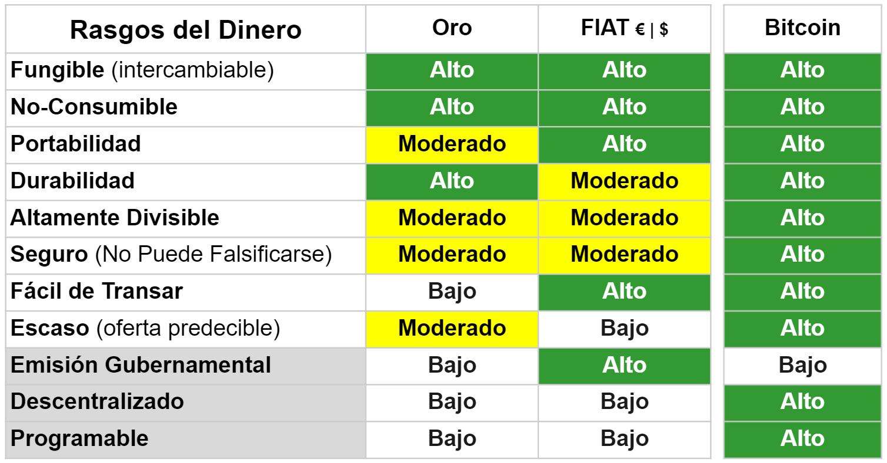

## Argumentos a Favor de Bitcoin
> "Bitcoin es un sistema opcional. Tú lo usas si eliges usarlo. Tú eliges las aplicaciones que vas a ejecutar. Tú eliges con quién vas a interactuar. Tú eliges las reglas del juego a través de las cuales tú vas a interactuar. Es por eso que bitcoin va a ganar. Ofrece la innovación que los consumidores quieren y necesitan." - **Andreas M. Antonopoulos**

### Un Cambio de Paradigma
Soy una persona nativa de la era digital, pero en el cuerpo de alguien de la Generación-X. Puedo recordar como era la vida sin Internet, incluso sin una videograbadora. Teníamos solo una estación de televisión en Austria, eso era todo. Mis padres obtuvieron nuestro primer teléfono fijo cuando yo tenía 12 años. A los 14 usé mi primera computadora, en 1997 instalé mi primera conexión a Internet con correo electrónico en casa. Ese mismo año había solo 1 millón de sitios web en todo el mundo y Google y Amazon no existían en ningún lugar del mundo.

Mucha gente desestimó a la Internet como una moda que pronto desaparecería. En 1995, el astrónomo y autor estadounidense Clifford Stoll escribió un artículo para Newsweek titulado "¿Internet? ¡Bah!"

>"Y luego está el negocio cibernético. Nos prometen compras instantáneas por catálogo: solo marca y haz clic para obtener excelentes ofertas. Solicitaremos boletos de avión a través de la red, haremos reservas en restaurantes y negociaremos contratos de venta. Las tiendas se volverán obsoletas. ¿Entonces como es que el centro comercial de mi localidad hace más negocios en una tarde de lo que todo Internet maneja en un mes? Incluso si hubiera una forma confiable de enviar dinero a través de Internet, que no existe, a la red le falta un ingrediente esencial del capitalismo: los vendedores." - **Clifford Stoll** [^56]

Viajemos hacia el futuro rápidamente hasta 2019 y encontramos a un Amazon que se encuentra entre las diez empresas más grandes del mundo; Google y YouTube son los motores de búsqueda más grandes y hay 1.800 millones de sitios web activos. Mi primer contacto con Bitcoin y las cadenas de bloques fue en abril de 2017 cuando escuché una charla de Shermin Voshmgir. Su charla me hizo clic de inmediato. 20 años después de cambiar de carrera como planificador urbano para convertirme en emprendedora en Internet, entendí que Bitcoin es tan masivo como los albores de Internet en 1997.

El descubrimiento de Bitcoin fue el advenimiento de una nueva tecnología sobre la capa de Internet, que usamos para los medios y la comunicación. El Internet del dinero, que nos permite intercambiar valor globalmente, sin fronteras. La comunicación a través de Internet ha cambiado enormemente el mundo en las últimas pocas décadas. ¿Cual crees que será el impacto que tendrá una la libre circulación de valores? Bitcoin y otros activos digitales públicos y abiertos cambiarán la dinámica de poderes entre las naciones, ya que de repente ahora es posible mover grandes cantidades de dinero a gran velocidad, sin fricciones y sin tocar el sistema financiero actual.

Bitcoin es una nueva tecnología. Si comparamos su desarrollo con el de Internet, estamos prácticamente donde estaba Internet en 1997.

### Haciendo Posible Un Cambio Social

Las personas que viven en naciones desarrolladas con democracias funcionales, a menudo desestiman al Bitcoin y lo ven como una mera herramienta para la especulación y como un peligro para los estados nacionales. Por lo tanto, algunos piensan que su consumo eléctrico es irresponsable con el medio ambiente. Algunos incluso abogan por su prohibición. Y podemos esperar que este tipo de críticas aumente en los próximos años.

La población mundial es de 7.800 millones de personas. Sólo el 8,4% vive en democracias verdaderas, el 41% en democracias defectuosas, el 15% en regímenes híbridos y el 35,6% en regímenes autoritarios.

¡Más del 50% de la población mundial vive en naciones que están lejos de ser democracias libres y justas! 1.700 millones de personas no tienen una cuenta bancaria y nunca la tendrán: Bitcoin es para ellos. [^57]

Son aquellas personas que viven en regiones tales como África y América del Sur las que impulsarán la adopción de Bitcoin. Los principales casos de uso son:

**Cobertura contra la inflación**
Esta tabla del Fondo Monetario Internacional muestra la variación anual de los precios al consumidor en porcentajes.  
 [^58]

* Venezuela registró aumentos de precios por el orden del 5.500 %. El sufrimiento de la gente es simplemente incomprensible.
* En Sudán, los precios aumentaron en un 200% solo en 2021.
* Los zimbabwenses enfrentaron una duplicación de los precios con una inflación del 100% de 2020 a 2021.
* El FMI no tenía datos para Argentina, pero mi socio de entrevistas argentino, Franco Amati, me informó que la tasa de inflación anual era del 50%.
* Nigeria registró una tasa de inflación del 16% en 2020.
* La tasa de inflación de Turquía en 2020 fue del 13,6%.

Desde mayo de 2020 hasta abril de 2021, el volumen de comercio de bitcoins en Nigeria aumentó en un 40% de unos 287 millones de dólares a 399 millones de dólares. Una encuesta hecha en 2020 muestra que el 32% de los nigerianos que fueron entrevistados habían usado o poseído criptomonedas. Mientras tanto, en países democráticos desarrollados como Alemania o EE.UU., solo entre el 5% al 6% ha utilizado o poseído criptomonedas.

 [^59]

Dadas estas tasas de inflación anual, las personas saben que necesitan resguardar su riqueza en algún tipo de dinero más duro, como el dólar norteamericano o, mejor aún, en Bitcoin. Si les explicamos las diferencias entre el Bitcoin y las monedas locales de estos países, todos comprenderán de inmediato cómo y por qué Bitcoin puede ayudarlos.

**Controles de Cambio Sobre Divisas**

Los países con economías débiles y democracias defectuosas utilizan los controles cambiarios para limitar, lo que ellos llaman, la especulación contra sus monedas débiles. Dado que los líderes autoritarios quieren limitar y controlar las posibilidades que tengan las personas para eludir sus sistemas opresivos, aplican regulaciones como las siguientes:

* Los controles de capitales de Argentina solo permiten que las personas obtengan un monto máximo de 200 dólares estadounidenses por mes a cambio de sus pesos argentinos.
* Se aplican las mismas duras regulaciones en Zimbabwe. Si tienes un negocio y necesitas importar bienes, debes solicitar permiso al Banco de la Reserva para enviar dólares estadounidenses al exterior. "Supongamos que estoy en el sector de la energía solar y quiero comprar 20 paneles solares para poder venderlos. Solo tengo 30 días para rotar mi mercancía sin que mi capital pierda valor. El Banco de la Reserva, en cambio, se puede tardar todo el tiempo que se le antoje para otorgarme un permiso, para reabastecerme. Esa es otra razón por la que los dólares de EE.UU. reales y en físico, el efectivo en mano, tiene mucho más valor en Zimbabwe", me dijo un socio entrevistado de Zimbabwe en marzo de 2020.

**El Sistema Bancario No Está Disponible o No Funciona**
* Las empresas locales de Zimbabwe pueden utilizar dólares para facturar a un proveedor local. Estas empresas tiene que liquidar esos dólares estadounidenses en un plazo de 30 días, o el dinero se les convierte en su cuenta a dólares RTGS, al tipo de cambio bancario oficial. El RTGS es el nombre del dólar de Zimbabwe, que muestra estas altas tasas de inflación.
* Si compras moneda extranjera en un banco argentino se utiliza el tipo de cambio oficial del banco (que es favorable para el banco, pero no para el cliente) y además se deduce un impuesto del 65%.
* El uso del sistema bancario también puede estar lleno de trámites burocráticos en los países occidentales, pero es mucho peor en países como los ya mencionados.

**Remesas**
* Si recibes dinero del exterior en Argentina a través del sistema bancario tradicional se te convertirá a pesos argentinos a la tasa bancaria oficial. Esto básicamente representa una confiscación del 30% del valor que te han enviado.
* En 2020, se enviaron hasta mil millones de dólares estadounidenses como remesas a Zimbabwe. Más de un tercio de la población depende de las remesas de familiares en el extranjero. Muchos zimbabwenses viven en Sudáfrica y del dinero que envían, se pierde hasta en un 20% al 30%  debido a las tarifas bancarias y los tipos de cambio oficiales. [^60]

**Barreras Para Las Mujeres**

El uso de una cuenta bancaria básica está fuera del alcance de casi mil millones de mujeres en todo el mundo. Los diversos grados de desigualdad de género permitidos o exigidos por la ley niegan a las mujeres la participación financiera total en muchos países del mundo. Dependiendo del país, las mujeres son discriminadas por las leyes sucesorales y deben obtener el permiso de su esposo para trabajar legalmente, obtener una cuenta bancaria, registrar una empresa o firmar un contrato; a muchas mujeres se les prohíbe acceder a determinadas profesiones. Las mujeres también pueden tener más dificultades para acceder a las tarjetas de identificación legales debido a las leyes vigentes o los requisitos de registro restrictivos, y dicha identificación suele ser necesaria para utilizar productos y servicios financieros.

Otros obstáculos que impiden que las mujeres accedan a los servicios financieros son la necesidad de viajar largas distancias, el riesgo de que les roben mientras acceden al dinero y la falta de privacidad que les permitiría proteger sus ahorros de los demás.

"Más del 80 por ciento de las pequeñas empresas manejadas en el Pacífico por mujeres se encuentran en pequeños mercados", dijo la Dra. Sharman Stone, Embajadora de la Mujer por Australia. "Cuando solo tenían efectivo, era extremadamente peligroso para ellas llevarlo a casa y conservarlo una vez que llegaban a casa". [^61] Con el Bitcoin y las criptomonedas, ellas están físicamente más seguras, pueden eludir la inflación así como conservar su propio dinero.

> Las mujeres son la mayoría de la población de Kenia; realizan el 70% del trabajo agrícola, pero poseen menos del 1% de la tierra y controlan muy poco de los ingresos producidos por su trabajo. [^62]

El 56% de todos los adultos no bancarizados a nivel mundial son mujeres. Las mujeres están sobrerrepresentadas entre los no bancarizados en la mayoría de las economías. Esto es cierto incluso en las economías que han aumentado con éxito la propiedad de cuentas y tienen una proporción relativamente pequeña de adultos que no están bancarizados. [^63] En los Estados Unidos, Oriente Medio y África del Norte, dos tercios de los no bancarizados son mujeres. [^64]

Un estudio en Kenia encontró que el acceso a los servicios financieros móviles brindaba grandes beneficios, especialmente para las mujeres. Permitió que los hogares encabezados por mujeres aumentaran sus ahorros en más de una quinta parte, permitió que 185.000 mujeres dejaran la agricultura y desarrollaran actividades comerciales o minoristas y ayudó a reducir la pobreza extrema entre los hogares encabezados por mujeres en un 22 por ciento.

Los servicios financieros móviles como M-Pesa en Kenia o EcoCash en Zimbabwe han aumentado el acceso a los instrumentos financieros. El problema: estos son servicios de empresas privadas centralizadas. El gobierno puede intervenirlas, las transacciones pueden ser censuradas o las cuentas pueden ser cerradas. Por ejemplo, en julio de 2020, el gobierno de Zimbabwe bloqueó el retiro de fondos de las cuentas del sistema de de dinero móvil de EcoCash hacia cuentas bancarias o efectivo.

Los servicios financieros también pueden ayudar a las personas a acumular ahorros y aumentar el gasto en productos de primera necesidad. Después de recibir cuentas de ahorro, los vendedores en los mercados en Kenia, principalmente mujeres, ahorraron a una tasa más alta e invirtieron un 60 por ciento más en sus negocios. Los hogares encabezados por mujeres en Nepal gastaron un 15 por ciento más en alimentos nutritivos (carne y pescado) y un 20 por ciento más en educación después de recibir cuentas de ahorro gratuitas. Además, los agricultores de Malawi que tenían sus ganancias depositadas en cuentas de ahorro gastaron un 13 por ciento más en equipos agrícolas y aumentaron el valor de sus cultivos en un 15 por ciento. [^65]

Bitcoin puede reducir el costo de recibir pagos, dejando a las personas con más dinero. Si bien los instrumentos financieros tradicionales requieren una identificación y un comprobante de domicilio, el uso de Bitcoin está abierto para todos. Por lo tanto, Bitcoin puede ayudar a las mujeres a obtener más libertad y soberanía.

Para obtener más información sobre las condiciones de vida de las personas en Zimbabwe y el verdadero uso que le dan día a día al Bitcoin en Venezuela, Argentina, Afganistán, Nigeria y más, [aquí se pueden escuchar mis entrevistas en podcast](https://anita.link/show). En cuanto a las ventajas para las mujeres que utilizan Bitcoin, se puede consultar la sección "Women in Bitcoin" ("Mujeres en Bitcoin").

### Lento, Pero Seguro

Una de las críticas a Bitcoin es que su desarrollo es lento y torpe. De hecho, la realidad muestra que Bitcoin es la cadena de bloques más antigua y técnicamente más segura. Bitcoin nunca ha sido pirateado ni alterado. La razón de esto es una comunidad de desarrolladores independientes de código abierto cuyo primer interés es contribuir al bien social más amplio. Podemos escuchar a [Adam Back](https://anita.link/12), [Gloria Zhao](https://anita.link/82), [Tim Akinbo](https://anita.link/63), [Amiti Uttawar](https://anita.link/62) o a [Matt Corrallo](https://anita.link/19) para comprender lo reflexivos y motivados que están por su misión. En segundo lugar, el ritmo de desarrollo es deliberadamente lento. El mantra de Silicon Valley de "Muévete rápido y rompe cosas" es lo opuesto a lo que quieres para un activo digital que ya maneja 600 mil millones de dólares y que es, al mismo tiempo, software en vivo.

### Internet de las Cosas  
Las máquinas también pueden utilizar dinero nativo de Internet como lo es bitcoin. Los autos eléctricos autónomos, como los taxis automáticos, podrán recargarse en las estaciones de carga y pagar automáticamente con bitcoin. Esto no es ciencia ficción, este es el futuro cercano. Andy Schroder de Kentucky ya está [cargando su Tesla con micropagos de máquina a máquina en tiempo real a través de Bitcoin Lightning Network](http://andyschroder.com/DistributedCharge/). Esta no será la única innovación que surgirá de las intersecciones entre las nuevas tecnologías, el dinero y las comunicaciones.

### Bitcoin, El Bote Salvavidas
Como expuse en el capítulo 1, no se trata de si el sistema financiero actual caerá, sino de cuándo. Incluso antes de que la pandemia de COVID-19 se extendiera a nivel mundial en la primavera de 2020, las naciones estaban profundamente endeudadas; los efectos devastadores fueron evidentes en las brechas de riqueza mundiales y regionales. Durante muchos años, los expertos han advertido al público al respecto. Simon Dixon ya había denunciado la Gran Depresión de la década de 2020 en 2011. Nomi Prins explicó la colusión de los bancos centrales en su libro de 2018 del mismo nombre. Satoshi Nakamoto se refirió a los peligros de un sistema monetario basado en la deuda y la crisis financiera en el documento técnico.

Bitcoin es dinero libre de deudas. Uno no simplemente infla la oferta. Es la alternativa perfecta a la hora de salirse del sistema fiat. Para protegerse contra esta crisis que se avecina, tiene sentido distribuir las inversiones entre diferentes activos y así reducir el riesgo sistémico. El oro, las acciones, los bonos, los bienes raíces, los relojes y los automóviles antiguos son activos de protección de valor bien conocidos. Bitcoin es un activo de protección de valor digital.

Cuando los directores ejecutivos de empresas que cotizan en bolsa como Elon Musk y Michael Saylor comenzaron a intercambiar efectivo en dólares estadounidenses por bitcoins, se aseguraron su lugar en el bote salvavidas de Bitcoin. Bitcoin se hizo para particulares. Para gente como tú y como yo. Ahora es nuestra oportunidad de salir del barco de las monedas fiduciarias, que se hunde. No es demasiado tarde, todavía estás a tiempo.

### El Bitcoin Es Un Bien Común
La red Bitcoin es una infraestructura pública; es una red de comunicaciones descentralizada que todavía se está construyendo frente a nuestros ojos. Nosotros, como individuos, no pudimos participar financieramente, de manera directa en la construcción de Internet. La mayoría de nosotros no teníamos acciones de Apple, Google o Facebook. Muchos obstáculos excluyen a miles de millones de personas de invertir en empresas emergentes. Bitcoin está abierto para que todos inviertan en su infraestructura. También podemos usar casas para imaginarnos a Bitcoin como propiedad digital; solo hay 21 millones de casas y puedes comprar una fracción de una casa, hasta incluso, la manija de una puerta.

### El Bitcoin Fomenta el Ahorro
Bitcoin es ideal para ahorrar a largo plazo. Si creemos que el valor aumentará en el futuro, se nos anima a mantener y no gastar nuestros bitcoins en cosas que no sean realmente necesarias.

### El Bitcoin Es Algo Que Podemos Permitirnos
No tienes que comprar un bitcoin completo. Un bitcoin es divisible en cien millones de unidades. La unidad más pequeña se llama "Satoshi", en honor a la figura fundadora seudónima, Satoshi Nakamoto. Puedes comprar partes de un bitcoin y comenzar con tan solo 20 euros, por ejemplo.

### Bitcoin y Las Funciones Del Dinero
Muchos economistas que son autores de libros de texto, insisten en el hecho de que Bitcoin no es dinero porque no cumple con los tres criterios funcionales que debe tener el dinero. Estas funciones fueron definidas por William Stanley Jevons [^66] en 1875, y su análisis se hizo muy popular en los libros de texto macroeconómicos desde entonces.

Según Jevons, Bitcoin solo es dinero si cumple estas funciones:  
1. Reserva de valor: el valor debe permanecer estable a lo largo del tiempo.
2. Medio de intercambio: es ampliamente aceptado a cambio de bienes y servicios.
3. Referencia de valor: se utiliza como medida de precios, costos y ganancias.
Fuente: https://en.wikipedia.org/wiki/Money

**1. Reserva de valor**
Los críticos dicen que Bitcoin no es una reserva de valor debido a su volatilidad y a que puede conducir a pérdidas potenciales a corto plazo. Bueno, como expuse en el capítulo 3.1, a largo plazo ese no es realmente el caso. Además, cuestiono la definición de "estable en el tiempo". ¿Cuál es el plazo? La inflación del dinero fiduciario en Austria ha sido del 20% durante la última década. Todas las demás monedas fiduciarias como el euro son reservas de valor igualmente poco fiables por esta misma razón.

**2. Medio de Intercambio**
Podemos utilizar bitcoin como medio de intercambio si lo deseamos. Sí, solo hay una pequeña cantidad de empresas, servicios y restaurantes que aceptan bitcoin como pago al momento de escribir este documento. Pero, para usarlo como medio de intercambio, podemos usar diferentes herramientas y servicios que podemos recargar con bitcoin y gastar en dinero fiduciario. Además de eso, hay muchas empresas dentro del espacio crypto, que ya aceptan y pagan salarios en bitcoin también.

**3. Referencia de Valor**
El dinero fiduciario debe ser referencia de valor por ley. Simplemente no tenemos otra opción. Pero Bitcoin se basa en el uso voluntario, es “opt-in”; si especulamos que su valor está subiendo, no lo gastaremos. Dado que la volatilidad de bitcoin disminuye con el tiempo, un día su valor se estabilizará y la gente comenzará a gastar bitcoin. Incluso antes de esto, cada vez más empresas comenzarán a aceptar bitcoin, ya que confiarán en que no pierde valor sino que lo aprecia.

Una nueva forma de dinero que no se nos impone, sino que es opcional, tiene que pasar por ciertas etapas y cierto orden: primero, debe convertirse en una reserva de valor, luego debe construirse la confianza, luego la gente lo usará como medio de intercambio. Solo entonces se utilizará como referencia de valor.

Descartar Bitcoin porque aún no cumple con todas las funciones del dinero es pasar por alto su esencia.

### Comparando Los Rasgos Del Dinero

En 2014, Ryan Walker tomó los conceptos de la teoría de la selección natural de Darwin para comparar la evolución de las diferentes formas de dinero. La siguiente tabla muestra el grado en que el oro, el dinero fiduciario y el bitcoin cumplen los rasgos del dinero tradicionalmente reconocidos (filas 1 - 8). Las medidas emitidas por los gobiernos el grado de centralización y control por parte de las autoridades (fila 9).

> "La llegada de las monedas basadas en criptografía ha permitido nuevos rasgos clave que antes no eran posibles con las formas tradicionales del dinero. Además, la incorporación de tales rasgos probablemente tendrá un impacto dramático en el entorno en el que compiten estas monedas. Las filas 10 y 11 incluyen rasgos distintivos de las criptomonedas cuando se comparan con los rasgos tradicionales y recientemente reconocidos del dinero". - **Ryan Walker**

 [^67]  
Esto muestra el grado en que el oro, las monedas fiduciarias y las monedas criptográficas cumplen con los rasgos tradicionalmente reconocidos de la moneda, así como los nuevos rasgos que el descubrimiento del Bitcoin hizo posible.

Como puede verse, Bitcoin va más allá del marco tradicional de lo que es el dinero. Está evolucionando hacia una dimensión completamente nueva de lo que puede hacer el dinero y a partir de qué aplicaciones se construirán en el futuro.

[^56]: [Clifford Stoll](https://www.newsweek.com/clifford-stoll-why-web-wont-be-nirvana-185306)  
[^57]: [Wikipedia, Índice de Democracia](https://en.wikipedia.org/wiki/Democracy_Index)  
[^58]: [Fondo Monetario Internacional, Tasas de Inflación](https://www.imf.org/external/datamapper/PCPIPCH@WEO/OEMDC/ADVEC/WEOWORLD), solicitado el 26 de abril de 2021  
[^59]: [Volumen de operaciones en intercambios P2P de Bitcoin en países subsaharianos desde mayo de 2020 hasta abril de 2021](https://www.usefultulips.org/combined_Sub%20Saharan%20Africa_Page.html), solicitado el 26 de abril de 2021  
[^60]: [Banco Mundial, Envío de dinero de Sudáfrica a Zimbabwe](https://remittanceprices.worldbank.org/en/corridor/South-Africa/Zimbabwe), solicitado el 26 de abril de 2021  
[^61]: [Bank of New York Mellon, apoya el impulso global para la igualdad financiera de género](https://www.bnymellon.com/us/en/about-us/newsroom/company-news/bny_mellon_supports_a_global_push_for_financial_gender_equality.html)  
[^62]:[Revista Georgetown de Leyes Internacionales](https://www.law.georgetown.edu/international-law-journal/wp-content/uploads/sites/21/2018/08/4-Kenya-Report-508.pdf)  
[^63]: [World Bank, Global ID Coverage, Barriers, and Use by the Numbers : An In-Depth Look at the 2017 ID4D-Findex Survey](https://globalfindex.worldbank.org/sites/globalfindex/files/chapters/2017%20Findex%20full%20report_chapter2.pdf)  
[^64]: [World Bank, The Little Data Book on Financial Inclusion 2018](https://openknowledge.worldbank.org/bitstream/handle/10986/29654/LDB-FinInclusion2018.pdf)  
[^65]: [Banco Mundial, Cobertura de identificación global, barreras y uso según los números: una mirada en profundidad a la encuesta ID4D-Findex de 2017](https://www.notion.so/Financial-Inclusion-feb3e3913cb042b9bc0ef525ad0f8272#f24c9e8d868e49fe9052c61ead55e080)  
[^66]: [William Stanley Jevons](https://en.wikipedia.org/wiki/William_Stanley_Jevons)  
[^67]: [Ryan Walker](https://www.coindesk.com/origins-money-darwin-evolution-cryptocurrency)  
