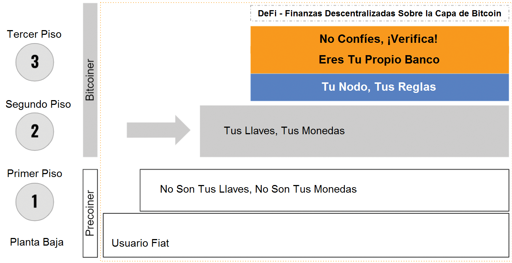

# La escalera Hacia La Soberanía Financiera

> "Si no son tus llaves, no son tus monedas". - **Andreas M. Antonopoulos**

Como lo has leído en los capítulos anteriores, la principal fortaleza de Bitcoin es su incensurabilidad, lo que nos otorga soberanía financiera. Es decir, además de una oferta fija de 21 millones de monedas, este es el principal diferenciador de todas las demás formas de dinero. Esto te protege de los “rescates” como el de Chipre de 2014 y de la inflación que devalúa tus fondos. Acaba con la financiarización forzosa a costa de tu dinero, a través de productos bancarios y financieros. Te brinda control total sobre tus fondos, te permite moverte globalmente mientras llevas tu dinero contigo. Es una alternativa, una exclusión voluntaria del sistema fiduciario; todo lo que necesitas son 12 palabras en inglés: tu frase semilla.

> "Bitcoin no es ni censurable ni inflable. Estas son sus propiedades más importantes". - **Anita Posch**

Si no tienes esas palabras semilla, no tienes ni los privilegios ni la libertad mencionados anteriormente.

## Los Riesgos de las Carteras de Custodia
Es importante tener en cuenta que existe una gran diferencia entre las carteras con custodia y las carteras sin custodia. Solo tendrás el control de la frase semilla cuando uses una cartera sin custodia (o auto-hospedada). Las casas de cambio como Coinbase, Kraken, Binance, Bitpanda, etc., no te brindan las llaves privadas de tus propias carteras. Si bien podría ser más conveniente guardar bitcoins en una cartera de una casa de cambios centralizada, esto no hace ninguna diferencia con un banco. Tu no vas a poseer los bitcoins en tu cuenta de una casa de cambios, lo que puede ser un gran problema si esa casa de cambios es pirateada, algo que ya ha sucedido muchas veces. Por ejemplo, les recuerdo a Mt. Gox, el hackeo más grande hasta la fecha que ocurrió en 2014. No pasa un solo día sin casos de cuentas congeladas o de marcación de monedas “en lista negra” y, a veces, la suspensión regulatoria del comercio. Además de eso, estas casa de cambio necesitan que te registres y que cumplas con todos los requisitos de identificación de los clientes, también conocidos como “KYC” (de sus siglas en inglés “conozca a su cliente” y regulaciones contra el lavado de dinero), lo cual es un obstáculo para miles de millones de personas sin documentos apropiados de identidad, excluyéndoles de la banca y ahora del uso de casas de cambio criptográficas también. Además de eso, estas regulaciones KYC están invadiendo nuestra privacidad. Afortunadamente, Bitcoin está diseñado para todos. Para mitigar los riesgos de contraparte de las carteras con custodia, debemos ignorar estas casas de cambio y usar una cartera sin custodia desde el principio.

> "Esta ilusión de que el dinero en el banco es más seguro que el dinero debajo del colchón es una percepción privilegiada". - **Andreas M. Antonopoulos**

Para las personas fuera del "mundo desarrollado occidental", no existe una cuenta bancaria segura. Esto es más bien es un privilegio. Podríamos pensar que es preferible dejar nuestro dinero en la casa de cambios porque no queremos tener la molestia y la responsabilidad de poseer nuestro propio dinero. Podemos hacer eso, pero no es lo que pretendía Satoshi Nakamoto y es lo que te hace vulnerable.

Una vez que hayas aprendido y ejecutado los pasos hacia la libertad financiera, verás que no es tan difícil como parece a primera vista.

## 3 Pasos Hacia la Soberanía Financiera

> "Con una gran libertad viene a una gran responsabilidad". - **Dr. Stephanie Murphy**

Stephanie Murphy, copresentadora del podcast "Hablando de Bitcoin", enmarca el modelo de libertad financiera como una escalera con diferentes niveles de soberanía. Dado que Bitcoin es una tecnología en desarrollo, el grado de libertad que uno puede alcanzar está cambiando todo el tiempo. Este libro te dará una guía para llegar al paso 2: el nivel de: "Tus llaves, tus monedas". Alcanzar el nivel "No confíes, verifica" será mucho más fácil en los próximos años. De momento requiere conocimientos técnicos y un mayor esfuerzo en tiempo y recursos, pero en principio todo el mundo puede alcanzarlo.

 [^68]

**Planta Baja** Eres un “precoiner” (termino usado para referirnos a personas que no conocen del Bitcoin o demás criptos), y ya que estás leyendo mi libro seguramente estas interesado en Bitcoin, pero no tienes ninguno.

**Primer Piso** Estás conociendo a BTC con una solución de custodia en una casa de cambios centralizada, pero no controlas ninguna de las llaves. Tienes cierta independencia porque estás invertido en una criptomoneda y ya no solo en moneda fiduciaria. Pero no es mucha independencia porque dependes de un tercero, lo que conlleva los riesgos de contraparte mencionados anteriormente. Estás en el nivel **"No Son Tus Llaves, No Son Tus Monedas"**.

Idealmente, salte del primer piso y ve al segundo piso lo más rápido posible.

**Segundo Piso** Aquí tu tomas el control de tus llaves y las almacenas de forma segura en una cartera sin custodia que te da tu semilla. Este es un grado mucho mayor de soberanía financiera. Puedes hacerlo con una cartera móvil en tu teléfono inteligente por pequeñas cantidades o, de la mejor manera y muy recomendable, con una cartera de hardware para cantidades más grandes. Has alcanzado el nivel **"Tus Llaves, Tus Monedas"**. Has alcanzado un nivel muy alto de independencia.

A partir de aquí, los pasos son para usuarios experimentados. Te brindarán aún más soberanía, privacidad y control sobre tus bitcoins.

**Tercer Piso** Aquí obtienes soberanía total sobre tus fondos conectando tu cartera de hardware con tu propio nodo completo. Con esta configuración, no solo puedes ver y recibir información sobre tus transacciones, sino también verificar bloques y transacciones minadas sin depender de terceros. Ya no tienes que confiar en nadie más y tienes un alto nivel de privacidad y control. **"Eres Tu Propio Banco"** y ahora has alcanzado el nivel **"No Confíes, ¡Verifica!"**.

Puedes llevar estas medidas de seguridad e independencia aún más allá con soluciones de aislamiento de red, configuraciones multi-firmas y más.

En la cima de esta escalera, están surgiendo soluciones financieras descentralizadas como la posibilidad de préstamos y de créditos en bitcoins.

En última instancia, si todo lo que quieres hacer es protegerte contra la inflación y utilizar Bitcoin como reserva de valor, **llegar al segundo piso, "Tus llaves, Tus monedas" es el objetivo**. Te mostraré cómo alcanzar este nivel de soberanía en los próximos capítulos.

[^68]: Anita Posch
