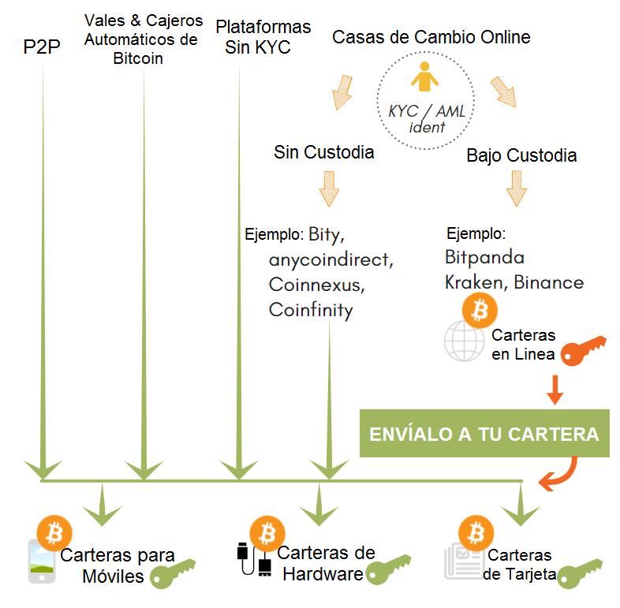

## Explorador de Carteras
Hay una gran variedad de proveedores de carteras y se estarán lanzando más con el tiempo. Tienes que decidir si quieres uno que sea solo para Bitcoin o uno para varias monedas. Cada cartera ofrece diferentes funcionalidades, diferentes niveles de seguridad y niveles de soporte para diferentes conjuntos de monedas. Las siguientes preguntas te ayudarán a elegir el tipo básico de cartera que se adaptará a tus necesidades. Aún tendrás que investigar qué fabricante admite qué monedas.

### Paso 1 - Selecciona un Monedero
**¿Te gustaría poder pagar con esa cartera de forma regular?**
Si no usas un teléfono móvil ni una computadora y no desea enviar pagos, puedes usar la Cartera de Tarjetas. Puedes enviarle bitcoins o ether y guardarlos. Tan pronto como desees reclamar tus monedas, deberás instalar una cartera. Si deseas realizar pagos regulares, entonces una cartera de software, posiblemente en combinación con autenticación de hardware como Trezor o BitBox02, es más apropiada.

**¿Quieres mantener tanto el software como un dispositivo actualizados?**
¿No? Entonces, nuevamente, la Cartera de Tarjetas es la opción correcta para ti. Y no tendrás que preocuparte por el mantenimiento de un dispositivo.

**La cantidad que planeas tener en tu cartera será… ?**
*Similar a lo que llevas en la cartera normal de tu bolsillo*: por lo general, una cartera móvil es suficiente. Es gratis y suficiente para pequeñas cantidades.

*Similar a lo que tienes en tu cuenta bancaria*: entonces usa una cartera de hardware. Las carteras de hardware son muy buscadas en las temporadas alcistas de Bitcoin y, a menudo, se agotan (ten esto en cuenta para tu agenda).

Hay una [guía extendida en el sitio web de Bitcoin.org](https://bitcoin.org/en/choose-your-wallet), que también puedes usar. Te guiará a través de la selección de tu cartera idónea, según el sistema operativo (móvil, computadora de escritorio, cartera de hardware) que elijas.

### Paso 2: Haz una Copia de Seguridad de Tus Llaves
Anota a mano la semilla mnemotécnica: de 12 a 24 palabras en inglés, el nombre, el tipo y la versión del software de tu cartera y guárdala en un lugar seguro (capítulo 5.3).

### Paso 3 - Compra Bitcoin
La mayoría de las carteras incluyen la posibilidad de comprar bitcoins directamente dentro de su interfaz. Los fabricantes de carteras están cooperando con las casas de cambio, que a cambio les pagan una comisión. Sin embargo, si yo necesito usar una casa de cambios, prefiero seleccionar una antes e independientemente de la cartera. De esa manera, me mantengo independiente del tipo de cartera, puedo usar esta casa de cambios para enviar bitcoins a todas mis carteras diferentes y solo tengo que dejar mis datos KYC en esa única casa de cambios, lo que reduce el riesgo de violaciones de datos. Usar métodos libres de custodia, sin KYC (capítulo 7.3) es aún mejor.

 [^72]

[^72]: Anita Posch
