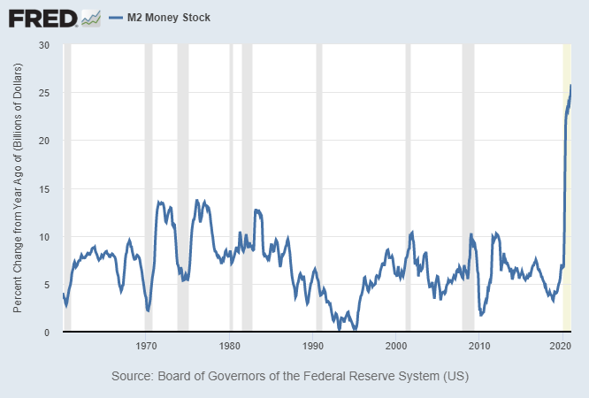

# L’evoluzione del denaro

Bitcoin è nato il 3 gennaio 2009. Sin dalla sua creazione, l’Internet Protocol (IP) Peer-to-Peer di Bitcoin ha collegato nuovi blocchi di dati ad una catena di transazioni approssimativamente ogni 10 minuti. La blockchain di Bitcoin registra le transazioni secondo l'ordine cronologico corretto in modo che non sia possibile alterarlo a posteriori, immutabile come il tempo stesso. Così come il battito cardiaco preserva il nostro corpo, tale processo è preservato da un sistema basato su crittografia, teoria dei giochi, informatica e reti decentralizzate che lo mantiene in equilibrio.

Questo sistema auto-regolato possiede le seguenti caratteristiche:

-   Le transazioni in Bitcoin non possono essere censurate.
-   Bitcoin è immutabile.
-   Bitcoin non può essere contraffatto.
-   Le transazioni in Bitcoin sono estremamente sicure senza la necessità di alcun intermediario, come ad esempio una banca.
-   Le transazioni in Bitcoin sono trasparenti, pubblicamente consultabili e possono essere verificate da tutti.

 [^1]
In un pagamento tradizionale possono esserci fino a sette intermediari prima che il pagamento raggiunga il destinatario. Bitcoin non ne ha alcuno.

-   Bitcoin è una rete neutrale: non giudica e non distingue tra pagamenti “buoni” e pagamenti “cattivi”.
-   Bitcoin è senza autorizazzione: non vi sono sorveglianti che possano impedirne l’uso.
-   Bitcoin è senza confini: può essere utilizzato globalmente.
-   L’Internet Protocol di Bitcoin è un bene comune: appartiene a tutti quanti, non a una singola entità come ad esempio un’azienda.
-   Le regole di Bitcoin vengono applicate attraverso il consenso programmaticamente assicurato di tutte le parti coinvolte.

Bitcoin è il denaro della gente. Bitcoin è l’evoluzione del denaro. È una continuazione dell’inesauribile processo di scoperta di nuove forme di denaro che è sempre stato parte della storia dell’umanità. Nel corso dei millenni, varie nuove forme di denaro sono state scoperte e utilizzate, dallo scambio di beni tra persone a un sistema di credito basato sul sistema aureo, alla valuta fiat fino a giungere all’attuale sistema inflazionistico non coperto da riserve. Il sistema bancario e monetario come lo conosciamo oggi esiste e si evolve da circa 300 anni. È del tutto naturale che, col sorgere di nuove forme di comunicazione via internet, emergano nuove forme di economia e una nuova tipologia di denaro nativa di internet.  

 [^2]

Il denaro crittograficamente programmabile o l'”Internet del denaro” – come definito da Andreas M. Antonopoulos – è inarrestabile. Siamo agli inizi di una nuova era nella storia dell’umanità.   

## Pietre Rai di Yap
Se Bitcoin può sembrarvi incredibile e non riuscite ad afferrare il concetto di blockchain come un registro condiviso della verità, le pietre Rai dell'isola di Yap sono un buon esempio per introdurre alcuni concetti simili.  

Le pietre Rai sono dei grossi dischi di pietra utilizzati nell'isola di Yap, nell’Oceano Pacifico Occidentale (Micronesia). Vengono "coniate" dai depositi calcarei dell'isola di Palau e sono state utilizzate come moneta fino al XX secolo.

 [^3] 

Le pietre Rai venivano trasportate a Yap tramite imbarcazioni e, a causa delle dimensioni e del peso considerevoli, quando erano spese non venivano spostate, ma ne veniva semplicemente cambiato il proprietario. Ogni transazione veniva “registrata” oralmente all'interno della piccola comunità, di modo che la storia della proprietà della pietra diventasse di dominio pubblico. Con il tempo, lo “storico”/“registro” delle transazioni divenne l’unica parte rilevante. Addirittura una volta una pietra cadde dalla zattera che la trasportava verso Yap ed affondò. La pietra venne comunque ritenuta utilizzabile come denaro, dal momento che continuava ad esistere nonostante nessuno potesse vederla o raggiungerla.   

Questo dettaglio è di particolare importanza in quanto dimostra l'utilizzo che avviene in maniera naturale di un registro di transazioni. Il registro era condiviso e tramandato oralmente tra gli abitanti, e poteva attribuire e delegare la proprietà senza che alcuna pietra si muovesse; tutti erano d'accordo, e così si formava consenso. Possiamo quindi fare un paragone con le proprietà della blockchain di Bitcoin; si tratta di un registro condiviso di tutte le transazioni, conservato simultaneamente e globalmente presso migliaia di computer denominati nodi (_“nodes”_ in inglese). [^4]

Un’ulteriore somiglianza con Bitcoin riguarda la creazione delle pietre Rai, che richiedeva lavoro intensivo, alla stregua del sistema di _proof-of-work_. Le pietre venivano ricavate tramite l’impiego di utensili e lavoro manuale, estratte presso località oltremare e poi trasportate nell’isola via zattera. Quando le tecniche moderne resero facile la produzione delle pietre Rai, queste divennero meno utili come moneta, dal momento che non rappresentavano più un indicatore affidabile del dispendio di energia.

Le pietre Rai sono considerate dagli economisti moderni come una forma primitiva di denaro, e sono spesso utilizzate come esempio a supporto della tesi che il valore di alcune forme di denaro può essere attribuito esclusivamente attraverso un sistema di credenze condiviso in tale valore.[^5] Le valute di oggi non sono garantite da alcuna riserva. Di fatto, sono state istituite e dichiarate monete a corso legale tramite disposizioni governative. Di conseguenza, costituiscono i mezzi e le unità di conto che utilizziamo e che  vengono dunque percepiti come aventi valore.  

## Come Viene Creato il Denaro

>"Bisogna aver fiducia nel fatto che la banca centrale non svaluti la moneta, ma la storia delle monete fiat è piena di violazioni di tale fiducia." - Satoshi Nakamoto

Scoprire Bitcoin è stata una rivelazione per me. Ci sono due periodi distinti nella mia vita, un prima di Bitcoin e un dopo Bitcoin. Oggi vedo le cose in maniera completamente differente. Con l’obiettivo di capire bitcoin, in primis ho dovuto comprendere il sistema monetario attuale. Quali sono le differenze tra sistemi monetari come il dollaro statunitense (USD) o l’euro (EUR) e Bitcoin? Cos’è l’inflazione? Che ruolo giocano le banche centrali, e così via? È sconcertante che le scuole non insegnino questi concetti, ma questa specifica mancanza di istruzione potrebbe, sfortunatamente, essere intenzionale.

180 valute vengono utilizzate in 195 Paesi nel mondo. Una valuta è un sistema di denaro di uso comune, stabilito dai governi. Molte giurisdizioni definiscono la propria valuta nazionale come moneta a corso legale; si tratta di denaro che per legge viene dichiarato valido per il pagamento di debiti e che non può essere rifiutato come mezzo di pagamento.

Tutte le 180 valute – il dollaro, l’euro, lo yen e la sterlina, ad esempio – possono essere ascritte alla categoria denominata “valute _fiat_”. Dal 1971 nessuna di questa valute fiat è basata su riserve auree o di altri asset tangibili. Il denaro ha valore perché noi crediamo che lo abbia. Il denaro è un linguaggio che permette di esprimere socialmente il valore delle cose. La parola fiat deriva dal latino e significa “_e così sia_”. Ad oggi il denaro viene creato tramite l'inserimento in un registro digitale, ed è solamente un numero all'interno di un sistema contabile. Non vi corrisponde alcuna generazione di produttività nel mondo reale.

Chi è incaricato della creazione del denaro? È un mix di governi e banche centrali, in concerto con le banche commerciali. È un sistema centralizzato e gerarchico con dei sorveglianti. Non esiste alcun accordo sul limite di erogazione o sul tasso di emissione.

La moneta fiat è _“moneta per decreto“_; è amministrata e gestita in modo coercitivo attraverso l’implicita minaccia di violenza da parte dello Stato. Il valore viene mantenuto dalla creazione di un obbligo fiscale senza fine, che può essere sostenuto solamente dalle valute fiat ed i mercati finanziari amministrati dagli Stati, nonché dalle leggi che definiscono la moneta a corso legale e la politica fiscale.

* Il denaro è creato dalle banche centrali sotto forma di banconote e monete.
* Le banche centrali comprano asset e obbligazioni dal mercato aperto, i liquidi entrano nel sistema.
* Il denaro è creato attraverso stimoli governativi, attraverso bonus, sovvenzioni ed operazioni di salvataggio.
* Il denaro è creato dalle banche commerciali tramite prestiti.

### Il Denaro Viene Creato Attraverso il Debito
Tutti conosciamo l’ultimo punto. È il modo in cui chiediamo un prestito per acquistare un immobile, iniziare un’impresa o comprare un’automobile. La procedura è semplice, ma solamente per chi è già privilegiato. Se non sei in grado di fornire una garanzia collaterale, sei un piccolo imprenditore, non hai un lavoro con un salario fisso, oppure sei una donna in un Paese in cui alle donne è ancora proibito possedere una proprietà, probabilmente non riuscirai ad ottenere un credito dalla banca. Se dovessi riuscire a ricevere il prestito, la banca modificherà il suo registro digitale e aggiungerà la somma del credito nel suo prospetto contabile. A quel punto tu dovrai restituire loro l’ammontare del prestito più il tasso di interesse. Dovrai quindi lavorare o vendere qualcosa in modo da poter ripagare il prestito più il tasso di interesse. È un ottimo affare per le banche. Non aggiungono nulla, ma guadagnano le commissioni sul tuo contratto di prestito e gli interessi quando li ripagherai.  

In aggiunta, c’è uno strumento che si chiama riserva frazionaria bancaria. Questo meccanismo consente alle banche di prestare più denaro di quanto ne abbiano nelle proprie riserve o in giacenza nel proprio conto presso la banca centrale. L’ammontare minimo che le banche devono mantenere sotto forma di asset liquidi, denominato “coefficiente di riserva obbligatoria”, è determinato dalla banca centrale. Questo tasso varia da Paese a Paese. Nell'eurozona, al momento in cui scrivo, la riserva obbligatoria è dell’1%. A marzo 2020, la FED (la Federal Reserve, la banca centrale degli Stati Uniti d’America) ha abolito questo requisito di riserva obbligatoria a causa della pandemia di COVID-19. Canada, Regno Unito, Nuova Zelanda, Australia, Svezia e Hong Kong non hanno alcun requisito minimo in merito alla riserva. Se tutti noi oggi andassimo in banca e chiedessimo di prelevare i nostri depositi, il sistema bancario collasserebbe. Poiché le banche hanno prestato più denaro di quanto ne possiedono, sarebbero impossibilitate a restituirti i tuoi soldi.  

Nel 2020 il debito globale è aumentato dell'incredibile cifra di 24.000 miliardi di dollari fino a raggiungere 281.000 miliardi di dollari, o il 355% del PIL globale. [^6]

### Le Banche Centrali Come Prestatori di Ultima Istanza  
Le banche commerciali possono richiedere ed hanno richiesto assistenza alla banca centrale come prestatore di ultima istanza. Nel 2008/2009 le banche, che erano le responsabili della crisi finanziaria globale, hanno potuto beneficiare di piani di salvataggio. Sono state salvate perché erano considerate _“too big to fail”_ , letteralmente "troppo grandi per fallire". E cos'hanno fatto del denaro ricevuto? Hanno riacquistato azioni delle loro stesse società. Niente è stato riversato "a cascata" nell’economia. Il divario tra ricchi e poveri si è inevitabilmente allargato.

Le banche centrali sono definite prestatori di ultima istanza. L’obiettivo è quello di prevenire le destabilizzazioni economiche che derivano dal panico finanziario, e di impedire che le corse agli sportelli si diffondano da una banca all'altra a casusa della mancanza di liquidità. Attori finanziari come le banche sanno che le banche centrali dovranno salvarle, il che conduce a un rischio morale – l’assunzione di rischi eccessivi da parte sia dei banchieri che degli investitori.

La creazione di denaro artificiale tramite le banche centrali ha fatto passare in secondo piano le distorsioni del mercato. Dal momento che il sistema monetario è stato manipolato e inondato di denaro a basso costo, non c’è più alcun meccanismo razionale di determinazione del prezzo. Normalmente, domanda e offerta determinano il valore di beni e servizi, ma in un mercato distorto e manipolato non c’è possibilità di avere un processo equo di determinazione dei prezzi. La classe media globale sta pagando per l’avidità delle élites finanziarie che, a sua volta, è alimentata da un sistema corrotto di creazione del denaro.

Come individuo, sei mai stato coinvolto in un piano di salvataggio? Se sì, decideresti mai di fare la stessa cosa più e più volte, manipolando il sistema sapendo che esiste un’ultima risorsa che ti salverà sempre? Questo è esattamente ciò che le banche, Wall Street, i fondi speculativi e i loro legali fanno costantemente, assistiti dalle banche centrali ovunque nel mondo.

“Classicamente, le banche centrali mantengono delle riserve da usare in caso di emergenza, fissano dei tassi di interesse, e allocano i propri fondi in modo da stimolare o rallentare le economie a seguito di eventi destabilizzanti come guerre o episodi di panico finanziario. Il ruolo che esse hanno assunto più recentemente è quello di assicurare l’intero sistema finanziario e di influenzare la traiettoria economica di intere nazioni sovrane. Questa è l’antitesi della democrazia. Questa oligarchia monetaria opera al di là delle norme e dei limiti democratici." [^7]

Il libro di Nomi Prins tocca la psiche di Wall Street, rivelando come la struttura stessa del sistema finanziario dipenda fortemente dai trader pronti a buttarsi in massa sulla prossima grande scommessa, incuranti della posta in gioco. Inoltre, sono sempre le _stesse_ persone e famiglie che continuano a saltar fuori, alternandosi tra Wall Street e Washington. Hanno influenzato l’economia sotto di loro dall’alto del loro status, grazie al denaro privato e alle cariche pubbliche, smantellando le leggi che li ostacolavano e usandone altre per trovare scappatoie. Le banche private hanno normalizzato la manipolazione del mercato. Le banche centrali ne hanno fatto un’arte, senza alcun freno." [^8] 

### Inflazione dell'Offerta di Moneta

Prendiamo il dollaro americano come esempio per tutte le monete fiat. A causa dell’inflazione dell'offerta di moneta, maggiore è la disponibilità di dollari, minore è il valore di ogni singola banconota. Immagina una banconota come fosse un prodotto, come ad esempio il rame. Se sul mercato c'è più disponibilità di rame rispetto alla domanda, il prezzo del rame crolla; il suo valore diminuisce. La stessa cosa vale per la tua banconota. Anche il valore delle valute fiat è determinato dal rapporto tra domanda ed offerta. Se si aumenta l'offerta ma la domanda rimane la stessa, il valore di ogni singola unità diminuisce. 

L’offerta di moneta è composta da vari tipi di aggregati monetari classificati con la lettera “M”, quali M0 (base monetaria), M1, M2 e M3. Le loro definizioni potrebbero variare leggermente da Paese a Paese. 

La base monetaria (M0) è l’ammontare totale di una valuta in forma di banconote e monete che siano o in circolazione nelle mani del pubblico oppure sotto forma di depositi che le banche commerciali mantengono presso le riserve della banca centrale. [^9] 

Finché detieni denaro contante, si tratta di un asset al pari di bitcoin, ossia di una proprietà che tu possiedi. Se prendi i tuoi contanti e li depositi presso una banca, ottieni un credito ma non possiedi più quei soldi. Similmente a quello che succede quando detieni bitcoin presso un exchange, ovvero una piattaforma di scambio.

Gli altri aggregati monetari (M1, M2, M3) comprendono forme di credito sulla base monetaria. [^10]

M1 include M0 più i depositi a vista, gli assegni turistici e altri depositi verificabili che siano facilmente convertibili in denaro contante.

M2 comprende M0, M1, i titoli del mercato monetario, i fondi comuni d'investimento ed altri depositi vincolati. Questi asset sono meno liquidi rispetto a M1 e non altrettanto adatti come mezzi di pagamento, tuttavia possono essere convertiti velocemente in denaro contante o in depositi bancari. L’aggregato M2 viene analizzato con attenzione come indicatore dell'offerta di moneta e dell'inflazione futura, oltre ad essere espressione degli obiettivi della politica monetaria delle banche centrali.

La quantità di moneta dell'aggregato M2 in circolazione negli Stati Uniti d’America ammontava a **19.700 miliardi di USD** nel febbraio 2021. [^11] Si noti la crescita nel 2020.

"Accettiamo tutto questo come fosse normale poiché presumiamo che non avrà mai fine. Il meccanismo di riserva frazionaria del sistema bancario ha funzionato in tutto il mondo per centinaia di anni (prima con il sistema aureo, poi basandosi completamente sul denaro fiat), seppure con occasionali eventi inflazionistici lungo la strada che hanno parzialmente risistemato le cose.

Ogni singola unità di valuta fiat si è svalutata di circa il 99% o più nel corso dei decenni. Questo significa che gli investitori hanno bisogno o di guadagnare un tasso di interesse che ecceda il tasso di inflazione reale (il che non sta attualmente accadendo), oppure di fare acquisti strategici come investimenti, in modo da far gonfiare il valore delle azioni e del mercato immobiliare rispetto ai propri flussi di cassa, e così spingendo verso l'alto i prezzi di alcuni prodotti rari come le opere d’arte." [^12]

Si aggiunge all’inflazione dell'offerta di moneta il fatto che la popolazione negli Stati Uniti e nelle altre nazioni occidentali non stia crescendo alla stessa velocità a cui cresce l’offerta di moneta. “In passato, la popolazione americana cresceva circa dell'1.5% annualmente, ora questo tasso si avvicina più allo 0.5% annuo. Questo è un dato piuttosto importante. Nel frattempo, l'offerta di moneta è salita del 25% su base annua, ed è sulla buona strada per aumentare di più del 75% nel corso di cinque anni, in futuro." [^13]

In senso stretto, l’inflazione si verifica quando l'offerta di moneta supera la crescita del PIL nominale, che consiste nella crescita della popolazione e della produttività. L'andamento dell’Indice dei Prezzi al Consumo statunitense mostra che i prezzi dei beni sono saliti mentre il valore della moneta è sceso.
 [^14]

### Schema Ponzi	

> Schema Ponzi: “Una forma di truffa in cui la fiducia nel successo di un'impresa fittizia è incoraggiata dall'ottenimento di guadagni rapidi da parte dei primi investitori, che vengono pagati utilizzando il denaro degli investitori successivi." - **Dizionario Oxford della Lingua Inglese**

I nemici di Bitcoin lo definiscono uno schema Ponzi. Io credo che o non comprendano Bitcoin e cosa sia un vero schema Ponzi, oppure abbiano un tornaconto personale nel caso in cui Bitcoin dovesse fallire. Charles Ponzi fu arrestato negli Stati Uniti nel 1920 per aver ottenuto 20 milioni di dollari da decine di migliaia di vittime. Ciò che prometteva era di duplicare i loro soldi nel giro di tre mesi. In cambio di denaro contante, gli investitori ricevevano delle cambiali che garantivano la restituzione dell’investimento inizialw più il 50% di interesse maturato. Queste cambiali recavano la firma di Ponzi.  Molti le chiamavano le “cambiali Ponzi".

> "Il mio sistema era semplice. Si trattava del vecchio giochetto di rubare a Peter per pagare Paul. Tu mi davi 100 dollari e io in cambio ti davo una cambiale a garanzia di un pagamento di 150 dollari entro tre mesi… Le mie cambiali diventarono più preziose dei soldi americani… Ma poi iniziarono i problemi. L’intero sistema era marcio." - **Charles Ponzi**

Per saperne di più, [ascolta l’episodio del mio podcast sulla vita e storia dell’italiano Charles Ponzi](https://anita.link/ponzi). Lo puoi trovare all’indirizzo https://anita.link/ponzi.

**Caratteristiche di uno Schema Ponzi**

* In uno schema Ponzi troviamo un attore centralizzato, un leader o un'organizzazione che raccoglie investimenti e, alla fine, sparisce. 
* Gli schemi Ponzi non sono revisionabili né trasparenti. Nessuno, tranne l’ideatore, è a conoscenza di cosa accada ai fondi.
* Lo schema Ponzi continua a emettere pagamenti fino a quando il meccanismo si rompe – non c’è limite nell'offerta.
* Difficoltà nel ripagare gli investitori: maggiore è il volume di denaro che fluisce all’interno dello schema, maggiore è la quantità di denaro che deve essere restituito, e maggiore diventa la difficoltà per l’ideatore nel fermare il meccanismo. 
* Il sistema ad un certo punto si rompe, non c’è via di scampo.
* Il truffatore ottiene un guadagno prestando fondi e senza dare un reale contributo alla performance economica del Paese.
* L’avidità è ciò che fa funzionare uno schema Ponzi. I singoli investitori che ci entrano per primi guadagnano gli interessi e lo riferiscono ad altri, che a loro volta desiderano arricchirsi velocemente.

Paragoniamo ora queste caratteristiche col sistema attuale di creazione del denaro.

**Caratteristiche della Creazione della Moneta Fiat**

* Attori centralizzati, come governi, banche centrali e banche commerciali, creano denaro.
* Il sistema monetario non è revisionabile né trasparente.
* Non c'è limite all'offerta monetaria.
* Difficoltà nel ripagare gli investitori: a causa del meccanismo della riserva frazionaria bancaria, se anche solo il 20% dei clienti di una banca richiedesse di prelevare tutti i propri risparmi nello stesso momento, la banca si troverebbe in un grosso guaio e non acconsentirebbe all’operazione. Questo accade regolarmente in tutto il mondo, ed è accaduto ad alcune banche americane agli inizi del 2020 durante il confinamento pandemico.
* Il sistema ad un certo punto si rompe, non c’è via di scampo.
* Le banche ottengono un guadagno prestando fondi e senza dare un reale contributo alla performance economica del Paese.
* L’avidità è ciò che fa funzionare il sistema fiat. Le élites finanziarie ricevono prestiti a tassi agevolati perché possiedono titoli finanziari, prestiti che usano per acquistare ulteriori titoli ed accresce la propria ricchezza ed il proprio potere.

### Il Vero Schema Ponzi

* L’unica similitudine tra Bitcoin e uno schema Ponzi è l’effetto-rete causato dall’avidità. Ma, differentemente da uno schema Ponzi, tu puoi detenere personalmente le chiavi di accesso ai tuoi bitcoin. Non vi è alcuna banca o attore centralizzato che controlli i tuoi bitcoin.

* Bitcoin ha un'offerta limitata: ne saranno creati solamente 21 milioni. Bitcoin è limitato mentre una valuta fiat è infinita. Non ci può essere inflazione dell'offerta di moneta in Bitcoin.

* L’emissione di bitcoin è predeterminata da un algoritmo su cui tutti i partecipanti in Bitcoin hanno concordato e che loro proteggono operando i propri nodi. Non può essere alterata senza il consenso della comunità Bitcoin globale. Considerato che il limite di emissione fissato a 21 milioni di bitcoin è una tra le caratteristiche più importanti di Bitcoin, sarà molto difficile se non impossibile ottenere un accordo volto a mutarlo.

* I banchieri centrali stanno al momento determinando il destino finanziario dei Paesi di tutto il mondo. Non sono stati eletti, ma agiscono come dei governi e tentano di controllare l’intero mercato finanziario. 

* L’effetto Cantillon è stato descritto dall’economista franco-irlandese Richard Cantillon attorno al 1730. Egli suggerì che l’inflazione avviene gradualmente e che la nuova moneta emessa dalle banche ha un effetto localizzato sull’inflazione, ricompensando i banchieri stessi e gli agenti economici a loro vicini attraverso la creazione artificiale di denaro, avvantaggiando solo chi è più prossimo all’origine del denaro. 

> "Le politiche monetarie della FED durante la crisi e dopo la crisi, che furono poi adottate da altre importanti banche centrali, avrebbero dovuto avere un effetto "a cascata" sulle masse. Ciò non è accadduto. Le élites globali lo sapevano allora, e ne sono ancora più consapevoli adesso. Nel gennaio 2017 il World Economic Forum ha ammesso che l’aumento della disuguaglianza è una minaccia per l’economia mondiale. Sono questi collusi a provocare la disuguaglianza, perché ne traggono vantaggi per sé e per la preservazione delle gerarchie di potere mondiali, a discapito di tutto e tutti gli altri." - **Nomi Prins** [^15]

### La Fine di Questo Tipo di Crescita

La disuguaglianza economica è in aumento negli ultimi secoli, assieme alla mercificazione e monetizzazione delle risorse naturali. Nulla è rimasto ancora da consumare. Stiamo vivendo una lotta per le risorse, per pari opportunità contro l’establishment e l’élite che si arricchiscono tramite corruzione e vantaggi finanziari.

"Un ulteriore derivato della crisi finanziaria e della collusione della banca centrale fu l’aumento dell’ansietà economica che contribuì alla generazione di sentimenti nazionalistici, dal Brasile alla Gran Bretagna, fino agli Stati Uniti. Lo shock della Brexit del Regno Unito riecheggiò intorno al mondo quando gli elettori si allontanarono dalla leadership in carica e dalle loro politiche economiche fallimentari. Negli Stati Uniti, la vittoria di Donald Trump, il presidente milionario ‘antiestablishment’ rappresentò un’ulteriore manifestazione del trend. Questa storica votazione non fu una causa diretta delle politiche della banca centrale ma ne fu un effetto." [^16]

Il divario crescente tra ricchi e poveri si basa sull’attuale sistema monetario, che è il reale schema Ponzi. I banchieri della banca centrale non sono eletti democraticamente, tuttavia hanno potere di decidere il destino finanziario del mondo. Banchieri e i loro amici traggono profitto da questo sistema. È giunto il tempo per un’alternativa: una forma di denaro per la gente, che sia decentralizzata, aperta, neutrale, trasparente, immutabile, non-inflazionaria e collaborativa: Bitcoin.

### Il sistema odierno del petrodollaro

Ora che abbiamo discusso su come il denaro viene creato, tuffiamoci nel mondo delle guerre delle valute e come questo sistema di valute nazionali è esclusivo ed è stato storicamente dominato da differenti imperi.

Quella delle guerre delle valute è una lunga storia. “Nel corso del secolo passato, il mondo passò da un sistema aureo, agli accordi di Bretton Woods, al sistema del petrodollaro. Ogni sistema fallì per cause interne anziché essere abbattuto dall’esterno, e ad ogni cambio di sistema si verificò una significativa e diffusa svalutazione monetaria."[^17] 

L’egemonia monetaria britannica durò dal 1871 alla Prima guerra mondiale. Allora, la valuta nazionale era ancorata all’oro. In seguito al periodo interbellico, quando il potere monetario iniziò a decentralizzarsi, gli Stati Uniti emersero come potenza centrale monetaria a seguito della vittoria degli alleati nella Seconda guerra mondiale. Il sistema degli accordi di Bretton Woods, stabiliti nel 1944, rappresentò il primo esempio di un ordine monetario negoziato tra le parti, inteso a regolare le relazioni monetarie tra stati indipendenti. Definì un sistema di regole, istituzioni e procedure per regolare il sistema monetario internazionale quale il Fondo Monetario Internazionale (FMI). Gli Stati Uniti, che controllavano due-terzi dell’oro del mondo, insistettero affinché gli accordi di Bretton Woods si basassero su ambo l’oro e il dollaro statunitense. I rappresentati sovietici parteciparono alla conferenza ma in seguito si rifiutarono di ratificare gli accordi finali, insistendo sul punto che le istituzioni createsi fossero “branche di Wall Street”. Questo episodio può essere interpretato come il punto di partenza della guerra fredda.

Il 15 agosto 1971, gli Stati Uniti, guidati dal Presidente Richard Nixon, soppressero unilateralmente la convertibilità del dollaro americano in oro, mettendo effettivamente la parola fine al sistema degli accordi di Bretton Woods, e rendendo il dollaro una valuta fiat. Allo stesso momento, numerose valute dal cambio fisso (come, ad esempio, la sterlina inglese) mutarono in un sistema fluttuante dal cambio flessibile.

Il sistema monetario odierno è costruito sulla base del petrodollaro. Lyn Alden lo descrive nel suo articolo “La struttura del sistema monetario globale":

"A partire dal 1971, a seguito della soppressione del sistema degli accordi di Bretton Woods, le valute del mondo divennero tutte valute fiat, e il sistema monetario globale venne stravolto. Nella storia umana, questa fu la prima volta in cui le valute del mondo divennero tutte allo stesso momento pezzi di carta non coperti da riserve.

La valuta fiat fa parte di un sistema monetario in cui non vi è alcun valore intrinseco nella valuta in sé e per sé; è solamente carta, monetine metalliche, o bit di informazioni digitali. Ottiene un valore solamente grazie a un governo che invece dichiara che lo abbia, e che la definisce moneta a corso legale atta al pagamento dei beni, tasse incluse.

Un Paese può imporre l’utilizzo di una valuta fiat come mezzo di scambio e unità di conto nell’ambito della propria nazione rendendo le tasse saldabili solamente in tale valuta, oppure emanare leggi volte ad aggiungere frizione, o in qualche caso bandire, altri mezzi di scambio e unità di conto. Tuttavia, se la valuta comincia ad avere problemi rilevanti, come nel caso di molti mercati emergenti, si svilupperà un mercato sotterraneo di altri mezzi di scambio quali valute estere o beni tangibili.

Una valuta fiat può rappresentare un problema particolare quando si è intenzionati ad utilizzarla fuori dai confini nazionali. Qual è il motivo per imprese e governi di accettare pezzi di carta non coperti da riserve che possono essere stampati senza soluzione di continuità da un governo estero, come forma di pagamento per i loro preziosi beni e servizi? Qual è il valore, se non sono convertibili? Per quale motivo venderesti petrolio a stranieri in cambio di carta?

Agli inizi degli anni ’70 vi erano svariati conflitti geopolitici inclusa la guerra dello Yom Kippur e l’embargo del petrolio dell’OPEC. Nel 1974, tuttavia, gli Stati Uniti e l’Arabia Saudita raggiunsero un accordo e, da allora, il mondo si assestò nell’ambito del sistema del petrodollaro; un modo scaltro affinché il sistema globale di valute fiat funzionasse decentemente… Col sistema del petrodollaro, l’Arabia Saudita (e gli altri Paesi dell’OPEC) vendeva il proprio petrolio esclusivamente in dollari, ottenendo in cambio protezione e cooperazione da parte degli Stati Uniti. Se ad esempio la Francia volesse acquistare petrolio dall’Arabia Saudita, lo dovrà fare utilizzando dollari… In cambio, gli Stati Uniti dispiegheranno la propria marina militare a protezione dei canali commerciali globali, e preserveranno lo status quo geopolitico tramite azioni militari o eventualmente la minaccia, a proprio piacimento… Alcuni di noi, in particolare coloro che maggiormente sono più vicini allo scalino più alto della scala del reddito, beneficiano di questo sistema, direttamente o indirettamente. Quegli americani il cui lavoro gravita attorno alla finanza, alla carica pubblica, alla sanità, e alla tecnologia godono dei molti benefit di vivere all’interno di una potenza egemonica, senza alcuno svantaggio. D’altra parte, però, gli americani che producono prodotti fisici e tangibili tendono a non beneficiarne, poiché hanno perso il loro lavoro oppure hanno soppresso il proprio reddito, e pertanto non hanno beneficiato dei guadagni. E fuori dagli Stati Uniti, i Paesi che fanno export beneficiano del sistema, mentre i Paesi a cui non piace come è strutturato il sistema monetario globale non hanno altre opzioni o possibilità per far qualcosa al riguardo, fatto salvo diventare una potenza al pari di Russia e Cina."[^18]

Da decenni siamo in una guerra di valute. Quale valuta è più forte? Quale Paese può godere di maggiori benefit nel manipolare la propria valuta? L’euro, il dollaro americano, lo yuan cinese? Oppure Diem di Facebook? La moneta privata delle corporazioni è il nuovo player nel mercato. Per mantenere i propri poteri, le banche centrali hanno iniziato a lavorare sulle proprie valute digitali (CBDC – Central Bank Digital Currency).

 [^19]

Bitcoin è la nostra alternativa in risposta a questo sistema. Proteggere la nostra privacy in quest’era digitale, votare contro l’abuso del potere monopolistico del sistema attuale, e dare alle persone che vivono in regimi autoritari di dittatori corrotti le stesse opportunità di partecipare al sistema economico. Bitcoin è una strategia di difesa, uno strumento tramite il quale possiamo preservare il diritto umano di libertà di transazione e di privacy.

[^1]: [Illustration NetGuardians retrieved April 2017](https://www.netguardians.ch/ngfintechblog/2016/11/17/blockchain-explained-part-1)  
[^2]: Anita Posch, credits: University of Nicosia, MOOC in Digital Currency, “A brief history of money” with image: Lotus Head, CC BY-SA 3.0, wikimedia.org  
[^3]: Image: "Stone Money of Uap, Western Caroline Islands." - Dr. Caroline Furness Jayne took this photograph during a 1903 stay on Yap, Public domain, via Wikimedia Commons  
[^4]: [Wikipedia Rai stones](https://en.wikipedia.org/wiki/Rai_stones)  
[^5]: [University of Nicosia, Introduction to Digital Currencies, Session 1, p. 15]  
[^6]: [Debt to GDP ratio, JS Blokland](https://twitter.com/jsblokland/status/1362138620665221122?s=20)  
[^7]: Collusion, by Nomi Prins, Bold Type Books, 2019, p. 7.  
[^8]: Collusion, by Nomi Prins, Bold Type Books, 2019, p. xvii  
[^9]: [Monetary Base](https://www.investopedia.com/terms/m/monetarybase.asp)  
[^10]: [Global Monetary Base, Crypto Voices](https://cryptovoices.com/basemoney)  
[^11]: [FRED, M2 Money Stock](https://fred.stlouisfed.org/graph/?graph_id=248494)  
[^12]: [Lyn Alden, Ponzi scheme](https://www.lynalden.com/bitcoin-ponzi-scheme/)  
[^13]: [Lyn Alden](https://twitter.com/LynAldenContact/status/1362912907659522049?s=20)
[^14]: [US Consumer Price Index](https://fred.stlouisfed.org/series/CPIAUCSL)
[^15]: Collusion, by Nomi Prins, Bold Type Books, 2019, p. 253.
[^16]: Collusion, by Nomi Prins, Bold Type Books, 2019, p. 249.
[^17]: [Lyn Alden, The Structure of the Global Monetary System](https://www.lynalden.com/fraying-petrodollar-system/)
[^18]: [Lyn Alden, Petrodollar System (1974-Present)](https://www.lynalden.com/fraying-petrodollar-system/)
[^19]: Anita Posch
