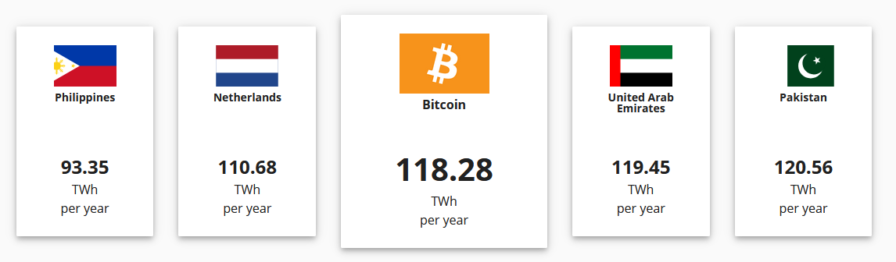
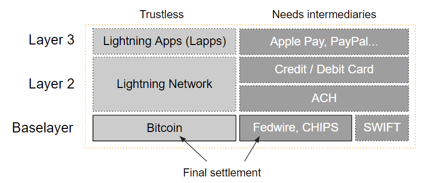

### L’impronta ecologica di Bitcoin
_Bitcoin consuma molta energia, la crisi climatica aumenterà ed è un atteggiamento irresponsabile._

 [^35]

La schermata precedente è stata catturata da una pubblicazione di Newsweek durante il bull run del 2017-2018. Si basa sul lavoro di Alex de Vries (_Digiconomist_), un data analyst della Banca dei Paesi Bassi. Svariati paper di ricerca e articoli di media mainstream si basano sulle sue false supposizioni, come comparare il consumo energetico delle transazioni di Bitcoin con i pagamenti di Visa, e calcolandone l’impronta ecologica. Io sostengo che molta della sua produzione sia mossa dal tentativo di diffondere false affermazioni col fine di demonizzare Bitcoin.

> "Ogni qualvolta si verifica un rally di Bitcoin, notiamo tutta questa attenzione negativa in merito all’impatto ambientale di Bitcoin. Apparentemente conta solo quando il prezzo è alto." - **Andreas M. Antonopoulos**

Addentriamoci nel tema. I critici di Bitcoin spesso menzionano il fatto che il consumo energetico di Bitcoin supera i benefici che crea. È indubbio che il mining di Bitcoin richiede molta energia elettrica. Viene stimato che tra 80 e 118 TWh all’anno siano usati globalmente per il mining, il che è equivalente all’intero consumo energetico di nazioni quali i Paesi Bassi.

 [^36]

Il mondo consuma molta energia elettrica. L’ammontare di elettricità consumata ogni anno solamente negli Stati Uniti da dispositivi casalinghi sempre accessi seppur inattivi, potrebbe alimentare la rete di Bitcoin per 1.9 anni. Ciò sta a significare che l’ammontare di energia sprecata negli Stati Uniti potrebbe quasi alimentare la rete di Bitcoin per due volte, anno dopo anno. [^37]

Allo stesso tempo, due-terzi di tutta l’energia prodotta negli Stati Uniti viene persa. È ragionevole presupporre che ciò accada anche in altre parti del mondo.

 [^38]

Si noti che l’energia sprecata ammonti a circa il 62% di tutta l’energia generata. L’energia sprecata è energia che è prodotta ma in ultima istanza non viene incanalata verso lavoro utile. A peggiorare la situazione, nel tempo questo numero è aumentato su base relativa. Nel 1970 il Lawrence Livermore National Laboratory scoprì che la proporzione di energia rigettata ammontava a circa il 48%. [^39]

Per dirla in un altro modo, Bitcoin rappresenta lo 0.54% di tutta l’energia elettrica usata globalmente.
 [^40]

**Consumo di energia elettrica facile da quantificare**  
La trasparenza di Bitcoin permette di stimarne la domanda energetica, piuttosto in contrasto con altre industrie in cui questi dati rimangono oscuri. Solamente sulla base dei costi dell’elettricità, possiamo presumere che su scala globale Bitcoin sia [decisamente più efficiente](https://medium.com/@danhedl/pow-is-efficient-aa3d442754d3) del sistema bancario tradizionale e dell’attività di estrazione dell’oro.

Viene stimato che il costo in dollari per Gigajoule speso del mining di Bitcoin sia 40 volte più efficiente del sistema bancario tradizionale e 10 volte più efficiente dell’estrazione dell’oro.

 [^41]

**Perché Bitcoin necessita di tale ammontare di elettricità?**  
La proof-of-work, il meccanismo di mining, è una caratteristica fondamentale che mette in sicurezza l’indipendenza, la neutralità e l’integrità automatizzata della rete. È il metodo più sicuro per prevenire gli attacchi agli asset registrati nel network dal valore di oltre 600 miliardi di dollari americani. (capitalizzazione di mercato di BTC, giugno 2021)

Bitcoin può riconciliare le transazioni senza intermediari poiché dell’hardware dedicato specializzato fornisce una prova trasparente che un computer ha eseguito un calcolo energeticamente impegnativo.

Il proof-of-work permette di ancorare il denaro digitale nel mondo reale. Come spiegato da Hugo Nguyen di Chaincode Labs, “Sotto la superficie, il mining tramite proof-of-work traduce energia cinetica (elettricità) in un registro a blocchi. Connettendo energia ad un blocco, gli si conferisce una ‘forma’, consentendogli di avere un peso concreto e delle conseguenze nel mondo fisico." [^42]

Inoltre, la proof-of-work è il solo meccanismo che permette una generazione di monete equamente distribuita e decentralizzata, quando invece altri metodi richiedono un’iniziale distribuzione dei token ed eventi di generazione dei token che permettono ad attori centralizzati di trarre vantaggio di monete pre-coniate (_proof-of-stake_).

**Assunto #1: Per effettuare una singola transazione sono necessari x kilowatt**  
Questo assunto è matematica fallace. Il consumo energetico di bitcoin non è correlato al numero di transazioni. Il numero di transazioni che accadono _on-chain_ e quelle che accadono _off-chain_ – ad esempio su tecnologie second layer come Lightning Network, oppure attraverso exchange _custodial_ che raggruppano una serie di transazioni – non sono correlate al costo di mining. L’80-90% del mining è spinto dal prezzo di bitcoin, mentre il restante 10-20% è spinto dalle fee di commissione. Maggiore è la possibilità del miner di trarre profitto, maggiori le possibilità che i miner si organizzino nella costituzione di infrastrutture adibite al mining, e quando il prezzo crolla alcuni di loro fermeranno i macchinari. Nel lungo termine, quando tutti i 21 milioni di bitcoin saranno minati, le fee di commissione saranno l’unico driver del mining. Solamente a quel punto l’intensità di transazione potrà essere correlata al consumo energetico. Ma oggi non è così, l’ultimo satoshi sarà minato nel 2140. Il mining è competizione in un libero mercato in cui la difficoltà si regola dinamicamente. Non ha nulla a che vedere col numero di transazioni che vengono processate. Il mining è un meccanismo di sicurezza. È relativo a quanta sicurezza il mercato alloca nel sistema, e dunque maggiore è la spesa energetica, maggiore sarà la sicurezza del sistema, e quando il prezzo di bitcoin sale, così aumenterà naturalmente la spesa economica allocata per la sua protezione. Pertanto, il consumo e la maggior adozione fungono da addizionale incentivo finanziario per i miner a consumare maggior energia con l’obiettivo di produrre maggior sicurezza.

**Assunto 2: Regressione lineare**  
Un secondo assunto fallace è fare una regressione lineare ed asserire che, se sono necessari x kilowatt di energia per effettuare una transazione oggi, e abbiamo sette miliardi e mezzo di individui nel pianeta che vogliono effettuare una transazione al giorno, dunque il futuro consumo energetico di bitcoin sarà y. Questo è falso. Bitcoin non scala linearmente in termini di transazioni in ragione dei limiti imposti dalla dimensione del blocco al livello base. Per mitigare questa limitazione, entrano in gioco il protocollo second layer di Lightning Network o anche sidechain - catene laterali – quale Liquid, che consentono migliaia di pagamenti senza la necessità di ulteriore consumo energetico. L’efficienza dell’attrezzatura per il mining è in costante aumento. I miner necessitano sempre più di minor energia per lo stesso ammontare di prestazione computazionale nel tempo. In aggiunta, gli sviluppatori di Bitcoin ne perfezionano il codice minimizzando la dimensione dei dati delle transazioni di modo che un maggior numero di transazioni possano essere minate in un singolo blocco.

**Assunto 3: Comparare Visa con Bitcoin**  
Una transazione on-chain di Bitcoin non può essere comparata con un pagamento tramite il circuito Visa. Non è la stessa cosa. Nel sistema bancario tradizionale vi sono vari livelli di riconciliazione che differiscono in grado di sicurezza e finalità. Prendiamo come esempio il sistema americano, comparabile ad altri sistemi globali. Il livello base è costituito da Fedwire e i sistemi CHIPS e SWIFT, mentre i pagamenti tramite carte di debito e di credito operano su uno o due livelli superiori, in aggiunta ad ulteriori intermediari. Il livello base di Bitcoin deve essere comparato con Fedwire, CHIPS e SWIFT. Soluzioni di secondo livello come i micropagamenti rapidi sul Lightning Network possono essere comparati a Visa.

 [^43]

Guardiamo ora al volume di transazioni medio di Visa e Bitcoin.

 [^44]

 [^45]

Il valore medio delle transazioni in bitcoin era 258,766 USD al 21 aprile 2021, mentre la transazione media via Visa era di 91 USD nel 2012.  Le transazioni di Bitcoin trasportano un valore di un ordine di grandezza decisamente maggiore rispetto ai pagamenti in carta di credito. Presumendo il fatto che un giorno Bitcoin venga adottato in massa, sarà dunque possibile trasferire valori di milioni di dollari al pari del sistema Fedwire ma a costi di transazione molto contenuti se comparati col sistema bancario.

Il valore medio delle transazioni Fedwire ammontava a 4.5 milioni USD a febbraio 2021. [^46]

 [^^47]

I _settlement_ delle transazioni in Bitcoin avvengono ogni 10 minuti, 24 ore al giorno, 365 giorni all’anno. Comparalo alle transazioni ACH (_automated clearing house_) che possono anche impiegare fino a due anni per essere completate. [^48] E non si dimentichi: Bitcoin e le transazioni Lightning sono permissionless e trustless – senza bisogno di autorizzazioni e in assenza di fiducia - mentre il sistema di pagamento tradizionale funziona perché attori intermedi controllano frodi e riaddebiti.

**Assunto 4: Equiparare il consumo energetico con l’inquinamento**  
Viene spesso detto che, ad esempio, “ogni transazione crea inquinamento” o “l’inquinamento causato di bitcoin è in aumento” oppure “bitcoin produce inquinamento a causa del proprio consumo energetico” – tutto ciò non è vero. Non c’è relazione diretta tra consumo d’energia ed inquinamento perché essa è interamente dipendente dal tipo di energia impiegata. Se stai producendo energia tramite l’uso del carbone, dunque stai inquinando e causando un impatto ambientale. Se produci energia tramite dighe idroelettriche, impianti eolici o solari, dunque non stai effettivamente inquinando. Al contrario, stai di fatto sostenendo tali fonti di energia alternative ed incentivando la creazione di più impianti solari, eolici, geotermali, di degassamento, e di altre forme energetiche attraverso l’applicazione di bitcoin come fattore economico nella produzione di tale energia.

I miner sono spinti dal profitto, pertanto hanno una costante tendenza a ricercare fonti energetiche più convenienti come le soluzioni rinnovabili. Carbone e petrolio saranno sempre più costosi dell’idroelettrico, del geotermale, del gas remoto, dell’eolico e del solare. Senza dimenticare l’energia nucleare, un’opzione che molti definiscono green.

Senza dubbio, i miner di Bitcoin sfruttano energia che altrimenti verrebbe sprecata. Ho discusso con [Sébastien Gouspillou](https://anita.link/103) e [Philippe Bekhazi](https://anita.link/101), due miner che impiegano energia idroelettrica e che confermano le dichiarazioni precedenti.

**Mix energetico della produzione di elettricità**  
I miner di Bitcoin sono ben distribuiti tutt’attorno al globo. Sebbene sia semplice quantificare la richiesta di elettricità, è molto più complesso quantificarne le fonti considerando che l’industria del mining di Bitcoin rimane privata e pseudoanonima. Pertanto, la ricerca sull’elettricità in uso nel mining fornisce una stima che l’impiego di energie rinnovabili vari dal 39% (Cambridge Center, CBECI.org) al 73% secondo il white paper sul mining di CoinShares, che asserisce:

"Utilizzando una combinazione delle stime di localizzazione del mining globale con le penetrazioni regionali delle energie rinnovabili, evinciamo che l’industria del mining di Bitcoin sia fortemente guidata dalle rinnovabili. La nostra approssimazione della percentuale della produzione di energia rinnovabile nel mix energetico del mining di Bitcoin ammonta al 73%, circa quattro volte la media globale. Complessivamente, la nostra scoperta riconferma il punto di vista che l’industria del mining di Bitcoin agisce in qualità di acquirente globale di ultima istanza di elettricità, e pertanto tende a raggrupparsi presso infrastrutture di energie rinnovabili relativamente sottoutilizzate. Ciò può aiutare a convertire in progetti lucrativi i servizi rinnovabili in perdita, e nel tempo – con la maturazione di un’industria che si radica nell’opinione pubblica - potrebbe innescare nuovi sviluppi sulle rinnovabili in località che prima erano considerate antieconomiche." [^49]

La domanda non deve essere quanta energia sia necessaria, ma come l’elettricità venga prodotta. Quanto CO2 viene emesso. Se come società decidiamo che non vogliamo inquinare, dunque dovremmo regolare la produzione dell’energia stessa e non consentire l’uso di sistemi inquinanti. Si tratta di normare la produzione dell’energia, non di regolare il consumo dell’energia in un settore specifico dell’economia che guarda caso riguarda Bitcoin.

Bitcoin impiega un ammontare di elettricità proveniente dalle rinnovabili più alto della Cina, gli Stati Uniti e il mondo intero.
 [^50]

**Emissioni CO2**  
Alcune ricerche hanno tentato di calcolare i flussi di emissioni CO2 e la sostenibilità di Bitcoin stimando l’offerta futura, basandosi su assunti fallaci. Un paper, ad esempio, dichiara che: “È previsto che il consumo energetico annuale della blockchain di Bitcoin in Cina raggiunga il culmine di 296.59 Twh nel 2024, generando 130.50 milioni di tonnellate metriche di emissioni CO2." [^51]

> "Fa risuonare un immediato campanello d’allarme il fatto che gli autori dichiarino con fiducia le future emissioni CO2 di Bitcoin con precisione centesimale, quando realisticamente tale ammontare può solamente essere stimato entro un ordine di grandezza.", ha dichiarato **Nic Carter**. [^52]

In base al [lavoro di Hass McCook](https://bitcoinmagazine.com/business/bitcoin-vs-financial-sector-energy-use) Bitcoin emette meno del 2% del complesso militare-industriale nel mondo, e meno del 5% delle emissioni CO2 del settore finanziario tradizionale. Le emissioni di gas serra annuali a livello globale ammontano circa a 50,000 milioni di tonnellate di CO2 equivalente. Bitcoin ne emette solamente lo 0.11%.

 [^53]

**Ultimo assunto: Bitcoin è inutile, pertanto l’impiego energetico di un singolo bitcoin è uno spreco**  

Se ritieni che Bitcoin sia inutile, dunque questa è un’opinione soggettiva. Bitcoin potrebbe non aver senso per te, ma potrebbe aver senso per molte altre persone. Se sollevi l’argomento energetico, devi convenire che vi sono molte altre forme di impiego energetico che a prima vista sembrino inutili o perfino dannose, e non ricevano il medesimo livello di scrutinio.

Possiamo accendere miliardi di luci natalizie ogni anno per esibire lo spirito festivo, e ciò potrebbe essere ritenuto completamente inutile da miliardi di persone di altro credo. Negli Stati Uniti, il primato per consumo energetico al di fuori dei mercati civili è del Dipartimento della Difesa. Il governo americano consuma importi enormi di energia e risulta il più grande inquinatore nel Paese, probabilmente non per ragioni legittime se non il conseguimento del controllo totale.

 [^54]

Ciò ci riporta al capitolo in cui si è discusso del petrodollaro e del collegamento tra il dollaro americano e l’OPEC, che rende gli Stati Uniti d’America la potenza dominante a livello globale ed è assicurata dalle forze armate statunitensi e dalle guerre nella regione del Golfo.

La macchina della guerra è cosa utile per la nostra società? Prima di fornire tesi benaltriste e dire che non sia possibile comparare due elementi così lontani l’uno con l’altro, e volere la riduzione della macchina della guerra come dell’uso di bitcoin, non scordare che c’è un fattore molto importante da tenere in considerazione. La macchina della guerra globale è finanziata direttamente dal debito in fiat prodotto e pagato tramite l’inflazione, abilitata a sua volta dall’incontrollata attività della banca centrale di stampare moneta, che va a danno tuo e dei contribuenti, che ne state pagando il conto. Bitcoin non è solamente una soluzione per un’economia aperta, è una soluzione che frena i governi dal produrre moneta a frequenze irragionevoli sfruttando l’inflazione come una forma nascosta di tassazione per finanziare la macchina della guerra, che in ultimo inquina e danneggia più di qualsiasi altra cosa in esistenza. Bitcoin non è semplicemente un sostituto per le attività economiche a livello generale, è anche una protesta contro la macchina della guerra che inquina e consuma energia col fine di recare morte. Pertanto, a mio avviso questi due fattori sono strettamente legati l’uno con l’altro. Ma questa è solamente un’opinione mia e di Andreas M. Antonopoulos.

**Conclusione: i benefit di Bitcoin**  

In Venezuela ho conversato con una persona che e` stata salvata dalla fame tra il 2016 e il 2019 grazie a Bitcoin. Bitcoin salva letteralmente la vita! Cosa può essere più utile di così?

Bitcoin è non censurabile ed incorruttibile, e permette l’accesso a miliardi di persone ad un sistema monetario globale al di là di colore della pelle, genere, patrimonio e status. Inoltre, è la nostra unica possibilità per assicurarci privacy finanziaria, o comunque lo pseudonimato, in un mondo di sorveglianza digitale.

La rete di Bitcoin conserva asset per circa 100 milioni di utenti a livello globale, per un valore di oltre 600 miliardi di dollari americani (a giugno 2021) senza tetto limite, e non si appoggia a potere militare o guerre di valuta.

In conclusione, come dichiarato da ARK Invest: “Contrariamente al pensiero comune, noi crediamo che l’impatto ambientale del mining di bitcoin sia irrilevante. Le energie rinnovabili, particolarmente l’energia idroelettrica, contano per la maggior percentuale del mix energetico di bitcoin. Come notato da Nic Carter, partner di Castle Island Ventures, ‘nella loro costante ricerca della forma di energia più conveniente, i miner continueranno ad affluire verso quelle regioni che offrono soluzioni di elettricità rinnovabile, sbloccando quelle risorse energetiche fino ad ora inutilizzate agendo come acquirenti di elettricità di ultima istanza, e creando una domanda base altamente mobile per qualsiasi fonte di energia elettrica in grado di offrire prezzi inferiori degli attuali produttori, indipendentemente dall'ubicazione’. Di conseguenza, il mining di bitcoin potrebbe risultare in un netto positivo da un punto di vista climatico." [^55]

[^35]: [Source Newsweek, 12/11/2017](https://www.newsweek.com/bitcoin-mining-track-consume-worlds-energy-2020-744036)  
[^36]: [Source Cambridge Center for Alternative Finance, March 2021](https://cbeci.org/cbeci/comparisons/)  
[^37]: [Cambridge Center for Alternative Finance](https://cbeci.org/cbeci/comparisons/)  
[^38]: [Source Energy Flow Chart, Lawrence Livermore National Laboratory](https://flowcharts.llnl.gov/)  
[^39]: [Conner Brown, Bitcoin: a bold american future](https://journal.bitcoinreserve.com/bitcoin-a-bold-american-future/)  
[^40]: [Cambridge Center for Alternative Finance, March 2021](https://cbeci.org/cbeci/comparisons/)  
[^41]: [Source, ARK Invest, Bitcoin myths](https://ark-invest.com/articles/analyst-research/bitcoin-myths/)  
[^42]: [ARK Invest Bitcoin myths](https://ark-invest.com/articles/analyst-research/bitcoin-myths/)  
[^43]: [Source Statista](https://www.statista.com/statistics/881541/bitcoin-energy-consumption-transaction-comparison-visa/)  
[^44]: [Source Statista](https://www.statista.com/statistics/279308/average-credit-card-transaction-value-worldwide/)  
[^45]: [Source BitInfoCharts](https://bitinfocharts.com/comparison/bitcoin-transactionvalue.html#1y)  
[^46]: [Source The Federal Reserve Services](https://frbservices.org/resources/financial-services/wires/volume-value-stats/monthly-stats.html)  
[^47]: Anita Posch  
[^48]: [Caitlin Long](https://twitter.com/CaitlinLong\_/status/1384925713648734212?s=20)  
[^49]:[CoinShares, Bitcoin Mining Whitepaper 2019](https://coinshares.com/research/bitcoin-mining-network-december-2019)  
[^50]: [Source: Hass McCook](https://bitcoinmagazine.com/business/what-elon-musk-gets-wrong-about-bitcoin)  
[^51]: [Nature communications](https://www.nature.com/articles/s41467-021-22256-3)  
[^52]: [Nic Carter, On Bitcoin, the Gray Lady Embraces Climate Lysenkoism](https://medium.com/@nic__carter/on-bitcoin-the-gray-lady-embraces-climate-lysenkoism-a2d31e465ec0)  
[^53]: [Source Annual Greenhouse Gas Emissions, Hass McCook, June 2021](https://bitcoinmagazine.com/culture/bitcoin-vs-world-military-emissions)  
[^54]: [Source Statista](https://www.statista.com/chart/18359/estimated-military-carbon-dioxide-emissions/)  
[^55]: [ARK Invest Bitcoin myths](https://ark-invest.com/articles/analyst-research/bitcoin-myths/)  
