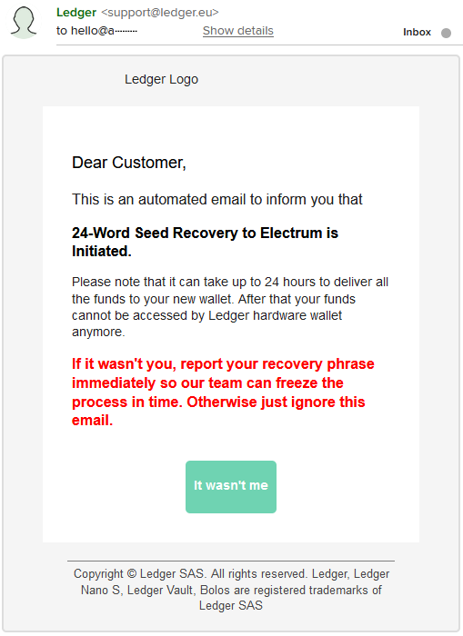

# Mettere al sicuro le tue coin

## Misure di sicurezza
Tutti i database possono essere attaccati da hacker. Fai una ricerca della tua email presso https://haveibeenpwned.com/ - se sei fortunato non sei stato compromesso, ma miliardi di altri account lo sono stati. Pertanto, è importante seguire misure di sicurezza generali, che a maggior ragione devono essere applicate quando si utilizza Bitcoin.

### Setup dell’hardware e del software
Puoi utilizzare browser popolari quali Firefox, Opera, Brave or Chrome. Le estensioni del browser che bloccano Javascript e i Cookies sono raccomandati. Ghostery, NoScript e ScriptSafe sono quel tipo di estensioni che puoi aggiungere al tuo browser. "HTTPS everywhere" applica una connessione SSL a tutti i siti web, inclusi quelli che non offrono SSL nativamente.

Presta attenzione che alcuni punti vendita online non funzionano al meglio se queste estensioni sono attivate, pertanto dovrai disattivarle manualmente.

È importante che tu mantenga sempre i tuoi dispositivi in sicurezza.

### Aggiornamenti
Questo consiglio è applicabile per tutti i tuoi dispositivi: esegui sempre tutti gli aggiornamenti del software. Sia del sistema operativo del tuo computer sia del tuo smartphone. Utilizza sempre l’ultima versione del tuo software wallet e aggiorna il  firmware del tuo wallet hardware.

### Indirizzi email
Non usare una singola email per tutto. Prepara delle email usa e getta che userai solamente una volta. Puoi anche acquistare un dominio che potrai usare per indirizzi email falsi, e che inoltrerai al tuo indirizzo principale.

### Password sicure
Utilizza password sicure per tutti i servizi online che fruisci. La data di compleanno, il luogo di residenza, il nome del tuo gatto o 1234567 non sono password sicure. Frasi intere che includono numeri, spazi, lettere maiuscole e minuscole, e caratteri speciali sono password più forti.

Utilizza una password differente per ogni sito in cui fai login. Altrimenti, con una sola password, un hacker può irrompere in tutti i servizi cui sei registrato. Non conservare queste password in un file Word o similare nel tuo computer. Un documento Word è semplice da rubare e leggere per un hacker.

Puoi utilizzare programmi quali 1Password, Bitwarden o KeePass (gratuito e open source). Sono dei database di password criptate che permettono la generazione e conservazione delle tue password, di cui tu dovrai solamente ricordartene una per potervi accedere.

### PIN
Configura un PIN per il tuo wallet di modo che nessuno potrà accedere facilmente al wallet nel tuo dispositivo.

### 2FA
Utilizza un metodo di autenticazione a due fattori per mettere al sicuro i tuoi account. Non usare l’SMS/messaggio di testo come secondo fattore per il metodo di autenticazione a causa degli attacchi di _SIM swapping_. Invece, installa nel tuo smartphone un autenticatore che impiega OTP (_one-time password_, una password monouso) o TOTP (_time-based one-time password_, password monouso basata sul tempo).

### SIM Swapping
Il SIM swapping avviene quando qualcuno si appropria e devia la tua SIM e il tuo numero di telefono. L’attaccante può usare il tuo numero di telefono per accedere a tutti gli account associati a tale numero, e in quelli in cui hai attivato un metodo di autenticazione a due fattori con SMS/messaggio di testo. Il SIM swapping è un attacco col fine di entrare nella tua email primaria. Se l’attaccante accede alla tua email primaria associata al tuo 2FA, che è a sua volta associato al tuo numero di telefono, possono individuare tutti gli account degli exchange di Bitcoin in cui sei registrato col 2FA, e svuotarli.

L’attacco è spesso effettuato partendo da una chiamata telefonica al servizio clienti del tuo fornitore telefonico (Vodafone, Wind, TIM, ...). Dicono al telefono qualcosa come “Sono il proprietario del numero di telefono, ho perso il telefono, trasferite cortesemente il mio numero alla mia nuova SIM”. L’operatore del servizio clienti chiederà qualche informazione personale per verificare l’identità. Gli attaccanti si avvarranno di alcuni stratagemmi a loro disposizione. Inganneranno l’operatore al fine di ottenere piccole informazioni, attaccheranno la telefonata e richiameranno un altro operatore utilizzando quel frammento di informazione col fine di ottenerne altre. Continueranno con questo stratagemma fino a quando otterranno sufficienti informazioni per persuadere l’operatore che siano di fatto il titolare dell’account, e la SIM verrà dunque trasferita.

Accederanno a tutti gli exchange crypto dove potresti aver attivato un conto associato al tuo indirizzo email e numero di telefono.

Una volta a conoscenza della tua email, tenteranno di cambiare le password tramite la funzione “password dimenticata”. I migliori siti web non forniranno informazioni sull’esistenza di un account. Gli attaccanti tenteranno il reset della password o proveranno ad ottenere una verifica tramite messaggio di testo.

**Cosa puoi fare – Esempio con Gmail**
Blocca l’account della tua email primaria e rimuovi il numero di telefono associato al tuo account email (ad esempio Gmail). Qui puoi vedere come si fa: [https://anita.link/removegmail](https://anita.link/removegmail). Usa una password differente per ogni account tu abbia in ogni sito o servizio. Come utente Gmail, puoi iscriverti al Google Advanced Protection Program, che ti difende contro attacchi online mirati.

## Attacchi phishing
Nel 2020, il database marketing del produttore francese Ledger ha subito un attacco hacker. I dispositivi non sono stati compromessi, tuttavia migliaia di dati tra indirizzi email, numeri telefonici e perfino indirizzi residenziali dei loro clienti sono stati sottratti e rilasciati nel web. Questo è disastroso, in quanto ci sono alte probabilità che chiunque avesse ordinato un wallet hardware possieda anche bitcoin. Nello scenario peggiore, qualcuno verrà a “visitarvi” a casa. Più probabilmente, riceverete minacce via email e attacchi di phishing. Per evitarlo, tieni a mente che non hai bisogno di utilizzare il tuo indirizzo fisico per la spedizione di un prodotto bitcoin, come ad esempio un wallet hardware. Puoi richiedere una cassetta postale per te. Negli Stati Uniti ci sono servizi che consentono di ricevere pacchi postali commerciali a tuo nome (CMRA). Se possibile, non utilizzare nemmeno il tuo nome reale quando fai acquisti. Procurati un numero di telefono secondario ed utilizza questo nel caso il venditore lo richieda. Fornisci un indirizzo email usa e getta che utilizzerai al fine esclusivo di questo specifico ordine.

Gli attacchi di phishing sono tentativi di manipolarti e spaventarti al punto di portarti ad inserire il tuo seed presso il sito dell’hacker. Ad esempio, potresti ricevere un’email che recita: “Il tuo dispositivo Ledger è stato corrotto o disattivato, visita questo link ed inserisci le tue 12 parole seed per salvare i tuoi fondi,” oppure “Abbiamo rilevato un largo prelievo dal tuo Ledger. Hai 24 ore per rispondere e confermare la validità della transazione. Siamo spiacenti, non possiamo connetterci al tuo Ledger, appare corrotto. Autorizzeremo il prelievo qualora non inizializzerai il processo di recupero, fornisci il tuo seed di 24 parole”, oppure ancora “Hai ricevuto un airdrop. I fondi raggiungeranno il tuo account, ciò di cui abbiamo bisogno è una verifica, cortesemente inizializza il processo di recupero e fornisci le 24 parole del seed."
 [^70]
L’attaccante tenterà di farti agire velocemente senza troppo pensare. Se ricevi email del genere, fermati. Non fare nulla. Perché nessuno può confiscare i tuoi fondi, nessuno può disattivare il tuo wallet hardware da remoto. È proprio questo il punto di una valuta decentralizzata come bitcoin.

Non fidarti mai delle email! E specialmente: non cliccare mai i link.

Aggiungi tra i preferiti gli indirizzi web dei siti ufficiali di Ledger, Shift Crypto, Trezor ecc. oppure digita il dominio da te nella barra degli indirizzi del browser e guarda il certificato di autenticazione SSL. L’attaccante ti invierà un indirizzo web falso che somiglierà molto a quello reale. L’unica differenza è l’URL. Un inganno tipico è utilizzare domini recanti caratteri Unicode, del tutto similari al dominio reale. Ad esempio, riesci ad individuare la macchiolina sotto la “l” di “electrum”? Se aprissi l’URL vedresti il sito electrum.org, ma stai invece di fatto visitando xn--eectrum-9hb.org.

 [^71]

Browser come Opera o Chrome ti invieranno un allarme, ma Firefox non lo fa di default. Puoi cambiare l’impostazione attivando _"punycode"_ nelle opzioni di Firefox, vedi qui una guida [anita.link/puny](https://anita.link/puny).

## Regola 3-2-1 per conservare al sicuro il tuo seed
Il seed consiste di 12-24 parole in lingua inglese. Oggi, sempre più wallet utilizzano 12 parole invece di 24 in quanto forniscono un livello di sicurezza sufficientemente alto, e sono più facili da ricordare e conservare.

Scrivi a mano il seed su un foglio di carta quando inizializzi il tuo wallet. Accertarti che l’ordine sia corretto, e controlla le parole più volte. Annotati il venditore, il modello e anche la versione del software del wallet. Potresti aver bisogno di queste informazioni nel caso tu debba recuperare i tuoi fondi.

Se imposti un wallet hardware, dovresti fare un test per assicurarti che tutto funzioni a dovere inviando un piccolo importo di bitcoin. Dopo aver ricevuto il piccolo importo, disinstalla il software dal dispositivo e reinstallalo utilizzando la seed phrase. Questo è un passaggio importante che non dovresti saltare.

In seguito, è raccomandabile seguire delle misure di sicurezza al fine di prevenire la perdita del seed. Quando le persone perdono l’accesso ai propri fondi, spesso è a causa della perdita del seed o ad un errore nell’annotazione delle parole, non perché il dispositivo è stato compromesso.

**3**: Annota il seed tre volte

**2**: Su almeno due supporti differenti (carta laminata, incisione o stampa su acciaio), e conservalo in un posto sicuro dal fuoco, perdita o furto.

**1**: In aggiunta, conserva una copia in un luogo differente, preferibilmente ad almeno 100 km di distanza.

Jameson Lopp, uno degli ospiti del mio podcast, testa i vari prodotti di seed incisi su acciaio per capire se possano essere utilizzati ai fini della messa in sicurezza a lungo termine. Li sottopone a stress test di reazione al fuoco e alla pressione, per comprenderne la longevità. Non tutti i prodotti sono fatti di acciaio o titanio, questo è il motivo per cui si sciolgono al contatto col fuoco. I risultati dei test possono essere consultati a questo link: [anita.link/metalseed](https://anita.link/metalseed)

Non essere troppo creativo! Dividere le parole in due o più gruppi e conservarli in luoghi differenti, è un errore tipico. Ne perdi uno, e non sarai più in grado di accedere alle tue coin.

* Non dare mai il seed a qualcuno di cui non ti fidi coi tuoi soldi!
* Non scrivere il seed in nessun sito o dispositivo elettronico!
* Il seed non è richiesto per inviare o ricevere bitcoin.
* Nessuna persona o entità credibile ti chiederà il seed.
* Controlla regolarmente il luogo in cui stai conservando il seed!
* Attiva un piano di successione ereditaria – gli scenari peggiori possono sempre accadere, e se non istruisci a dovere i beneficiari dell’eredità, i tuoi bitcoin saranno perduti. Suggerisco il libro di Pamela Morgan "Cryptoasset Inheritance Planning".

### Frase d’accesso
Oltre al seed, una frase d’accesso è un metodo addizionale per la messa in sicurezza dei tuoi fondi. Se aggiungi una frase d’accesso, il software crea un wallet addizionale che puoi utilizzare per proteggerti da attacchi fisici. Se qualcuno prendesse possesso del tuo seed, non sarebbe in grado di accedere ai tuoi fondi perché non possiede la frase d’accesso.

Un esempio: potresti voler lasciare una piccola parte dei tuoi fondi nel wallet basico sprovvisto di frase d’accesso, e muovere la maggioranza dei tuoi fondi in un wallet protetto dalla frase d’accesso. L’idea dietro a questa manovra, è che se ti trovassi in una situazione in cui qualcuno cercasse di estorcerti un riscatto, o di metterti sotto costrizione, potresti sbloccare il tuo wallet e fornire accesso all’attaccante del wallet normale (che contiene solamente un piccolo ammontare dei tuoi fondi).

Sembra fantastico, ma ci sono anche dei rischi.

1. Dato che la frase d’accesso non è conservata in automatico da nessuna parte, devi prendere **tutte le precauzioni necessarie** per assicurarti che sia al sicuro ed accessibile, ad esempio effettuando un backup fisico.
2. Se la frase d’accesso viene perduta, **non sarai più in grado di accedere a tale wallet** e tutte le coin conservate in quel wallet saranno inaccessibili.

Con la frase d’accesso, dovrai non solo mettere al sicuro il seed, ma anche la frase d’accesso stessa. Ora devi trovare un posto sicuro per ambo il seed E la frase d’accesso, il che rende il processo ancor più complicato. Presta attenzione: per ripristinare un wallet di questo tipo, avrai necessità del seed E della frase d’accesso utilizzate da quel wallet per ripristinare l’accesso ai fondi.

Considerato che gli attacchi fisici accadano raramente, conservare il seed col metodo 3-2-1 dovrebbe essere sufficiente.

### Backup alternativi
Alcuni wallet usano differenti meccanismi per il backup. Ad esempio, Muun utilizza una combinazione di codici di recupero – che dovrai annotarti come il seed – e un kit d’emergenza.

## Imparare facendo
Usare Bitcoin può sembrare intimidante perché si tratta di denaro reale. Ecco perché è considerabile una buona pratica iniziare con importi molto piccoli.

Per la tua prima prova, installa un wallet nel tuo smartphone, cerca un [ATM Bitcoin](https://anita.link/atm) vicino a te, o partecipa a un meet-up locale per scambiare un piccolo ammontare. Prepara un wallet nel tuo computer e invia bitcoin tra i tuoi due wallet a indirizzi differenti.

Il momento migliore per fare queste operazioni è nel fine settimana, quando la mempool non è congestionata di transazioni, e le fee sono minori.

Utilizza wallet differenti, ripristina il wallet partendo dal seed dal wallet A al wallet B, usa il seed su dispositivi differenti. Affinando la tecnica, ti sentirai sempre più sicuro.

### Testare l’indirizzo di ricezione
Prima di inviare un ammontare importante per la prima volta, assicurati che l’indirizzo del ricevente sia corretto effettuando una transazione di test di ammontare minore. Controlla sempre l’indirizzo Bitcoin due o tre volte prima di eseguire la transazione. Compara le prime e le ultime cifre e lettere dell’indirizzo ricevente. I bitcoin inviati a un indirizzo incorretto sono perduti.

### Testare il tuo wallet hardware

Prima di conservare larghi importi in un nuovo wallet hardware, dovresti controllare le funzionalità e il seed.

Quando inizializzi il dispositivo per la prima volta, viene generato il seed che dovrai annotarti a mano (assieme al nome del venditore, il modello e la versione del software). In seguito, utilizzi il software del produttore (o altro software, come Electrum) per creare il primo indirizzo Bitcoin nel tuo wallet hardware cliccando su _“Ricevi”_. Dopodiché, invii al tuo wallet hardware un piccolo ammontare dal tuo wallet su smartphone precedentemente installato. Se l’ammontare sul wallet hardware giunge a destinazione – status “_Confermato”_ - il primo test è considerabile passato con successo.

Inoltre, prova un trasferimento dal tuo wallet hardware ad un altro wallet. Ad esempio, puoi inviare un piccolo ammontare al tuo wallet sullo smartphone, oppure ad un altro indirizzo del tuo wallet hardware. Non c’è molta differenza. La cosa principale è testare un pagamento a partire dal tuo wallet hardware. Per fare ciò, devi verificare l’indirizzo di ricezione nel wallet hardware e confermare l’invio cliccando una o due volte direttamente sul wallet hardware. La conferma manuale dal dispositivo rende i wallet hardware sicuri, in quanto sei solamente tu a premere i pulsanti, nessuno potrà premerli virtualmente tramite Internet.

**Ripristinare il tuo wallet**
In seguito, assicurati di avere il tuo backup/seed! Cancella i dati dal tuo wallet hardware. Alcuni produttori chiamano questa opzione _“Factory reset”_, _“Wipe”_ o _“Reset the device”_. Il tuo wallet si svuoterà. Ora, recupera i tuoi fondi e il wallet tramite il seed. Questa opzione è chiamata _“Restore from recovery word”_, _“Restore wallet”_, oppure _“Import seed”_. Inserisci la seed phrase nel dispositivo hardware. Se tutto è andato a buon fine, il wallet sarà ripristinato e potrai visionare lo storico transazioni e il saldo dei tuoi fondi.

**Aggiornamento firmware e software**
Non limitarti a bloccare il wallet e riporlo al sicuro. Dovresti consultare la presenza di aggiornamenti software o firmware almeno ogni 6 mesi. L’ambiente crypto è in rapido movimento, nuovi sviluppi sono integrati nel software dei wallet su base regolare.

## Smartphone smarrito? Computer rubato?

### Smarrimento, furto, o malfunzionamento del tuo dispositivo

Se il tuo dispositivo viene rubato, ricordati che i tuoi bitcoin sono registrati nella blockchain a cui accedi tramite la tua chiave privata. Dato che hai impostato un PIN sul wallet, il ladro non potrà aprirlo. Tenterà comunque di trovare metodi per scoprire il PIN e farvi breccia.

Dovresti immediatamente installare un nuovo wallet e importare il seed che hai tenuto al sicuro, al fine di riacquisire accesso ai tuoi fondi (vedi l’opzione _“Restore your wallet”_). In seguito, muovi le coin dal wallet derubato all’indirizzo Bitcoin del tuo nuovo wallet non appena possibile, ripetendo la procedura di configurazione di sicurezza per il nuovo wallet.

Se il tuo dispositivo si corrompe, segui i medesimi passaggi, senza la premura di muovere le tue coin. Basta che ripristini il wallet software, e hai finito.

[^70]: Anita Posch  
[^71]: [Source @ElectrumWallet](https://twitter.com/ElectrumWallet/status/1144678604523147265?s=20)

