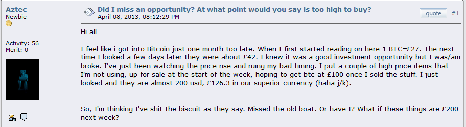

## Strategia

### Come resistere alla volatilità
C’è un metodo veramente valido per evitare la volatilità di bitcoin quando lo si impiega come mezzo di pagamento. Quando spendi bitcoin per l’acquisto di un bene o servizio, ricarichi il tuo wallet comprando un importo di bitcoin con valuta fiat non appena conclusa la transazione. In questo modo non perdi valore, perché il prezzo di bitcoin rimane quasi lo stesso in un così breve intervallo di tempo.

### Creare un piano di risparmio
Procurati una piccola somma di bitcoin ad intervalli temporali regolari – ogni giorno/settimana/mese. Questo metodo è noto come _dollar cost averaging_ (DCA) – o _fiat cost averaging_ (FCA). Tale frazionamento temporale dell’acquisto permette di equilibrare la volatilità del prezzo di bitcoin sul lungo periodo.

In siti come [Bitcoin Dollar Cost Average](https://www.bitcoindollarcostaverage.com/) puoi calcolare la differenza nei guadagni in base a svariate strategie d’investimento.

**Servizi FCA esclusivi per Bitcoin**

Austria, Germania: [Coinfinity](https://coinfinity.co/sparplan/?ref=6716)
France: [StackinSat](https://www.stackinsat.com/)
Europe: [Relai](https://relai.ch/)
UK: [Coinfloor](https://coinfloor.co.uk/hodl/), [xsats](https://xsats.com/)
Australia: [Bitaroo](https://support.bitaroo.com.au/hc/en-au/articles/360042838874-Recurring-Buy-DCA-), [Amber App](https://amber.app/)
Canada: [Bull Bitcoin](https://bullbitcoin.com/)
Nigeria: [Bitnob](https://bitnob.com/)
USA: [Swan Bitcoin](https://www.swanbitcoin.com/), [River](https://river.com/)

### Trading
Online ci sono numerosi esperti di trading finanziario che insegnano ai principianti come prevedere l'andamento del prezzo di bitcoin (_“Time the market”_). Provano a venderti software e seminari sul trading. Fermati. Non spendere il tuo tempo e denaro per provare una cosa del genere. Non puoi prevedere il mercato. I grossi attori della finanza ti “distruggeranno”. Inoltre, l’esborso per le fee di trading sarà rilevante, e tieni a mente che dovrai anche tracciare le tue movimentazioni per ragioni fiscali. In alcuni Paesi, le plusvalenze di bitcoin sono esenti da tassazione se non cambi le tue coin per 12 mesi. Ogni scambio può costituire un nuovo evento tassabile..

### Altcoin
Altcoin è l’abbreviazione di _“alternative coin”_, ossia monete alternative. Sono asset crypto creati in seguito a Bitcoin. Molti principianti seguono il consiglio di “diversificare il portfolio” ed iniziare lo scambio di bitcoin con altcoin. Migliaia di altcoin sono elencate nel sito [Coinmarketcap](https://coinmarketcap.com/). Non puoi studiarle tutte quante, e molte non sono più in sviluppo e non hanno alcun valore. Bitcoin è stato il primo asset crypto, ed è quello con l’effetto network più rilevante. Se vuoi diversificare, la mia opinione personale è di farlo con la testa. Entra nel tunnel di Bitcoin, impara come custodirlo da te, impara come configurare un nodo, impara i nuovi sviluppi DeFi di Bitcoin o impara come guadagnare bitcoin.

### Se solo avessi… È troppo tardi
Se solo avessi comprato Bitcoin nel 2011, ora saresti molto ricco. Sarebbe vero, e mi congratulerei senza invidia alcuna perché saresti stata una delle poche persone che ha creduto in Bitcoin, e pronte a mettere in gioco i propri risparmi guadagnati duramente in un esperimento rischioso. Nessuno tra i primi utilizzatori poteva sapere che Bitcoin si sarebbe apprezzato come dimostrato nel tempo. Allora era molto complesso mettere in sicurezza le chiavi, e molti bitcoin sono andati perduti o rubati. Se tu avessi preservato le tue coin superando indenne quel periodo, forse li avresti venduti nel 2014 o 2017? È inutile speculare sul “cosa sarebbe se”. Siamo ancora all’inizio. Se stai iniziandoti all’educazione e all’uso di Bitcoin, sei in rilevante anticipo rispetto alla massa. Non è mai troppo tardi per imparare Bitcoin.

 [^73]

### Tasse
Non sono un consulente fiscale, ma ciò che posso dire è di imparare le normative e gli adempimenti fiscali nella tua giurisdizione. La blockchain di Bitcoin è trasparente, e sempre più autorità fiscali richiedono alle borse di scambio di consegnare i dati relativi al trading dei propri utenti. Mantieni prova dei tuoi acquisti in caso le autorità inizializzassero accertamenti fiscali.

[^73]: [Source BitcoinTalk](https://bitcointalk.org/index.php?topic=170725.0)
