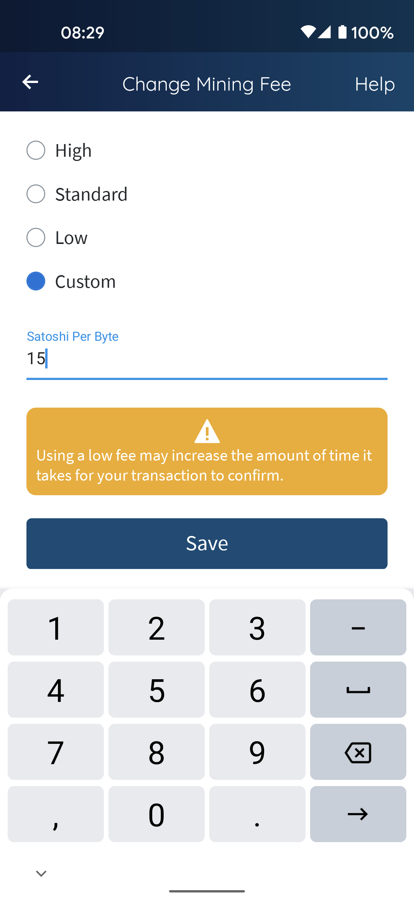

# Usare Bitcoin

## Costi di transazione
Una fee di mining deve essere pagata ad ogni transazione in bitcoin, e queste commissioni sono fondamentali affinché la rete Bitcoin continui ad operare. Il lavoro dei miner è ricompensato da tali fee, oltre che dalla creazione di nuovi bitcoin (vedi capitolo 2.3). Il mining è un fattore essenziale del protocollo Bitcoin. Quando un blocco di transazioni viene minato, viene collegato alla blockchain. Questo è il modo in cui si garantisce la sicurezza della rete. Dato che Bitcoin ha una fornitura totale fissata a 21 milioni di coin, i miner non riceverebbero più alcuna ricompensa per la loro prestazione una volta raggiunto tale limite massimo, e perderebbero l’interesse a processare le transazioni e pertanto a mantenere la blockchain. Pertanto, Satoshi Nakamoto ha introdotto i costi di transazione. In base al white paper, l’obiettivo è mantenere il costo di queste fee più basse rispetto ai costi di natura omologa del sistema bancario tradizionale. Tuttavia, non è proprio il caso che le transazioni siano gratuite semplicemente perché, in teoria, non vi è necessità di intermediari o banche.

Quando acquisti bitcoin tramite un exchange, i costi di commissione (le fee di mining) solitamente non sono negoziabili e sono fissati dal fornitore del servizio.

Nel tuo wallet non-custodial di Bitcoin, puoi determinare da te le fee di transazione dei pagamenti verso terzi. Più alta sarà la fee che imposterai, più velocemente la transazione sarà processata dai miner in quanto loro saranno attratti a selezionare la transazione con le fee più alte. Se la tua transazione non è urgente, puoi selezionare una fee meno onerosa.

Per un maggior controllo, puoi stimare la fee e la velocità di conferma dei blocchi su pagine come [Mempool.space](https://mempool.space/) oppure [Johoe's Bitcoin Mempool](https://jochen-hoenicke.de/queue/). Questi siti web esibiscono il numero e la dimensione delle transazioni non ancora confermate. Mostrano e provvedono a fornire una panoramica in tempo reale di come evolve la mempool. Le transazioni sono colorate in base dell’ammontare della fee pagata per byte (virtuale).

 [^74]

Qui sotto puoi vedere le impostazioni del wallet Edge. Puoi selezionare dei range per le fee di transazione di default, oppure un valore personalizzato.

 [^75]

**Transazione in Attesa**
Considerato che nuovi blocchi vengono minati ogni 10 minuti, servirà attendere una media di 10 minuti per la conferma della transazione. Se configuri dei costi di commissione troppo bassi, dunque la transazione potrebbe rimanere in status di attesa per un periodo prolungato nel tempo, dato che bisognerà attendere che la mempool si liberi e i miner inizino a reinserirvi le transazioni dalle basse fee. Qui puoi vedere una mia transazione, rimasta intrappolata nella mempool per un mese.  
 [^76]  
Puoi consultare gli status delle tue transazioni in un [Blockchain explorer](https://blockchair.com). Come puoi vedere nell’immagine sottostante, la mia transazione è alla posizione 4,717 nell’ordine di priorità di mining, in un totale di 41,610 transazioni incluse nella mempool. Ho selezionato una fee di 5 sat per vbyte.  
 [^77]

Non devi necessariamente seguire i seguenti punti al fine della conferma della tua transazione. La maggior parte delle transazioni con bassi costi di commissione rimangono validi per giorni, e verranno confermati prima o poi Tuttavia, ci sono due metodi per risolvere il problema ed accelerare l’ottenimento della conferma di eventuali transazioni intrappolate.

**Un pagamento in uscita è bloccato**  
* _Replace-by-fee_ (RBF): alcuni wallet ti abilitano a configurare questa opzione prima di inviare il pagamento. In questo caso, se la transazione originaria si blocca, potrai aggiornarla selezionando una fee più alta e ritrasmettere nuovamente la transazione.

**Un pagamento in entrata è bloccato**
* _Child pays for parent_ (CPFP): puoi immaginarti questa funzione come un genitore sprovvisto di sufficiente denaro per affrontare una spesa, e il figlio interviene pagando la differenza a nome del genitore. CPFP è una tecnica tramite la quale puoi promuovere la transazione in entrata bloccata effettuando una nuova transazione con fee più alte (transazione figlio) usando gli output (fondi) della transazione precedente (transazione padre) che risulta bloccata.

Consulta la documentazione del wallet che stai usando per ottenere istruzioni dettagliate.

## Comprare qualcosa con Bitcoin
Di seguito trovi un elenco di negozi dove puoi spendere bitcoin.
* [Accepted here](https://www.acceptedhere.io)
* [Servizi B2B che accettano BTC](https://cryptwerk.com/companies/b2b/btc/)
* [Coinmap](https://coinmap.org/view/), negozi fisici che accettano Bitcoin
* [Spending Bitcoin](https://spending-bitcoin.com/), elenco
* [UseBitcoins](https://usebitcoins.info/), elenco

## Carte di debito Bitcoin
Puoi usare una carta di debito Bitcoin per acquistare qualsiasi cosa proprio come una comune carta di debito bancaria. La differenza è che si appoggia a bitcoin o altcoin. La società che gestisce il pagamento accredita al venditore la valuta di sua scelta, mentre la spesa viene dedotta dal tuo saldo in bitcoin, e ciò ti permette di poter vivere puramente in soli bitcoin.

Devi depositare i tuoi bitcoin alla società che eroga il servizio della carta di debito, il che significa che stai consegnando il controllo delle tue coin a una terza parte. Deposita nella carta solamente tanto quanto a te strettamente necessario, e controlla costi e fee caricati dalla società della carta.

Una breve lista di carte attualmente disponibili nel mercato:
Cryptocom Visa, Binance, Bitpanda Visa, Coinbase Visa, Wirex Visa, BlockCard, Cryptopay, Nexo, Bitwala Visa, BitPay Visa, Cash App

## Spendere e ricevere
La lista seguente elenca strumenti e servizi che permettono di spendere a ricevere BTC nella tua vita quotidiana.
* [Bity](https://bity.com/products/crypto-online-bill-pay/), salda bollette online con bitcoin
* [Cash App](https://cash.app/bitcoin), compra e vendi BTC direttamente dal tuo saldo disponibile in Cash App
* [Strike](https://global.strike.me/), invia e ricevi istantaneamente pagamenti internazionali, bonifici immediati e con accesso completo alla rete Bitcoin
* [Piixpay](https://www.piixpay.com/?lang=en), paga chiunque in euro utilizzando le tue crypto
* [Bitrefill](https://www.bitrefill.com/?hl=en), compra gift card e ricariche telefoniche

[^74]: [Screenshot by Anita Posch](https://mempool.space)  
[^75]: Screenshot by Anita Posch, Edge wallet  
[^76]: Screenshot by Anita Posch, Edge wallet  
[^77]: Screenshot by Anita Posch, Blockchair  
