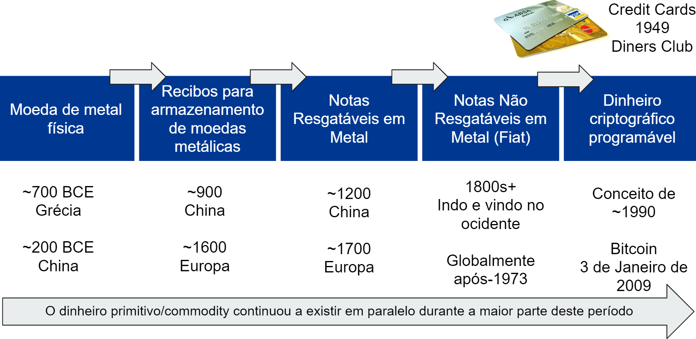
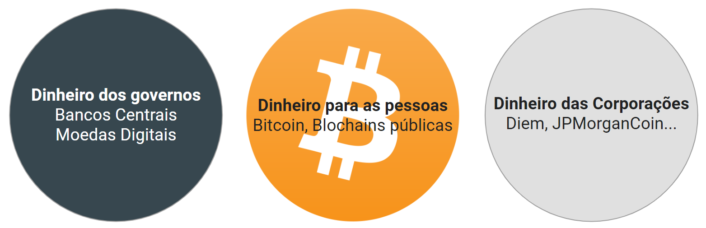

# A evolução do dinheiro

Em 3 de janeiro de 2009, nasceu o Bitcoin. Desde a sua criação, o protocolo de Internet (IP) da rede Bitcoin P2P anexou novos blocos de dados a uma cadeia de transações aproximadamente a cada 10 minutos. A blockchain do Bitcoin armazena transações na ordem cronológica correta e não pode ser alterada posteriormente, tão fixa quanto o próprio tempo. Assim como nossos batimentos cardíacos preservam nossos corpos, esse processo é preservado por um sistema que se baseia em criptografia, teoria dos jogos, TI e redes descentralizadas que se mantêm em equilíbrio.

Este sistema autorregulado tem as seguintes características:

- As transações de Bitcoin são resistentes à censura.
- Bitcoin é imutável.
- Bitcoin não pode ser falsificado.
- As transações de Bitcoin são altamente seguras sem intermediários, sem bancos.
- As transações de Bitcoin são transparentes, visíveis publicamente e podem ser auditadas por qualquer pessoa.

*Representação* [^1]

Em um pagamento tradicional existem até sete intermediários até que o pagamento chegue ao destinatário. Bitcoin não tem nenhum.

- Bitcoin é uma rede neutra: não moraliza ou distingue entre pagamentos "bons" e "ruins".
- Bitcoin não tem permissão: não há guardiões que possam impedir seu uso.
- Bitcoin não tem fronteiras: pode ser usado em todo o mundo.
- Bitcoin, como o protocolo da internet, é um bem comum: pertence a todos, não a uma única entidade, como uma empresa.
- As regras do Bitcoin são aplicadas pelo consenso programado e seguro de todas as partes envolvidas.

Bitcoin é o dinheiro das pessoas. Bitcoin é a evolução do dinheiro. É uma continuação do processo perpétuo de descoberta de dinheiro novo que sempre fez parte da história da humanidade. Ao longo dos milênios, várias novas formas de dinheiro foram encontradas e usadas, desde uma troca direta entre pessoas até um sistema de crédito no padrão-ouro, da moeda fiduciária ao atual sistema inflacionário sem lastro de hoje. O sistema bancário e monetário como o conhecemos hoje existe e evoluiu por cerca de 300 anos. É natural que, com o surgimento de uma nova forma de comunicação via internet, surja uma nova forma de economia e um novo tipo de dinheiro, o dinheiro nativo da internet.

*Representação* [^2]

O dinheiro criptográfico programável ou a "Internet do Dinheiro" - como diz Andreas M. Antonopoulos - é imparável. Estamos no início de uma nova era na história da humanidade.

## Rai Stones of Yap
Se o Bitcoin parece incompreensível e você não consegue entender o conceito de blockchain como um livro razão compartilhado, as pedras Rai da Ilha de Yap é um bom exemplo para introduzir alguns conceitos sobrepostos.

Rai são grandes discos de pedra usados na ilha Yap no Pacífico Ocidental (Micronésia). Eles foram "cunhados" dos depósitos de calcário da ilha de Palau e usados como moeda até o século XX.

*Representação* [^3]

As pedras Rai foram trazidas para Yap via barco e, devido ao seu tamanho e peso, não foram movidas quando gastas, mas simplesmente mudaram de dono. Cada transação foi "registrada" oralmente dentro da pequena comunidade, com o histórico de propriedade da pedra tornando-se de conhecimento comum. Eventualmente, o "histórico"/"ledger" da transação tornou-se a única parte que importava. Certa vez, uma pedra foi derrubada pela canoa que a transferiu para Yap e afundou. A pedra ainda era dinheiro, pois ainda existia, embora ninguém a tenha visto ou tido acesso desde então.

Isso é particularmente importante porque demonstra um uso natural de um livro de transações. O livro-caixa era partilhado oralmente entre os habitantes e atribuía-se a propriedade e a propriedade delegada sem que uma única pedra se movesse; todos concordaram com isso e um consenso foi formado. É assim que podemos fazer uma comparação com as funções do blockchain do Bitcoin; é um registro compartilhado de todas as transações, armazenado simultaneamente em milhares de computadores (nós) globalmente. [^4]

Outra semelhança com o Bitcoin é a criação da pedra Rai, que foi um trabalho intenso e uma forma de prova de trabalho. As pedras foram esculpidas com ferramentas manuais, extraídas no exterior e trazidas para a ilha de canoa. Uma vez que as pedras Rai se tornaram fáceis de fabricar com técnicas modernas, elas se tornaram menos úteis como dinheiro, porque não eram mais um indicador confiável de energia gasta.

As pedras Rai foram vistas pelos economistas modernos como uma forma primitiva de dinheiro e são frequentemente usadas como exemplo para apoiar a tese de que o valor de algumas formas de dinheiro pode ser atribuído puramente por meio de uma crença compartilhada nesse valor.[^5] O dinheiro de hoje também não é apoiado por nada. Na verdade, só é estabelecido e declarado curso legal por regulamentação governamental. Por isso, é o meio de conta que usamos e, portanto, é percebido como valioso.

## Como o dinheiro é criado

>"Deve-se confiar no banco central para não desvalorizar a moeda, mas a história das moedas fiduciárias está cheia de violações dessa confiança." - **Satoshi Nakamoto**

Aprender sobre Bitcoin me abriu os olhos. Existem dois períodos distintos da minha vida, um antes do Bitcoin e outro depois do Bitcoin. Eu vejo as coisas de forma completamente diferente hoje. No meu objetivo de entender o Bitcoin, primeiro tive que entender o sistema monetário atual. Quais são as diferenças entre sistemas monetários como o USD ou Euro e Bitcoin? O que é inflação? Que papel estão desempenhando os bancos centrais? E assim por diante. É intrigante que não aprendamos esses conceitos na escola, mas essa falta específica de educação pode, infelizmente, ser intencional.

180 moedas são usadas em 195 países ao redor do mundo. Uma moeda é um sistema de dinheiro de uso comum, definido pelos governos. Muitas jurisdições definem sua moeda nacional como moeda legal; é dinheiro declarado por lei válido para o pagamento de dívidas que não podem ser recusadas como forma de pagamento.

Todas as 180 moedas – o dólar americano, o euro, o iene e a libra esterlina, por exemplo – podem ser definidas como estando dentro de uma categoria chamada “dinheiro fiduciário”. Desde 1971, nenhuma dessas moedas fiduciárias foi apoiada por ouro ou por qualquer outro ativo tangível. O dinheiro tem valor porque acreditamos nele. O dinheiro é uma linguagem para expressar o quão valioso algo é, socialmente. A palavra fiat vem do latim e significa "faça-se". O dinheiro atual é criado por meio de uma entrada em uma base de dados e é apenas um número em um sistema de contabilidade. Não há produtividade real por trás disso.

Quem é responsável pela criação do dinheiro? É uma mistura de governos e bancos centrais, juntamente com bancos comerciais. É um sistema centralizado e hierárquico com guardiões. Não há acordo sobre um limite ou taxa de emissão de novas moedas.

Fiat é "dinheiro por decreto"; é administrado coercitivamente através da ameaça implícita de violência do Estado. O valor está sendo mantido pela criação de uma responsabilidade fiscal infinita que você só pode satisfazer com dinheiro fiduciário e por mercados de títulos administrados pelo Estado, bem como leis de curso legal e política tributária.

* O dinheiro é criado pelos bancos centrais na forma de papel-moeda e moedas.
* Os bancos centrais compram ativos e títulos do mercado aberto, o dinheiro flui para o sistema.
* O dinheiro é criado por meio de estímulos governamentais, por meio de benefícios, subsídios e resgates.
* O dinheiro é criado por bancos comerciais através de empréstimos.

### O dinheiro é criado através da dívida
O último ponto é o que todos nós conhecemos. É como fazemos um empréstimo para comprar uma casa, abrir um negócio ou comprar um carro. O processo é fácil, mas só para quem já é privilegiado. Se você não puder oferecer uma garantia, se não for proprietário de uma pequena empresa, se não tiver um emprego regular de renda fixa ou se for uma mulher em um país onde as mulheres ainda são proibidas de ter qualquer propriedade, provavelmente você não irá ser qualificado para receber crédito no seu banco. Se você conseguir o empréstimo, o banco edita sua base de dados e adiciona o valor do crédito à sua conta. Você deve então a eles o empréstimo mais a taxa de juros. Agora você deve sair e trabalhar ou vender algo para poder pagar o empréstimo mais a taxa de juros. É um grande negócio para os bancos. Eles não acrescentam nada, mas ganham as taxas do seu contrato de empréstimo e os juros do seu retorno.

Além disso, há algo chamado reserva fracionária. Isso permite que os bancos emprestem mais dinheiro do que mantêm em reservas ou como saldos em sua conta no banco central. O valor mínimo que os bancos devem manter em ativos líquidos, chamado de "taxa de reserva", é determinado pelo banco central. Esta taxa varia de país para país. Na área do euro, os bancos devem deter um mínimo de 1% no momento da redação. Em março de 2020, o FED aboliu essa exigência de reserva mínima devido à pandemia de COVID-19. Canadá, Reino Unido, Nova Zelândia, Austrália, Suécia e Hong Kong não têm requisitos de reserva. Se cada um de nós fosse ao banco hoje e pedisse para retirar nosso dinheiro, o sistema bancário desmoronaria. Como os bancos emprestaram mais dinheiro do que possuem, eles não poderão devolver seu próprio dinheiro.

Em 2020, a dívida global aumentou incríveis 24 trilhões para 281 trilhões de dólares, ou 355% do PIB global.[^6]

*Representação* [^6] 

### Bancos Centrais como Credores de Último Recurso
Os bancos comerciais podem e têm pedido a ajuda do banco central como credores de última instância. Em 2008/2009, os bancos, responsáveis pela crise financeira global, receberam o dinheiro do resgate. Eles foram resgatados porque eram "grandes demais para falir". E o que fizeram com o dinheiro? Eles compraram de volta ações em suas próprias empresas. Nada "escorregou" para baixo na economia. A distância entre ricos e pobres inevitavelmente se tornou cada vez maior.

Os bancos centrais são chamados de credores de última instância. O objetivo é evitar perturbações econômicas como resultado de pânicos financeiros, e corridas aos bancos se espalhando de um banco para outro devido à falta de liquidez. Atores financeiros como os bancos sabem que os bancos centrais terão que salvá-los, o que leva ao risco moral – risco excessivo por parte de banqueiros e investidores.

A criação de dinheiro artificial através dos bancos centrais ofuscou a distorção no mercado. Por causa da inundação e manipulação do sistema monetário com dinheiro barato, não há mais mecanismo racional de determinação de preços. Normalmente, oferta e demanda determinam o valor de bens e commodities, mas, em um mercado distorcido e manipulado, não há espaço para descoberta de preços justos. A classe média global está pagando pela ganância das elites financeiras que, por sua vez, está sendo alimentada por um sistema corrompido de criação de dinheiro.

Você, como indivíduo, já foi resgatado da falência? E se tiver, você faria a mesma coisa repetidamente, manipulando o sistema sabendo que há um último recurso, que sempre o salvará? Isso é exatamente o que os bancos, Wall Street, Hedge Funds e seus advogados de lobby fazem constantemente, auxiliados por bancos centrais de todo o mundo.

"Classicamente, os bancos centrais mantêm reservas em caso de emergências, estabelecem taxas de juros e alocam fundos para estimular ou desacelerar economias após eventos disruptivos como pânicos ou guerras. O papel mais recente que eles assumiram é o de proteger todo o sistema financeiro e influenciar o trajetória econômica de nações soberanas inteiras. Esta é a antítese do regime democrático. Tal oligarquia monetária opera além das normas e limites democráticos." [^7]

O livro de Nomi Prins abordou a psique de Wall Street, revelando como a própria estrutura do sistema financeiro dependia de traders que migrassem para a próxima grande aposta, independentemente das apostas. Além disso, as _mesmas_ pessoas e famílias continuavam surgindo, pedalando por Wall Street e Washington. Eles influenciaram a economia abaixo deles por terem status, dinheiro privado e cargos públicos, desmantelando leis que estavam em seu caminho e encontrando brechas em outras. Os bancos privados normalizaram a manipulação do mercado. Os bancos centrais fizeram disso uma forma de arte, sem limites." [^8]

### Inflação da oferta de dinheiro

Vamos pegar o dólar americano como exemplo para todas as moedas fiduciárias. Por causa da inflação da oferta monetária, quanto mais dólares estão disponíveis, menos valor uma única nota tem. Imagine uma nota de banco como uma mercadoria como o cobre. Se houver mais cobre no mercado do que demanda, o preço do cobre cairá; seu valor diminuirá. O mesmo vale para as nota. O valor das moedas fiduciárias também é determinado pela oferta e demanda. Se você aumentar a oferta e a demanda permanecer a mesma, o valor de uma unidade diminui.

A oferta monetária consiste em vários tipos de dinheiro que são geralmente classificados como Ms, como M0 (moeda base), M1, M2 e M3. As definições podem variar ligeiramente em diferentes países.

A base monetária (M0) é o montante total de uma moeda em papel e moeda física que está em circulação nas mãos do público ou na forma de depósitos de bancos comerciais mantidos nas reservas do banco central. [^9]

Contanto que você guarde o seu dinheiro com você, como um ativo assim como bitcoin, ele é uma propriedade que só você possui. Se você pegar seu dinheiro e armazená-lo no banco, você tem uma reivindicação, mas não possui mais o dinheiro. Semelhante ao bitcoin em uma exchange.

Qualquer outra oferta de moeda fiduciária (M1, M2, M3) é composta por créditos sobre a base monetária. [^10]

M1 inclui M0, depósitos à vista, cheques de viagem e outros depósitos à vista, que são facilmente conversíveis em dinheiro.

M2 inclui M0, M1, títulos do mercado monetário, fundos mútuos e outros depósitos a prazo. Esses ativos são menos líquidos que o M1 e não são tão adequados quanto os meios de troca, mas podem ser rapidamente convertidos em dinheiro ou depósitos à vista. O M2 é observado de perto como um indicador da oferta monetária e da inflação futura, e como uma meta para a política monetária do banco central.

A quantidade de moeda M2 em circulação nos EUA era de **19,7 trilhões de dólares** em fevereiro de 2021. [^11] Veja o crescimento em 2020.

*Representação* [^11]

"Aceitamos isso como normal porque assumimos que nunca terminará. O sistema bancário de reservas fracionárias funciona em todo o mundo há centenas de anos (primeiro apoiado em ouro e depois totalmente baseado em moeda fiduciáriz), embora com eventos inflacionários ocasionais ao longo do caminho para redefinir parcialmente as coisas.

Cada unidade individual de moeda fiduciária degradou cerca de 99% em valor ou mais ao longo de uma linha de tempo de várias décadas. Isso significa que os investidores precisam ganhar uma taxa de juros que exceda a taxa de inflação real (o que não está acontecendo atualmente) ou precisam comprar investimentos, o que infla o valor de ações e imóveis em comparação com seus fluxos de caixa e empurra aumentar os preços de objetos escassos como obras de arte." [^12]

Somando-se à inflação da oferta monetária está o fato de que a população nos EUA e em outras nações ocidentais não está crescendo na mesma proporção que a oferta monetária. "A população dos EUA costumava crescer talvez 1,5% ao ano, e agora cresce mais perto de 0,5% ao ano. Isso é muito importante. Enquanto isso, a ampla oferta monetária aumentou 25% ano a ano e está a caminho de aumentar 75% + ao longo de um período de 5 anos no futuro." [^13]

A rigor, a inflação ocorre quando a oferta de moeda supera o crescimento nominal do PIB, que consiste no crescimento da população e da produtividade. O Índice de Preços ao Consumidor dos EUA mostra que os preços dos bens subiram desde que o valor do dinheiro diminuiu.

*Representação* [^14]

### Esquema Ponzi

> Esquema Ponzi: "Uma forma de fraude em que a crença no sucesso de um empreendimento fictício é fomentada pelo pagamento de retornos rápidos aos primeiros investidores do dinheiro investido por outros." - **Dicionário de Inglês Oxford**

Os inimigos do Bitcoin o chamam de esquema Ponzi. Eu digo, eles não entendem o Bitcoin ou o que é o verdadeiro esquema Ponzi, ou eles têm interesse em que o Bitcoin não tenha sucesso. Charles Ponzi foi preso nos Estados Unidos em 1920 por tirar 20 milhões de dólares de dezenas de milhares de vítimas. Sua promessa era dobrar o dinheiro investido em três meses. Em troca de dinheiro, os investidores recebiam notas promissórias que garantiam o investimento original mais 50% de juros. Essas notas traziam a assinatura de Ponzi com carimbo de tinta. Muitos se referiam a eles como "notas Ponzi".

> "Meu negócio era simples. Era o velho jogo de roubar Peter para pagar Paul. Você me daria cem dólares e eu lhe daria uma nota para lhe pagar cento e cinquenta dólares em três meses... Minhas notas se tornaram mais valiosas do que o dinheiro americano... Então veio o problema. A coisa toda foi quebrada." - **Charles Ponzi**

Se você quiser saber mais, [ouça meu episódio de podcast sobre a vida e a história do italiano Charles Ponzi](https://anita.link/ponzi). Você pode encontrá-lo em https://anita.link/ponzi.

**Características de um Esquema Ponzi**

* Um esquema Ponzi tem um ator, líder ou organização centralizada que coleta investimentos e foge no final.
* Esquemas Ponzi não são auditáveis ou transparentes. Ninguém, exceto o criador, sabe o que acontece com os fundos.
* Um esquema Ponzi emite dinheiro até quebrar - não há limite de oferta.
* Dificuldade em reembolsar os investidores: quanto mais dinheiro entra no esquema, mais dinheiro tem que ser devolvido, e mais difícil fica para o criador parar a máquina.
* O sistema tem que quebrar um dia, não tem saída.
* Os golpistas ganham dinheiro emprestando fundos sem nenhuma contribuição real para o desempenho econômico de um país.
* A ganância está conduzindo o esquema Ponzi. Investidores de varejo que chegam cedo, ganham juros e contam a outros, que também querem ficar ricos rapidamente.

Vamos comparar essas características com o sistema atual de criação de dinheiro.

**Características da Criação do Dinheiro Fiat**

* Atores centralizados como governos, bancos centrais e bancos comerciais criam dinheiro.
* O sistema monetário não é auditável nem transparente.
* Não há limite de oferta de dinheiro.
* Dificuldade em reembolsar os investidores: devido ao sistema bancário de reserva fracionária, se apenas 20% dos clientes de um banco solicitarem saque ao mesmo tempo, o banco entra em apuros e dirá "não" à sua retirada. Isso acontece regularmente em todo o mundo e aconteceu com alguns bancos dos EUA no início de 2020 durante a pandemia.
* O sistema tem que quebrar um dia, não tem saída.
* Os bancos ganham dinheiro emprestando fundos sem nenhuma contribuição real para o desempenho econômico de um país.
* A ganância está conduzindo o sistema fiduciário. As elites financeiras recebem empréstimos baratos porque possuem títulos para comprar mais títulos e aumentar sua riqueza e poder.

### O verdadeiro esquema Ponzi

* A única semelhança entre Bitcoin e um esquema Ponzi é o efeito de rede da ganância. Mas, ao contrário de um Ponzi, você mesmo pode segurar as chaves do seu bitcoin. Não há banco ou agente centralizado controlando seu bitcoin.

* Bitcoin tem uma oferta limitada. Apenas 21 milhões serão criados. Bitcoin é finito, moeda fiduciária é infinita. Não pode haver inflação baseada na oferta de dinheiro no Bitcoin.

* A emissão do Bitcoin é predeterminada por um algoritmo que todos os atores do Bitcoin concordaram e protegem por meio de nós operacionais. Não pode ser alterado sem o consentimento da comunidade global de Bitcoin. Como o limite de 21 milhões de bitcoins é uma das características mais importantes do Bitcoin, um acordo para alterá-lo será muito difícil ou mesmo impossível de alcançar.

* Os banqueiros centrais estão determinando o destino financeiro de todos os países do mundo. Eles não são eleitos, mas atuam como governos tentando controlar todo o mercado financeiro.

* O efeito Cantillon foi descrito pelo economista irlandês-francês Richard Cantillon por volta de 1730. Ele sugeriu que a inflação ocorre gradualmente e que a nova oferta de dinheiro criada pelos bancos tem um efeito localizado sobre a inflação, recompensando os banqueiros e atores próximos criando dinheiro artificialmente, beneficiando os mais próximos da origem do dinheiro.

> "As políticas monetárias da crise e pós-crise do Fed, adotadas por outros grandes bancos centrais, deveriam "gotejar" para as massas. Isso não aconteceu. As elites globais sabiam disso na época e estão mais conscientes disso agora. Em janeiro de 2017, o Fórum Econômico Mundial admitiu que o aumento da desigualdade ameaça a economia mundial. Esses coniventes provocam a desigualdade porque os beneficia e a preservação de suas hierarquias de poder global em detrimento de tudo e de todos." - **Nomi Prins** [^15]

### O fim deste tipo de crescimento

A desigualdade de riqueza tem aumentado nos últimos séculos, juntamente com a mercantilização e monetização dos recursos naturais. Nada fica para ser consumido. Estamos vivendo uma luta por recursos, por oportunidades iguais contra o establishment e as elites que se enriquecem com a corrupção e as vantagens financeiras.

"Outro subproduto da crise financeira e do conluio do banco central foi o aumento da ansiedade econômica que gerou uma virada para o nacionalismo, do Brasil à Grã-Bretanha e aos Estados Unidos. O choque do Brexit no Reino Unido reverberou em todo o mundo como eleitores se afastou da liderança incumbente e de suas políticas econômicas fracassadas. Nos Estados Unidos, a vitória eleitoral de Donald Trump, o presidente bilionário 'antiestablishment', foi outra manifestação dessa tendência. Esses votos marcantes não foram causados diretamente pela política do banco central, mas foram os efeitos." [^16]

A crescente divisão entre ricos e pobres é baseada em nosso atual sistema monetário, que é o verdadeiro esquema Ponzi. Os banqueiros centrais não são eleitos democraticamente, mas decidem o destino financeiro do mundo. Banqueiros e seus amigos estão lucrando com este sistema. É hora de uma alternativa: uma forma de dinheiro descentralizada, aberta, neutra, transparente, imutável, não inflável e colaborativa para as pessoas: Bitcoin.

### Sistema Petrodólar de hoje

Agora que discutimos como o dinheiro é criado, vamos mergulhar no mundo das guerras cambiais e como esse sistema de moedas nacionais é exclusivo e, historicamente, foi dominado por diferentes impérios.

A história das guerras cambiais é longa. "Ao longo do século passado, o mundo passou de um sistema padrão-ouro, para o sistema de Bretton Woods, para o sistema Petrodólar. Cada sistema se destruiu por dentro, em vez de ser derrubado externamente, e cada vez que um sistema fazia a transição para outro, ocorreu uma desvalorização generalizada e significativa da moeda."[^17]

A hegemonia monetária britânica durou de 1871 até a Primeira Guerra Mundial. Naquela época, a moeda de uma nação estava atrelada ao ouro. Após o período entre guerras, quando o poder monetário começou a se descentralizar, os Estados Unidos emergiram como a potência monetária central após a vitória dos aliados na Segunda Guerra Mundial. O sistema de Bretton Woods, fundado em 1944, foi o primeiro exemplo de uma ordem monetária totalmente negociada, destinada a governar as relações monetárias entre estados independentes. Estabeleceu um sistema de regras, instituições e procedimentos para regular o sistema monetário internacional, como o Fundo Monetário Internacional (FMI). Os Estados Unidos, que controlavam dois terços do ouro mundial, insistiram que o sistema de Bretton Woods se baseia tanto no ouro quanto no dólar americano. Representantes soviéticos compareceram à conferência, mas depois se recusaram a ratificar os acordos finais, insistindo que as instituições que eles criaram eram "filiais de Wall Street". Isso pode ser interpretado como o ponto de partida da Guerra Fria.

Em 15 de agosto de 1971, os Estados Unidos, liderados pelo presidente Richard Nixon, encerraram unilateralmente a conversibilidade do dólar americano em ouro, efetivamente pondo fim ao sistema de Bretton Woods e tornando o dólar uma moeda fiduciária. Ao mesmo tempo, muitas moedas fixas (como a libra esterlina) também se tornaram flutuantes.

O sistema monetário de hoje é construído sobre o Petrodólar. Lyn Alden descreve isso em seu artigo "A Estrutura do Sistema Monetário Global":

"A partir de 1971, após o colapso do sistema de Bretton Woods, todas as moedas ao redor do mundo se tornaram moedas fiduciárias e o sistema monetário global tornou-se menos ordenado. Esta foi a primeira vez na história da humanidade que isso aconteceu, onde todas as moedas do mundo em ao mesmo tempo foram transformados em papel sem suporte.

A moeda fiduciária é um sistema monetário pelo qual não há nada de valor na própria moeda; é apenas papel, moedas baratas de metal ou bits digitais de informação. Elas tem valor porque o governo declara ter e que é moeda legal para pagar todas as coisas, incluindo impostos.

Um país pode impor o uso de uma moeda fiduciária como meio de troca e unidade de conta dentro de seu país, tornando todos os impostos pagáveis apenas nessa moeda, ou promulgando outras leis para adicionar atrito ou, em alguns casos, banir totalmente outras meios de troca e unidades de conta. Se a moeda deles tiver um problema grande o suficiente, como é o caso de muitos mercados emergentes, um mercado negro se desenvolverá para outros meios de troca, como moeda estrangeira ou ativos tangíveis.

Uma moeda fiduciária pode enfrentar problemas específicos ao tentar ser usada fora de seu país de origem. Por que empresas e governos de outros países deveriam aceitar pedaços de papel, que podem ser impressos indefinidamente por um governo estrangeiro e não têm apoio firme, como forma de pagamento por seus valiosos bens e serviços? Sem um apoio real, o que vale a pena? Por que você venderia petróleo para estrangeiros em troca de papel?

No início da década de 1970, houve uma variedade de conflitos geopolíticos, incluindo a Guerra do Yom Kippur e o embargo de petróleo da OPEP. Em 1974, no entanto, os Estados Unidos e a Arábia Saudita chegaram a um acordo e, a partir daí, o mundo foi colocado no sistema petrodólar; uma maneira inteligente de fazer um sistema global de moeda fiduciária funcionar decentemente o suficiente... Com o sistema petrodólar, a Arábia Saudita (e outros países da OPEP) vendem seu petróleo exclusivamente em dólares em troca da proteção e cooperação dos EUA. Mesmo que a França queira comprar petróleo da Arábia Saudita, por exemplo, eles o fazem em dólares. Em troca, os Estados Unidos usam sua incomparável marinha para proteger as rotas marítimas globais e preservar o status quo geopolítico com ação militar ou a ameaça disso, conforme necessário... Alguns de nós, particularmente perto do topo da escada de renda, se beneficiam direta ou indiretamente deste sistema. Os americanos que trabalham com finanças, governo, saúde e tecnologia obtêm muitos dos benefícios de viver no poder hegemônico, sem as desvantagens. Por outro lado, os americanos que fabricam produtos físicos tendem a não se beneficiar, porque perderam seus empregos ou tiveram seus rendimentos suprimidos e, portanto, não se beneficiaram dos ganhos. E fora dos Estados Unidos, os países exportadores se beneficiam do sistema, enquanto os países que não gostam de como o sistema monetário global está estruturado não têm muito recurso para fazer nada a respeito, a menos que se tornem grandes o suficiente como Rússia e China. "[^18]

Estamos em guerras cambiais há muitas décadas. Qual moeda é mais forte? Qual país pode obter mais benefícios manipulando sua moeda? O Euro, o Dólar Americano, o Yuan Chinês? Ou até mesmo o Diem do Facebook? O dinheiro corporativo é o novo e forte jogador do mercado. Para manter seus poderes, os bancos centrais começaram a trabalhar em suas próprias moedas digitais (CBDCs).

*Representação* [^19]

Bitcoin é a nossa alternativa a este sistema. Proteger nossa privacidade nesta era digital, votar contra o abuso do poder monopolista no sistema atual e dar às pessoas que vivem em estados autoritários com governantes corruptos as mesmas oportunidades de participar do sistema econômico. Bitcoin é uma estratégia de defesa, uma ferramenta com a qual podemos preservar o direito humano à liberdade e privacidade transacionais.

[^1]: [Ilustração NetGuardians recuperada em abril de 2017](https://www.netguardians.ch/ngfintechblog/2016/11/17/blockchain-explained-part-1)
[^2]: Anita Posch, créditos: Universidade de Nicósia, MOOC em moeda digital, “Uma breve história do dinheiro” com imagem: Lotus Head, CC BY-SA 3.0, wikimedia.org
[^3]: Imagem: "Stone Money of Uap, Western Caroline Islands." - Dr. Caroline Furness Jayne tirou esta fotografia durante uma estadia de 1903 em Yap, domínio público, via Wikimedia Commons
[^4]: [Wikipedia Rai stone](https://en.wikipedia.org/wiki/Rai_stones)
[^5]: Universidade de Nicósia, Introdução às Moedas Digitais, Sessão 1, p. 15
[^6]: [Relação dívida/PIB, JS Blokland](https://twitter.com/jsblokland/status/1362138620665221122?s=20)
[^7]: Collusion, de Nomi Prins, Bold Type Books, 2019, p. 7.
[^8]: Collusion, de Nomi Prins, Bold Type Books, 2019, p. xvii
[^9]: [Base Monetária](https://www.investopedia.com/terms/m/monetarybase.asp)
[^10]: [Base Monetária Global, Crypto Voices](https://cryptovoices.com/basemoney)
[^11]: [FRED, M2 Money Stock](https://fred.stlouisfed.org/graph/?graph_id=248494)
[^12]: [Lyn Alden, esquema Ponzi](https://www.lynalden.com/bitcoin-ponzi-scheme/)
[^13]: [Lyn Alden](https://twitter.com/LynAldenContact/status/1362912907659522049?s=20)
[^14]: [Índice de preços ao consumidor dos EUA](https://fred.stlouisfed.org/series/CPIAUCSL)
[^15]: Collusion, de Nomi Prins, Bold Type Books, 2019, p. 253.
[^16]: Collusion, de Nomi Prins, Bold Type Books, 2019, p. 249.
[^17]: [Lyn Alden, The Structure of the Global Monetary System](https://www.lynalden.com/fraying-petrodollar-system/)
[^18]: [Lyn Alden, Petrodollar System (1974-presente)](https://www.lynalden.com/fraying-petrodollar-system/)
[^19]: Anita Posch
