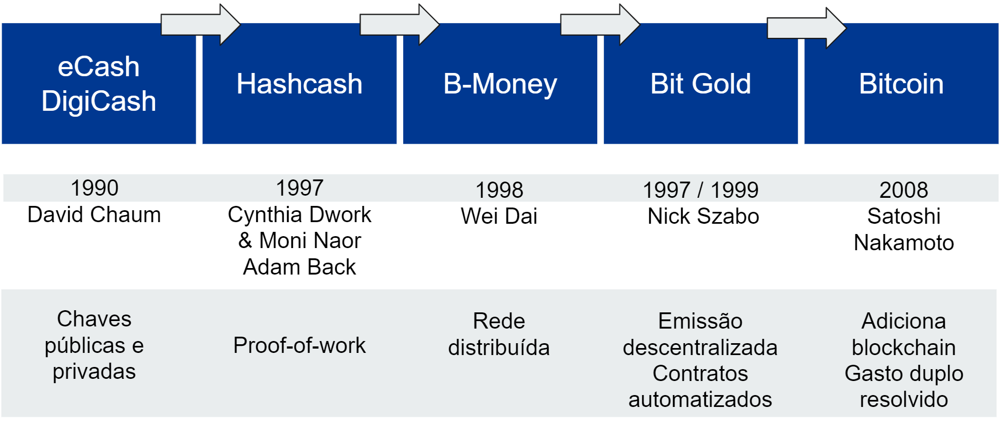

## A história do Bitcoin
>"A crise financeira dos EUA de 2007-2008 foi consequência de um sistema bancário pouco regulamentado em que o poder estava concentrado nas mãos de um elenco muito limitado de especuladores." [^20]

>"A crise financeira de 2007-2008 que devastou a economia global foi desencadeada por um sistema bancário voraz nos Estados Unidos. Em resposta, comandados pelo Fed, os bancos centrais dos países do G7 desceram uma trilha interminável de fabricação de dinheiro - em plena luz do dia." [^21]

Em 31 de outubro de 2008, no advento das maiores crises financeiras que o mundo já viu, alguém usando o pseudônimo Satoshi Nakamoto publicou um white paper chamado "Bitcoin: A Peer-to-Peer Electronic Cash System" no domínio bitcoin.org e propôs uma nova forma digital de dinheiro.

Em 3 de janeiro de 2009, o primeiro bloco público de Bitcoin, o chamado Genesis Block, foi minerado. Satoshi deixou uma mensagem nele: "Chanceler à beira do segundo resgate dos bancos", que foi a manchete do jornal diário The Times, no Reino Unido naquele mesmo dia. É um timestamp que marca o início do Bitcoin e mostra a intenção de que ele seja uma alternativa ao sistema bancário e financeiro atual, no qual você precisa confiar em intermediários para processar pagamentos eletrônicos.

Em 9 de junho de 2021, o bitcoin se tornou moeda legal em El Salvador.

Desde a década de 1990, especialistas em computação, matemáticos e criptógrafos - incluindo algumas mulheres - vêm trabalhando em conceitos de criação de dinheiro digital. O Bitcoin pode ser criado porque foi construído sobre as principais tecnologias de seus antecessores.

### Projetos de criptomoeda antes do Bitcoin
Partes dos conceitos a seguir foram incorporadas ao white paper Bitcoin de Satoshi Nakamoto.

[^22]

**Pares de chaves públicas e privadas**
Em 1990, David Chaum estava preocupado com a natureza pública e o acesso aberto a pagamentos online e informações pessoais. Ele fundou a "Digicash", uma corporação e dinheiro eletrônico de mesmo nome, que usava protocolos criptográficos, bem como chaves privadas e públicas para anonimizar transações. O uso de assinaturas - pares de chaves públicas e privadas - tornou-se essencial no desenvolvimento do dinheiro eletrônico e do Bitcoin.

**Comprovante de Trabalho**
> As pirâmides do Egito são prova de trabalho. Eles são um manifesto da cultura, riqueza e organização egípcias.

Com o advento da internet e do e-mail veio o problema do spam. Para combater o crescente problema do spam, em seu artigo de 1992 "Pricing via Processing or Combatting Junk Mail", Cynthia Dwork e Moni Naor propuseram a ideia "... ." antes de serem tecnicamente capazes de enviar e-mails. Isso significava que, se alguém quisesse enviar um grande número de e-mails ao mesmo tempo, o computador precisaria resolver um problema matemático. Esse processo leva tempo e esforço e evita que os spammers enviem mensagens em rápida sucessão.

Em 1997, Adam Back propôs uma ideia semelhante chamada "Hashcash". Satoshi Nakamoto implementou o Hashcash como o sistema de prova de trabalho usado no Bitcoin. O trabalho de Adam Back é citado no white paper do Bitcoin. Ouça minha entrevista com Adam Back de 2019, onde discutimos sua ideia para Hashcash e a evolução de seu trabalho até o Bitcoin. Encontre-o em https://anita.link/12

O termo "prova de trabalho" foi criado e formalizado pela primeira vez em um artigo de 1999 por Markus Jakobsson e Ari Juels.

**Descentralização**
Hashcash foi seguido por "B-Money" por Wei Dai em 1998. Seu conceito foi o primeiro a ser baseado em uma rede descentralizada de computadores. Isso é incorporado à rede peer-to-peer do Bitcoin com computadores executando o software Bitcoin como nós completos ou mineradores. Peer-to-peer significa um sistema de participantes equipotentes e igualmente privilegiados, sem hierarquia na rede.

Pouco tempo depois, Nick Szabo publicou um artigo sobre "BitGold", o primeiro sistema de dinheiro digital capaz de funcionar sem uma entidade central emitindo o dinheiro. Ele também é a primeira pessoa a apresentar um artigo sobre "Contratos Inteligentes".

### Resolvendo o problema do gasto duplo
Essas tecnologias monetárias predecessoras tinham um grande problema não resolvido. O problema do "gasto duplo" significa que o dinheiro digital já gasto pode ser usado uma segunda vez. Imagine um arquivo PDF que você pode copiar, modificar e enviar infinitamente a custo zero, alegando que cada cópia é a original. Tal arquivo digital seria inútil como dinheiro.

A engenhosa ideia de Satoshi Nakamoto foi adicionar um livro-razão ao sistema com blocos que contêm transações. Esses blocos são encadeados por meio de mineração de "prova de trabalho", daí o termo blockchain. Esse encadeamento de transações na ordem oportuna correta torna o bitcoin infalível e imutável.

Assim que um ator na rede Bitcoin trapaceia, a rede irá detectá-lo e bani-lo temporariamente. Isso significa que você não precisa confiar em ninguém, não há necessidade de um intermediário como um banco ou PayPal. Isso não significa que não existem golpistas por aí ou que você pode parar de verificar o que é verdadeiro ou falso, ou parar de aprender sobre como usar o Bitcoin. Conhecimento é poder.

O lema do Bitcoin é "Não confie, verifique". Isso foi um pouco confuso para mim no começo. Por um lado, você aprende que ainda não precisa confiar em um intermediário, por outro, pode verificar suas transações. O que isso significa é: se você quiser verificar as transações de bitcoin, você pode fazê-lo. Você até deveria, se tiver o conhecimento técnico para configurar seu próprio nó completo.

Isso é revolucionário - assim que você começa a verificar suas próprias transações de bitcoin, você se torna essencialmente um banco. Isso é o que os bancos fazem - eles verificam suas transações em seus livros. No entanto, você precisa confiar neles para fazer um bom trabalho. Isso pode estar funcionando muito bem em países desenvolvidos, mas a experiência bancária é muito pior na maior parte do mundo. Agora imagine que você não tem uma situação bancária confiável ou um documento de identidade, mas tem um celular e acesso à internet. Há apenas uma opção para você armazenar e usar dinheiro. É dinheiro móvel como M-Pesa ou EcoCash na África ou criptomoedas, onde você não precisa se identificar.

Todas as pessoas em todo o mundo com um celular com acesso à Internet têm acesso ao Bitcoin. Os bancos como os conhecemos não são obrigados a usar Bitcoin. Você não precisa pedir permissão a ninguém para possuir ou usar o Bitcoin. Tudo o que você precisa para começar é um smartphone, uma conexão com a internet e um aplicativo de carteira bitcoin.

[^20]: Collusion, de Nomi Prins, Bold Type Books, 2019, p. 1.
[^21]: Collusion, de Nomi Prins, Bold Type Books, 2019, p. 247.
[^22]: Anita Posch, Fonte [The Merkle](https://themerkle.com/top-4-cryptocurrency-projects-created-ahead-of-bitcoin/), [Hashcash.org](http:// www.hashcash.org/bitcoin/)
