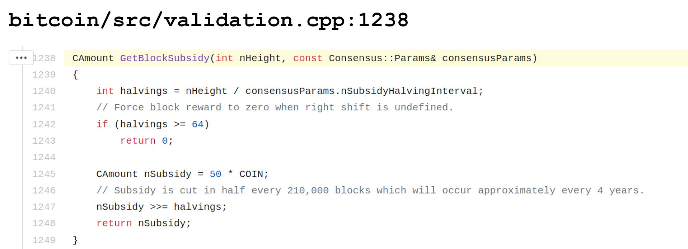

## 21 milhões de Bitcoin
Bitcoin são criados, conforme descrito nas páginas anteriores, quando um computador de mineração resolve uma tarefa computacional e é o primeiro a anexar com sucesso o bloco recém-cunhado à cadeia.

Atualmente, os mineradores recebem um prêmio de 6,25 bitcoin por este trabalho. Essa recompensa é o incentivo para os mineradores se comportarem positivamente em relação à rede Bitcoin e impedir que eles se associem a outros e ataquem a rede.

### Halving
As regras do Bitcoin estipulam que a recompensa para os mineradores será reduzida pela metade a cada 210.000 blocos, aproximadamente a cada quatro anos. No início, essa recompensa era de 50 bitcoin. Desde maio de 2020 são 6,25 bitcoins. Em 2024, essa recompensa será reduzida pela metade em 3.125 bitcoins por bloco. Este evento é comumente chamado de Halving.

Satoshi Nakamoto codificou esses halvings no software Bitcoin Core. A quantidade produzida diminui ao longo do tempo, resultando em uma curva de oferta achatada.

 [^24]

Esse algoritmo tende a zero, de modo que haverá um máximo de 21 milhões de bitcoins. Atualmente, existem cerca de 18,7 milhões em circulação. Em 2140, todos os 21 milhões de bitcoins terão sido gerados. A mineração continuará e os mineradores serão recompensados apenas com taxas de transação. A essa altura, espera-se que o Bitcoin como rede tenha uma adoção tão alta que as taxas de transação por si só facilitem adequadamente a recompensa justa para os mineradores.

 [^25]

### Por que 21 milhões?
Por que Satoshi Nakamoto escolheu 21 milhões para o limite de fornecimento? Existem muitas teorias, mas aqui está a resposta de Satoshi:

 [^26]

### Unidades de Bitcoin
A menor unidade de denominação de um bitcoin é um satoshi. 1 bitcoin é composto por 100.000.000 satoshis; 1 satoshi é um centésimo milionésimo de 1 bitcoin (0,00000001).

Você não precisa comprar ou vender 1 bitcoin por vez, você pode começar pequeno e transacionar uma fração minúscula dele.

### Bitcoin ou bitcoin, mas nunca BitCoin
Bitcoin com B maiúsculo é usado para se referir à rede Bitcoin, blockchain, comunidade e o conceito como um todo, enquanto bitcoin com b minúsculo é usado para referenciar a moeda, o token bitcoin.

Na verdade, moeda é o termo errado para descrever o ativo digital, é um pouco enganador. Em termos técnicos, é chamado de UTXO - saída de transação não gasta. Um UTXO define a quantidade de valor que é armazenada no blockchain em um endereço Bitcoin específico. Portanto, há opiniões divergentes sobre se existe um plural para bitcoin, a unidade, porque é fluido e não há moedas individuais definidas. Mas como Satoshi Nakamoto falou de bitcoins, nós, como comunidade, também o nomeamos assim. Não há plural para Bitcoin, pois há apenas um blockchain e uma rede.

Golpes como a rede BitClub se referiam a ela como BitCoin e isso também é usado erroneamente por iniciantes em Bitcoin.

[^24]: [Fonte Andreas M. Antonopoulos](https://twitter.com/aantonop/status/1257366095515848716?s=20)
[^25]: [Fonte: Insti](https://commons.wikimedia.org/wiki/File:Total_bitcoins_over_time.png)
[^26]: [Fonte plan99.net](https://plan99.net/~mike/satoshi-emails/thread1.html)
