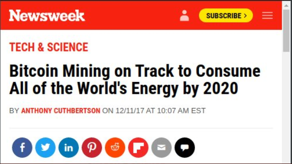
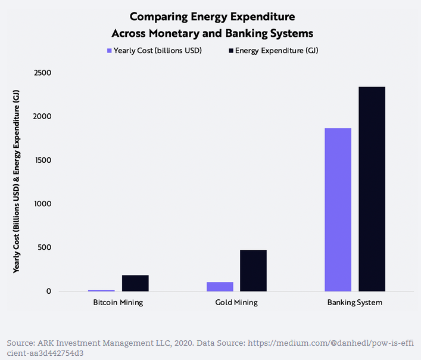
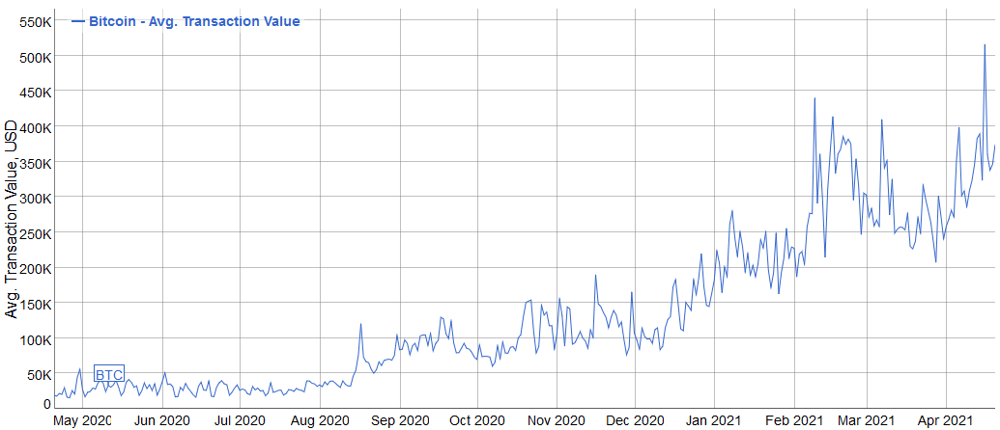
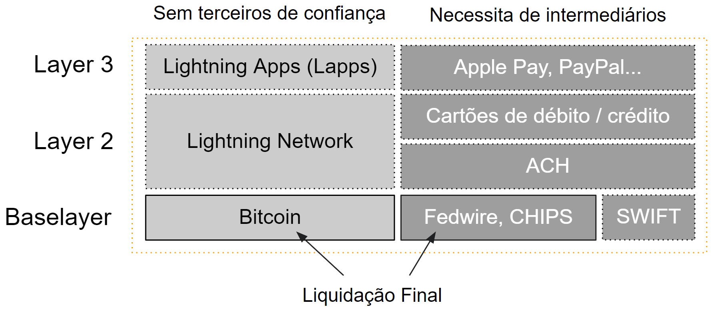

### Pegada Ecológica do Bitcoin
_Bitcoin consome muita eletricidade, o que aumentará nossa crise climática e é irresponsável._

 [^35]

A captura de tela acima é um artigo da Newsweek bem no meio da alta de 2017-2018. É baseado no trabalho de Alex de Vries (Digiconomist), ex-analista de dados do Banco Central Holandês. Muitos trabalhos de pesquisa e artigos da mídia tradicional são baseados em falsas suposições, como comparar o consumo de energia das transações Bitcoin com os pagamentos VISA e calcular uma pegada de carbono a partir disso. Argumento que muito desse trabalho é feito para espalhar alegações falsas para demonizar o Bitcoin.

> "Toda vez que temos um rali no Bitcoin, vemos toda essa atenção negativa ao impacto ambiental do Bitcoin. Aparentemente, só importa quando o preço está alto." - **Andreas M. Antonopoulos**

Vamos mergulhar nisso. Os críticos do Bitcoin costumam mencionar que o Bitcoin consome mais energia do que os benefícios que cria. É inegável que a mineração de Bitcoin requer muita eletricidade. Estima-se que entre 80 e 118 TWh por ano sejam usados globalmente para mineração, o que equivale a todo o consumo de energia de países como a Holanda.

 [^36]

O mundo desperdiça muita eletricidade. A quantidade de eletricidade consumida todos os anos por dispositivos domésticos sempre ativos, mas inativos, apenas nos EUA, poderia alimentar a rede Bitcoin por 1,9 anos. Isso significa que a quantidade de energia desperdiçada nos EUA quase poderia alimentar a rede Bitcoin duas vezes, ano a ano. [^37]

Ao mesmo tempo, perdem-se dois terços de toda a energia produzida nos EUA. É razoável supor que isso esteja acontecendo em todas as outras partes do mundo também.

 [^38]

Observe que a energia rejeitada rejeitada cerca de 62% de toda a geração de eletricidade. A energia rejeitada é a energia que é produzida, mas, em última análise, não vai para algo útil. Para piorar a situação, ao longo do tempo, esse número vem aumentando de forma relativa. Em 1970, o Lawrence Livermore National Laboratory descobriu que nossa proporção de energia rejeitada era de cerca de 48%. [^39]

Em outras palavras, o Bitcoin é responsável por 0,54% de toda a eletricidade usada globalmente.
 [^40]

**Consumo de eletricidade fácil de quantificar**
A transparência do Bitcoin permite estimativas de sua demanda de energia em contraste com muitas outras indústrias, onde esses pontos de dados são mais obscuros. Medido apenas pelos custos de eletricidade, podemos supor que o Bitcoin é [muito mais eficiente](https://medium.com/@danhedl/pow-is-eficiente-aa3d442754d3) do que os bancos tradicionais e a mineração de ouro em escala global.

O custo estimado em dólares da mineração de Bitcoin por Gigajoule gasto é 40 vezes mais eficiente do que o dos bancos tradicionais e 10 vezes mais eficiente do que o da mineração de ouro.

 [^41]

**Por que o Bitcoin precisa dessa quantidade de eletricidade**
O mecanismo de mineração de prova de trabalho é um recurso fundamental que garante a independência, neutralidade e integridade automatizada da rede. É a maneira mais segura de evitar ataques aos ativos no valor de mais de 600 bilhões de dólares que estão bloqueados na rede. (valor de mercado do BTC, junho de 2021)

Bitcoin pode liquidar transações sem intermediários porque hardware especializado e dedicado prova de forma transparente que o computador executou um cálculo caro.

A prova de trabalho está ancorando o dinheiro digital no mundo real. Como Hugo Nguyen, residente da Chaincode Labs, explica: "Nos bastidores, a mineração de prova de trabalho converte energia cinética (eletricidade) em um bloco de registro. Ao anexar energia a um bloco, dá-se 'forma', permitindo que ele tenha peso real e consequências no mundo físico." [^42]

A prova de trabalho também é o único mecanismo que permite uma criação descentralizada e igualmente distribuída do fornecimento de moedas, enquanto outros métodos exigem emissões iniciais de token e eventos de geração de token que permitem que atores centralizados tirem vantagem de moedas pré-mineradas (Prova de Participação).

**Suposição nº 1: São necessários X Kilowatts para fazer uma única transação**
Isso é matemática defeituosa. O uso de energia do bitcoin não se ajusta ao número de transações. O número de transações que acontecem na cadeia e o número de transações que acontecem fora da cadeia - por exemplo, em tecnologias de segunda camada como a Lightning Network ou por meeio de exchanges custódiantes, essas transações em lote - não estão correlacionadas com o custo de mineração. 80-90% da mineração é impulsionado pelo preço do bitcoin, com os outros 10-20% sendo impulsionados por taxas. Quanto maior o lucro possível para os mineradores, maior a chance de os mineradores estabelecerem novas instalações de mineração e, quando o preço cair, alguns terão que parar suas máquinas. A longo prazo, quando todos os 21 milhões de bitcoins forem minerados, as taxas de transação por si só impulsionarão a mineração. Nesse ponto, a intensidade da transação estará mais correlacionada ao uso de energia. Mas não hoje, o último satoshi será extraído em 2140. A mineração é impulsionada pela competição em um mercado livre onde a dificuldade de mineração se ajusta dinamicamente. Não tem nada a ver com quantas transações estão sendo processadas. A mineração é um mecanismo de segurança. Está relacionado a quanta segurança o mercado aloca ao sistema, então mais energia é igual a mais segurança e quando o preço do bitcoin sobe a quantidade de dinheiro alocada para protegê-lo também aumenta naturalmente. Portanto, o uso e a maior adoção geram motivação financeira adicional para os mineradores produzirem mais segurança consumindo mais energia.

**Suposição 2: Extrapolação Linear**
A segunda suposição errada é extrapolar linearmente e dizer que, se são necessários X quilowatts de energia para fazer uma transação hoje e temos sete bilhões e meio de pessoas no planeta que vão querer fazer uma transação por dia cada, então a energia do bitcoin o consumo no futuro será Y. Isso é falso. O Bitcoin não pode escalar linearmente em termos de transações devido a restrições de tamanho de bloco na camada base. Para mitigar isso, são desenvolvidos protocolos de segunda camada como a Lightning Network ou sidechains como o Liquid, que permitem milhares de pagamentos sem a necessidade de energia extra. A eficiência dos equipamentos de mineração está aumentando. Os mineradores precisam de menos energia para a mesma quantidade de desempenho de computação ao longo do tempo. Além disso, os desenvolvedores do Bitcoin estão melhorando o código, minimizando o tamanho dos dados das transações para que mais transações possam ser extraídas em um bloco.

**Suposição 3: Comparando VISA com Bitcoin**
Uma transação Bitcoin on-chain não pode ser comparada com um pagamento VISA. Não é a mesma coisa. No banco tradicional, existem várias camadas de liquidação, o que significa que diferem em seu nível de segurança e finalização. Tomemos o exemplo do sistema dos EUA, que é comparável globalmente. A camada base são as redes Fedwire, CHIPS e SWIFT, enquanto os pagamentos com cartão de débito e cartão de crédito operam um ou dois níveis acima com muitos intermediários. A camada base do Bitcoin deve ser comparada com Fedwire, CHIPS e SWIFT. Apenas soluções de segunda camada, como micropagamentos rápidos na Lightning Network, podem ser comparadas com a VISA.

 [^43]

Vamos dar uma olhada no volume médio de transações de VISA e Bitcoin.

 [^44]

 [^45]

O valor médio de transação de bitcoin foi de 258.766 USD em 21 de abril de 2021, enquanto a transação média de VISA foi de 91 USD em 2012. As transações de Bitcoin transportam muito mais valor em comparação com pagamentos com cartão de crédito. Supondo que o Bitcoin ganhe adoção em massa, então ele pode um dia liquidar milhões de dólares como o sistema Fedwire com taxas muito baixas em comparação com o sistema bancário.

O valor médio da transação por transferência Fedwire foi de 4,5 milhões de dólares em fevereiro de 2021. [^46]

 [^^47]

As transações de Bitcoin são liquidadas a cada 10 minutos, 24 horas por dia, 365 dias por ano. Compare isso com as transações ACH que podem levar até dois anos para serem finalmente liquidadas. [^48] Para não esquecer: as transações Bitcoin e Lightning são sem permissão e sem confiança, enquanto o sistema de pagamento tradicional só funciona porque os intermediários assumem a custódia de fraudes e estornos.

**Suposição 4: Igualando o Consumo de Energia à Poluição**
As pessoas dizem, por exemplo, que “toda transação polui” ou “a poluição do bitcoin está aumentando” ou “o bitcoin produz poluição como resultado de seu consumo de energia” – isso simplesmente não é verdade. Não há correlação direta entre o uso de energia e a poluição porque depende inteiramente do tipo de energia que está sendo usada. Se você está produzindo energia com carvão, isso causa poluição e impacto ambiental. Se você está produzindo energia com represas hidrelétricas ou eólica ou solar, por exemplo, então você não está realmente poluindo. Na verdade, você está subsidiando esses mecanismos de energia e incentivando a criação de mais energia solar, eólica, geotérmica, sem gás e outras formas de energia através da aplicação do bitcoin como fator econômico na produção dessa energia.

Os mineradores de Bitcoin são movidos pelo lucro, então eles sempre procurarão a energia mais barata, que é renovável. Carvão e petróleo sempre serão mais caros do que energia hidrelétrica, geotérmica, gás encalhado, eólica e solar. Sem esquecer a nuclear, que também é uma opção que muitos contam como energia verde.

Indiscutivelmente, os mineradores de Bitcoin estão usando energia desperdiçada. Falei com [Sébastien Gouspillou](https://anita.link/103) e [Philippe Bekhazi](https://anita.link/101) dois mineradores que usam energia hidrelétrica, que confirmaram as declarações acima.

**Mix de Energia da Produção de Eletricidade**
Os mineradores de Bitcoin são bastante bem distribuídos em todo o mundo. Embora seja fácil quantificar a demanda de eletricidade, é mais difícil quantificar as fontes de eletricidade, pois a indústria de mineração de Bitcoin continua sendo uma indústria altamente privada e pseudônima. Portanto, pesquisas sobre a eletricidade usada na mineração estimam que o uso de energia renovável varia de 39% (Cambridge Center, CBECI.org) a 73% no CoinShares Mining Whitepaper, que conclui:

"Usando uma combinação de estimativas de locais de mineração globais e penetrações regionais de energias renováveis, calculamos novamente que a indústria de mineração de Bitcoin é fortemente impulsionada por energias renováveis. Nossa porcentagem atual aproximada de geração de energia renovável no mix de energia de mineração de Bitcoin é de 73%, cerca de quatro vezes a média global. No geral, nossas descobertas reafirmam nossa visão de que a mineração de Bitcoin está atuando como um comprador global de eletricidade de último recurso e, portanto, tende a se agrupar em torno de infraestruturas renováveis comparativamente subutilizadas. à medida que a indústria amadurece e se estabelece como permanente aos olhos do público - poderia atuar como um impulsionador de novos desenvolvimentos de energias renováveis em locais que antes eram antieconômicos." [^49]

A questão não é quanta energia é necessária, mas como a eletricidade é produzida? Quanto CO2 é emitido? Se decidirmos como sociedade que não queremos energia poluente, devemos regular a produção de energia e não permitir o uso de sistemas poluentes. Trata-se de regular a produção de energia e não de regular o consumo de energia em um setor específico da economia que é o Bitcoin.

O Bitcoin usa uma quantidade maior de eletricidade de fontes renováveis do que a rede na China, nos EUA e no mundo em geral.
 [^50]

**Emissões de carbono**
Algumas pesquisas tentaram avaliar os fluxos de emissão de carbono e a sustentabilidade do Bitcoin por meio da estimativa da demanda futura, com base em suposições falsas. Um artigo, por exemplo, afirma que: “o consumo anual de energia da blockchain Bitcoin na China deve atingir o pico em 2024 em 296,59 Twh e gerar 130,50 milhões de toneladas métricas de emissão de carbono correspondentemente”. [^51]

> "É uma bandeira vermelha imediata que os autores declaram com confiança o futuro gasto de carbono do Bitcoin com duas casas decimais, quando realisticamente o número só pode ser estimado dentro de uma ordem de magnitude.", afirma **Nic Carter**. [^52]

Com base no [trabalho de Hass McCook](https://bitcoinmagazine.com/business/bitcoin-vs-financial-sector-energy-use) Bitcoin emite menos de 2% do complexo militar-industrial do mundo e menos de 5% das emissões de carbono do setor financeiro legado. As emissões globais anuais de gases de efeito estufa são de aprox. 50.000 milhões de toneladas de dióxido de carbono equivalente. O Bitcoin emite apenas 0,11% deles.

 [^53]

**Suposição final: Bitcoin não é útil, portanto, qualquer uso de energia para um Bitcoin é um desperdício**

Se você decidir que o Bitcoin não é útil, então esta é uma opinião muito subjetiva. Bitcoin pode não fazer sentido para você, mas pode fazer sentido para muitas outras pessoas. Se você está argumentando, você deve concordar que existem muitas outras formas de uso de energia que são prima facie inúteis ou mesmo prejudiciais em seu uso, e elas não recebem a mesma quantidade de escrutínio.

Podemos acender bilhões de luzes de Natal todos os anos para exibir o espírito natalino, o que pode ser completamente inútil para bilhões de pessoas de outras crenças. O uso número um de energia nos Estados Unidos, por exemplo, fora dos mercados civis é o Departamento de Defesa. O governo dos EUA usa enormes quantidades de energia e é o maior poluidor do país, sem dúvida por nenhuma razão legítima além de buscar controle extremo.

 [^54]

Isso nos leva de volta ao capítulo sobre o petrodólar, a ligação entre o dólar americano e a OPEP, que torna os EUA a potência globalmente dominante e é garantido pelos militares dos EUA e pelas guerras na região do Golfo.

A máquina de guerra é uma coisa útil para se ter em nossa sociedade? Antes de gritar "Whataboutism!", diga que está comparando duas coisas diferentes e exija que devemos reduzir o uso da máquina de guerra, bem como o uso de bitcoin, não esqueça que está faltando um elo muito importante. A máquina de guerra em todo o mundo é financiada diretamente pela dívida fiduciária que é produzida e paga através da inflação que é habilitada através do banco central descontrolado que imprime dinheiro, que no final você, o contribuinte, está pagando. Bitcoin não é apenas uma solução para uma economia aberta, é uma solução que restringe os governos de produzir moeda a taxas irracionais e usar a inflação como uma forma oculta de tributação para financiar a máquina de guerra, que em última análise polui e danifica mais do que qualquer outra coisa existente . Bitcoin não é simplesmente um substituto para a atividade econômica geral, é também um controle direto sobre a máquina de guerra que polui e usa muito mais energia simplesmente para matar pessoas. Então, na minha opinião, essas duas coisas estão intimamente ligadas. Mas isso é apenas a opinião de Andreas M. Antonopoulos e minha.

**Conclusão: Os Benefícios do Bitcoin**

Falei com alguém que foi salvo da fome na Venezuela entre 2016 e 2019 graças ao Bitcoin. Bitcoin literalmente salva vidas! O que pode ser mais útil do que isso?

O Bitcoin é incensurável, incorruptível e permite que bilhões de pessoas tenham acesso aberto a um sistema monetário global, independentemente de cor, gênero, riqueza e status. Além disso, é nossa única chance de garantir a privacidade financeira, ou pelo menos o pseudônimo, em um mundo de vigilância digital.

A rede Bitcoin protege ativos para cerca de 100 milhões de usuários globalmente, no valor de mais de 600 bilhões de dólares (junho de 2021) sem qualquer limite superior e não depende de poder militar ou guerras cambiais.

Aqui está uma conclusão, conforme colocado pela ARK Invest: "Ao contrário do pensamento consensual, acreditamos que o impacto ambiental da mineração de bitcoin é de minimis. As energias renováveis, particularmente a energia hidrelétrica, representam uma grande porcentagem do mix de energia do bitcoin. , Nic Carter, observou que, em sua busca pela forma mais barata de eletricidade, os mineradores continuarão a migrar para regiões que oferecem um excesso de eletricidade renovável, desbloqueando ativos de energia ociosos como 'compradores de eletricidade de último recurso, criando uma demanda base altamente móvel para quaisquer fontes de eletricidade capazes de produzir a preços inferiores aos dos produtores atuais, independentemente da localização.». Como resultado, do ponto de vista climático, a mineração de bitcoin pode ser um resultado líquido positivo." [^55]

[^35]: [Fonte Newsweek, 11/12/2017](https://www.newsweek.com/bitcoin-mining-track-consume-worlds-energy-2020-744036)
[^36]: [Fonte Cambridge Center for Alternative Finance, março de 2021](https://cbeci.org/cbeci/comparisons/)
[^37]: [Cambridge Center for Alternative Finance](https://cbeci.org/cbeci/comparisons/)
[^38]: [Fonte de fluxograma de energia, Lawrence Livermore National Laboratory](https://flowcharts.llnl.gov/)
[^39]: [Conner Brown, Bitcoin: a bold american future](https://journal.bitcoinreserve.com/bitcoin-a-bold-american-future/)
[^40]: [Cambridge Center for Alternative Finance, março de 2021](https://cbeci.org/cbeci/comparisons/)
[^41]: [Fonte, ARK Invest, mitos Bitcoin](https://ark-invest.com/articles/analyst-research/bitcoin-myths/)
[^42]: [ARK Invest Bitcoin mitos](https://ark-invest.com/articles/analyst-research/bitcoin-myths/)
[^43]: [Fonte Statista](https://www.statista.com/statistics/881541/bitcoin-energy-consumption-transaction-comparison-visa/)
[^44]: [Fonte Statista](https://www.statista.com/statistics/279308/average-credit-card-transaction-value-worldwide/)
[^45]: [Fonte BitInfoCharts](https://bitinfocharts.com/comparison/bitcoin-transactionvalue.html#1y)
[^46]: [Fonte do Federal Reserve Services](https://frbservices.org/resources/financial-services/wires/volume-value-stats/monthly-stats.html)
[^47]: Anita Posch
[^48]: [Caitlin Long](https://twitter.com/CaitlinLong\_/status/1384925713648734212?s=20)
[^49]:[CoinShares, Bitcoin Mining Whitepaper 2019](https://coinshares.com/research/bitcoin-mining-network-december-2019)
[^50]: [Fonte: Hass McCook](https://bitcoinmagazine.com/business/what-elon-musk-gets-wrong-about-bitcoin)
[^51]: [Comunicação da natureza](https://www.nature.com/articles/s41467-021-22256-3)
[^52]: [Nic Carter, On Bitcoin, the Grey Lady Embraces Climate Lysenkoism](https://medium.com/@nic__carter/on-bitcoin-the-gray-lady-embraces-climate-lysenkoism-a2d31e465ec0)
[^53]: [Fonte de emissões anuais de gases de efeito estufa, Hass McCook, junho de 2021](https://bitcoinmagazine.com/culture/bitcoin-vs-world-military-emissions)
[^54]: [Fonte Statista](https://www.statista.com/chart/18359/estimated-military-carbon-dioxide-emissions/)
[^55]: [ARK Invest Bitcoin mitos](https://ark-invest.com/articles/analyst-research/bitcoin-myths/)
