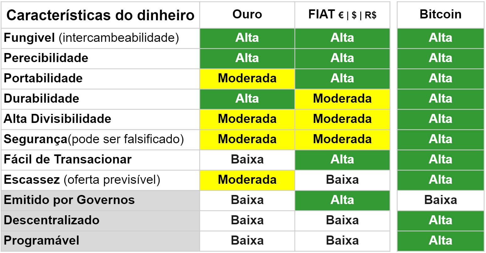

## Argumentos para Bitcoin
> "Bitcoin é um sistema opt-in. Você escolhe usá-lo. Você escolhe quais aplicativos você vai rodar. Você escolhe com quem você vai interagir. Você escolhe as regras do jogo pelo qual você está vai interagir. É por isso que o bitcoin vai vencer. Ele oferece a inovação que os consumidores querem e precisam." - **Andreas M. Antonopoulos**

### Uma mudança de paradigma
Eu sou um indivíduo nativo digital em um corpo da Geração X. Eu me lembro da vida sem internet, mesmo sem videocassete. Tínhamos uma estação de TV na Áustria, era isso. Meus pais ganharam nosso primeiro telefone fixo quando eu tinha 12 anos. Aos 14 usei meu primeiro computador, em 1997 instalei minha primeira conexão com a internet e e-mail em casa. Naquele mesmo ano, havia apenas 1 milhão de sites globalmente e Google e Amazon não existiam internacionalmente.

Muita gente descartou a internet como uma tendência que iria embora. Em 1995, o astrônomo e autor norte-americano Clifford Stoll escreveu um artigo para a Newsweek intitulado "A Internet? Bah!"

>"Depois, há o cibernegócio. Prometem-nos compras instantâneas por catálogo - basta apontar e clicar para obter grandes ofertas. Compramos passagens aéreas pela rede, fazemos reservas em restaurantes e negociamos contratos de vendas. As lojas se tornarão obsoletas. O shopping faz mais negócios em uma tarde do que toda a Internet lida em um mês? Mesmo que houvesse uma maneira confiável de enviar dinheiro pela Internet - o que não existe - a rede está perdendo um ingrediente essencial do capitalismo: vendedores." - **Clifford Stoll** [^56]

Avançando para 2019 e a Amazon está entre as dez maiores empresas do mundo, o Google e o YouTube são os maiores mecanismos de pesquisa e existem 1,8 bilhão de sites ativos. Meu primeiro contato com Bitcoin e blockchains foi em abril de 2017 quando ouvi uma palestra de Shermin Voshmgir. A ficha caiu imediatamente pra mim. 20 anos depois de mudar minha carreira de planejadora urbana para empreendedora da internet, entendi que o Bitcoin é tão grande quanto o surgimento da internet em 1997.

A descoberta do Bitcoin foi o advento de uma nova tecnologia em cima da internet que usamos para mídia e comunicação. A internet do dinheiro, que nos permite trocar valor globalmente sem fronteiras. A comunicação pela internet mudou o mundo massivamente nas últimas décadas. Qual você acha que o impacto da livre circulação de valor terá? Bitcoin e outros ativos digitais públicos e abertos mudarão a dinâmica de poder entre as nações, uma vez que de repente é possível movimentar enormes quantias de dinheiro em velocidade, sem atrito ou tocar no sistema financeiro atual.

Bitcoin é uma nova tecnologia. Se compararmos seu desenvolvimento com a internet, estamos praticamente onde a internet estava em 1997.

### Permitindo a mudança social

Pessoas em nações desenvolvidas com sistemas democráticos funcionais geralmente descartam o Bitcoin como uma ferramenta para especulação e um perigo para os estados-nação. Portanto, alguns acham que seu consumo de eletricidade é ambientalmente irresponsável. Alguns até defendem a proibição. Espere que esse tipo de crítica aumente nos próximos anos.

A população mundial é de 7,8 bilhões de pessoas. Apenas 8,4% deles vivem em democracias plenas, 41% em democracias imperfeitas, 15% em regimes híbridos e 35,6% em regimes autoritários.

Mais de 50% da população mundial vive em nações longe de democracias livres e justas! 1,7 bilhão de pessoas não têm conta bancária e nunca terão. Bitcoin é para eles. [^57]

São pessoas em regiões como África e América do Sul que impulsionarão a adoção do Bitcoin. Os principais casos de uso são:

**Hedge contra a inflação**
Esta tabela do Fundo Monetário Internacional mostra a variação anual dos preços ao consumidor em porcentagem.
 [^58]

* A Venezuela teve aumentos de preços de 5.500%. O sofrimento do povo é simplesmente incompreensível.
* No Sudão os preços aumentaram 200% somente em 2021.
* Os zimbabuanos enfrentaram uma duplicação de preços com inflação de 100% de 2020 a 2021.
* O FMI não tinha dados para a Argentina, mas fui informado pelo meu interlocutor argentino, Franco Amati, que a taxa de inflação anual era de 50%.
* A Nigéria viu uma taxa de inflação de 16% em 2020.
* A taxa de inflação da Turquia em 2020 foi de 13,6%.

De maio de 2020 a abril de 2021, o volume de negociação de bitcoin na Nigéria aumentou 40%, de US$ 287 milhões para US$ 399 milhões. Uma pesquisa de 2020 mostra que 32% dos nigerianos entrevistados usaram ou possuíam criptomoedas. Enquanto isso, em países democráticos desenvolvidos como Alemanha e EUA, apenas 5-6% usaram ou possuem criptomoedas.

 [^59]

Dadas essas taxas de inflação anuais, as pessoas sabem que precisam armazenar sua riqueza em dinheiro mais forte como USD e, melhor ainda, Bitcoin. Se você explicar as diferenças do Bitcoin para as moedas locais nesses países, todos entenderão imediatamente como e por que o Bitcoin pode apoiá-los.

**Controles cambiais**

Países com economias fracas e democracias defeituosas usam controles cambiais para limitar - o que eles chamam - a especulação contra suas moedas fracas. Como os líderes autoritários querem limitar e controlar as possibilidades das pessoas de contornar seus sistemas opressores, eles aplicam regulamentações como as seguintes:

* Os controles de capital da Argentina só permitem que as pessoas troquem um valor máximo de US$ 200 por mês de pesos argentinos para dólares.
* Os mesmos regulamentos severos se aplicam no Zimbábue. Se você administra um negócio e precisa importar mercadorias, deve solicitar permissão ao Banco Central para enviar USD para o exterior. "Suponha que eu esteja em energia solar e queira comprar 20 painéis para poder vendê-los. Tenho apenas 30 dias para gastar o dinheiro que já tinha. O Banco Central pode levar o tempo que quiser. Essa é outra razão pela qual os dólares físicos reais dos EUA, o dinheiro físico, têm muito mais valor no Zimbábue", um entrevistador do Zimbábue me disse em março de 2020.

**O sistema bancário não está disponível ou quebrado**
* As empresas locais no Zimbábue podem usar USD para faturar um fornecedor local. Esse fornecedor tem que liquidar esses dólares americanos dentro de 30 dias, ou o dinheiro será convertido em sua conta LBTR à taxa bancária. RTGS é o nome do dólar do Zimbábue, que mostra essas altas taxas de inflação.
* Se você comprar moeda estrangeira em um banco argentino, a taxa de câmbio oficial do banco é usada (o que é favorável para o banco, mas não para o cliente) e, além disso, é deduzido um imposto de 65%.
* Usar o sistema bancário também pode ser cheio de burocracia nos países ocidentais, mas é muito pior nesses países.

**Remessas**
* Se você receber dinheiro do exterior através do sistema bancário tradicional, ele será convertido em pesos argentinos à taxa oficial do banco. Isso representa basicamente um confisco de 30% do valor.
* Em 2020, até 1 bilhão de dólares foram enviados como remessas para o Zimbábue. Mais de um terço da população depende de remessas de parentes no exterior. Muitos zimbabuenses vivem na África do Sul e do dinheiro que enviam, até 20-30% são perdidos através de taxas bancárias e taxas de câmbio oficiais. [^60]

**Barreiras para Mulheres**
Usar uma conta bancária básica está além do alcance de quase um bilhão de mulheres em todo o mundo. Graus variados de desigualdade de gênero permitidos ou exigidos por lei negam às mulheres a participação financeira total em muitos países ao redor do mundo. Dependendo do país, as mulheres são discriminadas nas leis de herança e são obrigadas a obter permissão do marido para trabalhar legalmente, obter uma conta bancária, registrar um negócio ou assinar um contrato; muitas mulheres são proibidas de entrar em certas profissões. As mulheres também podem achar mais difícil acessar carteiras de identidade legais devido a leis existentes ou requisitos de registro restritivos, e essa identificação é geralmente necessária para usar produtos e serviços financeiros.

Outros obstáculos que impedem as mulheres de acessar serviços financeiros são a necessidade de viajar longas distâncias, o risco de serem roubadas ao acessar dinheiro e a falta de privacidade que lhes permitiria proteger suas economias de outras pessoas.

"Mais de 80 por cento dos pequenos negócios conduzidos por mulheres no Pacífico estão em pequenos mercados", disse a Dra. Sharman Stone, Embaixadora das Mulheres da Austrália. “Quando eles só tinham dinheiro, era extremamente perigoso para eles levar esse dinheiro para casa e reter esse dinheiro quando chegassem em casa”. [^61] Com Bitcoin e criptomoedas, eles são fisicamente mais seguros, podem contornar a inflação e manter seu próprio dinheiro.

> As mulheres são a maioria da população do Quênia; eles realizam 70% do trabalho agrícola, mas possuem menos de 1% da terra e controlam muito pouco a renda produzida por seu trabalho. [^62]

56% de todos os adultos não bancarizados em todo o mundo são mulheres. As mulheres estão sobre-representadas entre os não bancarizados na maioria das economias. Isso é verdade mesmo em economias que aumentaram com sucesso a propriedade de contas e têm uma parcela relativamente pequena de adultos que não têm conta bancária. [^63] Nos Estados Unidos, Oriente Médio e Norte da África, dois terços dos desbancarizados são mulheres.[^64]

Um estudo no Quênia descobriu que o acesso a serviços de dinheiro móvel trouxe grandes benefícios, especialmente para as mulheres. Permitiu que as famílias chefiadas por mulheres aumentassem suas economias em mais de um quinto, permitiu que 185.000 mulheres deixassem a agricultura e desenvolvessem atividades comerciais ou de varejo e ajudou a reduzir a pobreza extrema entre as famílias chefiadas por mulheres em 22%.

Serviços de dinheiro móvel como M-Pesa no Quênia ou EcoCash no Zimbábue aumentaram o acesso a instrumentos financeiros. O problema: estes são serviços de empresas privadas centralizadas. O governo pode interferir, as transações podem ser censuradas ou as contas podem ser fechadas. Como exemplo, em julho de 2020, o governo do Zimbábue bloqueou pagamentos de contas de dinheiro móvel EcoCash para contas bancárias ou dinheiro.

Os serviços financeiros também podem ajudar as pessoas a acumular economias e aumentar os gastos com necessidades básicas. Depois de receber contas de poupança, os vendedores do mercado no Quênia, principalmente mulheres, economizaram a uma taxa mais alta e investiram 60% a mais em seus negócios. As famílias chefiadas por mulheres no Nepal gastaram 15% a mais em alimentos nutritivos (carne e peixe) e 20% a mais em educação depois de receberem contas de poupança gratuitas. Além disso, os agricultores do Malawi que tiveram seus ganhos depositados em contas de poupança gastaram 13% a mais em equipamentos agrícolas e aumentaram o valor de suas colheitas em 15%. [^65]

O Bitcoin pode reduzir o custo de recebimento de pagamentos, deixando as pessoas com mais dinheiro. Embora os instrumentos financeiros tradicionais exijam um documento de identidade e um comprovante de endereço, o uso do Bitcoin está aberto a todos. Portanto, o Bitcoin pode apoiar as mulheres na conquista de mais liberdade e auto-soberania.

Para mais informações sobre as condições de vida das pessoas no Zimbábue e seu uso real do Bitcoin na Venezuela, Argentina, Afeganistão, Nigéria e muito mais, [ouça minhas entrevistas em podcast](https://anita.link/show). Em relação às vantagens para as mulheres que usam Bitcoin, consulte a seção "Mulheres no Bitcoin".

### Lento, mas seguro
Uma crítica ao Bitcoin é que seu desenvolvimento é lento e desajeitado. Na verdade, a realidade mostra que o Bitcoin é o blockchain mais antigo e tecnicamente mais seguro. Nunca foi hackeado ou alterado. A razão para isso é uma comunidade de desenvolvedores independentes de código aberto cujo primeiro interesse é contribuir para o bem social mais amplo. Ouça [Adam Back](https://anita.link/12), [Gloria Zhao](https://anita.link/82), [Tim Akinbo](https://anita.link/63), [Amiti Uttawar](https://anita.link/62) ou [Matt Corrallo](https://anita.link/19) para entender como eles são atenciosos e motivados por sua missão. Em segundo lugar, o ritmo de desenvolvimento é deliberadamente lento. O mantra do Vale do Silício de "Mova rápido e quebre as coisas" é o oposto do que você deseja para um ativo digital de 600 bilhões de dólares que é, ao mesmo tempo, software vivo.

### Internet das Coisas
Um dinheiro nativo da internet como o bitcoin também pode ser usado por máquinas. Carros elétricos autônomos, como táxis automáticos, poderão se recarregar em estações de carregamento e pagar automaticamente com bitcoin. Isso não é ficção científica, isso é um futuro próximo. Andy Schroder, de Kentucky, já está [carregando seu Tesla com micropagamentos máquina a máquina em tempo real pela Bitcoin Lightning Network](http://andyschroder.com/DistributedCharge/). Esta não será a única inovação que virá das interseções de novas tecnologias, dinheiro e comunicação.

### Bitcoin, o barco salva-vidas
Como expus no capítulo 1, não é uma questão de saber se o atual sistema financeiro cairá, mas quando. Mesmo antes da pandemia do COVID-19 se espalhar globalmente na primavera de 2020, as nações estavam endividadas; os efeitos devastadores foram evidentes nas diferenças de riqueza global e regional. Por muitos anos, os especialistas alertaram o público sobre isso. Simon Dixon já havia chamado a Grande Depressão da década de 2020 já em 2011. Nomi Prins explicou o conluio dos bancos centrais em seu livro de 2018 com o mesmo nome. Satoshi Nakamoto referiu-se aos perigos de um sistema monetário baseado em dívidas e na crise financeira no white paper.

Bitcoin é dinheiro livre de dívidas. Não se infla sua oferta. É a alternativa perfeita para desativar o sistema fiduciário. Para se proteger dessa crise iminente, faz sentido distribuir os investimentos entre diferentes ativos e, assim, reduzir o risco sistêmico. Ouro, ações, títulos, imóveis, relógios e carros antigos são ativos de proteção de valor bem conhecidos. Bitcoin é um ativo de proteção de valor digital.

Quando os CEOs de empresas de capital aberto como Elon Musk e Michael Saylor começaram a trocar reservas de dinheiro em dólares por bitcoin, eles garantiram seu lugar no bote salva-vidas Bitcoin. Bitcoin foi feito para indivíduos. Para pessoas como você e eu. Agora é sua chance de sair do barco afundando das moedas fiduciárias. Não é tarde demais, ainda é cedo.

### Bitcoin é um bem comum
A rede Bitcoin é uma infraestrutura pública; é uma rede de comunicação descentralizada que ainda está sendo construída bem diante de nossos olhos. Nós, como indivíduos, não podíamos participar financeiramente, diretamente da construção da internet. A maioria de nós não possuía ações da Apple, Google ou Facebook. Muitos obstáculos excluem bilhões de pessoas de investir em start-ups. O Bitcoin está aberto para que todos invistam em sua infraestrutura. Você também pode usar casas para imaginar o Bitcoin sendo propriedade digital; existem apenas 21 milhões de casas e você pode comprar uma fração de uma casa, até a maçaneta de uma porta.

### Bitcoin incentiva a economizar
Bitcoin é ideal para economia de longo prazo. Se você acredita que o valor vai subir no futuro, você é encorajado a manter e não gastar seu bitcoin em coisas que não são realmente necessárias.

### Você pode pagar Bitcoin
Você não precisa comprar um bitcoin inteiro. Um bitcoin é divisível por cem milhões de unidades. A menor unidade é chamada de "Satoshi" - em homenagem à figura fundadora pseudônima, Satoshi Nakamoto. Você pode comprar partes de um bitcoin e começar com apenas 20 euros, por exemplo.

### Bitcoin e as funções do dinheiro
Muitos economistas de livros didáticos estão insistindo no fato de que o Bitcoin não é dinheiro porque não atende aos três critérios funcionais que o dinheiro deve ter. Essas funções foram definidas por William Stanley Jevons[^66] em 1875, e sua análise tornou-se amplamente popular nos livros de macroeconomia desde então.

De acordo com Jevons, o Bitcoin só é dinheiro se cumprir essas funções:
1. Reserva de valor - o valor deve permanecer estável ao longo do tempo
2. Meio de troca - é amplamente aceito em troca de bens e serviços
3. Meio de conta - é usado como medida de preços, custos e lucros
Fonte: https://en.wikipedia.org/wiki/Money

**1. Reserva de valor**
Os críticos dizem que o bitcoin não é uma reserva de valor devido à sua volatilidade e potencial para perdas de curto prazo. Bem, como expus no capítulo 3.1, a longo prazo esse não é realmente o caso. Além disso, questiono a definição de "estável ao longo do tempo". Qual é o período de tempo? A inflação em moeda fiduciária na Áustria foi de 20% na última década. Todas as outras moedas fiduciárias, como o Euro, são reservas de valor igualmente não confiáveis ​​por esse motivo.

**2. Meio de troca**
Você pode usar bitcoin como meio de troca, se quiser. Sim, há apenas um pequeno número de empresas, serviços e restaurantes que aceitam bitcoin como pagamento no momento da redação. Mas, para fazer isso, você pode usar diferentes ferramentas e serviços que você pode preencher com bitcoin e gastar em moeda fiduciária. Além disso, existem muitas empresas dentro do espaço que já aceitam e pagam salários em bitcoin também.

**3. Meio da conta**
O dinheiro fiduciário é obrigado a ser o meio de conta por lei. Simplesmente não temos escolha. Bitcoin é baseado em uso voluntário, é opt-in; se especularmos que o valor está subindo, não vamos gastá-lo. Como a volatilidade do bitcoin se torna menor ao longo do tempo, um dia o valor atingirá um patamar e as pessoas começarão a gastar bitcoin. Ainda antes disso, mais e mais empresas começarão a aceitar o bitcoin, pois confiarão que ele não perde valor, mas valoriza.

Uma nova forma de dinheiro que não é imposta a nós, mas é um opt-in, tem que passar por certas etapas nessa ordem: primeiro, tem que se tornar uma reserva de valor, então a confiança tem que ser construída, então as pessoas vão usá-lo como meio de troca. Só então será usado como meio de conta.

Dispensar o Bitcoin porque ainda não cumpre todas as funções do dinheiro é perder o ponto.

### Comparando as características do dinheiro

Em 2014 Ryan Walker tomou os conceitos da teoria da seleção natural de Darwin para comparar a evolução das diferentes formas de dinheiro. A tabela abaixo mostra o grau em que ouro, moeda fiduciária e bitcoin cumprem as características tradicionalmente reconhecidas do dinheiro (linha 1 - 8). O governo emitido mede o grau de centralização e controle pelas autoridades (linha 9).

> "A chegada de moedas baseadas em criptografia possibilitou novas características importantes anteriormente não possíveis com as formas tradicionais de dinheiro. Além disso, a realização de tais características provavelmente terá um impacto dramático no ambiente em que essas moedas competem. As linhas 10 e 11 incluem a espécie de criptomoeda quando avaliada em relação às características tradicionais e recém-realizadas do dinheiro." - **Ryan Walker**

[^67]
Isso mostra o grau em que o ouro, a moeda fiduciária e as moedas criptográficas cumprem as características tradicionalmente reconhecidas da moeda, bem como as novas características possibilitadas pela descoberta do Bitcoin.

Como você pode ver, o Bitcoin vai além da estrutura tradicional do que é dinheiro. Está evoluindo para uma dimensão completamente nova do que o dinheiro pode fazer e de quais aplicativos serão construídos no futuro.

[^56]: [Clifford Stoll](https://www.newsweek.com/clifford-stoll-why-web-wont-be-nirvana-185306)
[^57]: [Wikipedia, Democracy Index](https://en.wikipedia.org/wiki/Democracy_Index)
[^58]: [Fundo Monetário Internacional, Taxa de inflação](https://www.imf.org/external/datamapper/PCPIPCH@WEO/OEMDC/ADVEC/WEOWORLD), solicitado em 26 de abril de 2021
[^59]: [Volume de negociação em trocas de Bitcoin P2P em países subsaarianos de maio de 2020 a abril de 2021](https://www.usefultulips.org/combined_Sub%20Saharan%20Africa_Page.html), solicitado em 26 de abril de 2021
[^60]: [Banco Mundial, Enviando dinheiro da África do Sul para o Zimbábue](https://remittanceprices.worldbank.org/en/corridor/South-Africa/Zimbabwe), solicitado em 26 de abril de 2021
[^61]: [BNY Mellon apoia o impulso global pela igualdade financeira de gênero](https://www.bnymellon.com/us/en/about-us/newsroom/company-news/bny_mellon_supports_a_global_push_for_financial_gender_equality.html)
[^62]:[Jornal de Direito Internacional de Georgetown](https://www.law.georgetown.edu/international-law-journal/wp-content/uploads/sites/21/2018/08/4-Kenya-Report -508.pdf)
[^63]: [Banco Mundial, Cobertura de ID Global, Barreiras e Uso pelos Números: Uma Análise Aprofundada da Pesquisa ID4D-Findex de 2017](https://globalfindex.worldbank.org/sites/globalfindex/files /chapters/2017%20Findex%20full%20report_chapter2.pdf)
[^64]: [Banco Mundial, The Little Data Book on Financial Inclusion 2018](https://openknowledge.worldbank.org/bitstream/handle/10986/29654/LDB-FinInclusion2018.pdf)
[^65]: [Banco Mundial, The Global Findex Database Measuring Financial Inclusion and the Fintech Revolution 2017](https://www.notion.so/Financial-Inclusion-feb3e3913cb042b9bc0ef525ad0f8272#f24c9e8d868e49fe9052c61ead55e080)
[^66]: [William Stanley Jevons](https://en.wikipedia.org/wiki/William_Stanley_Jevons)
[^67]: [Ryan Walker](https://www.coindesk.com/origins-money-darwin-evolution-cryptocurrency)
