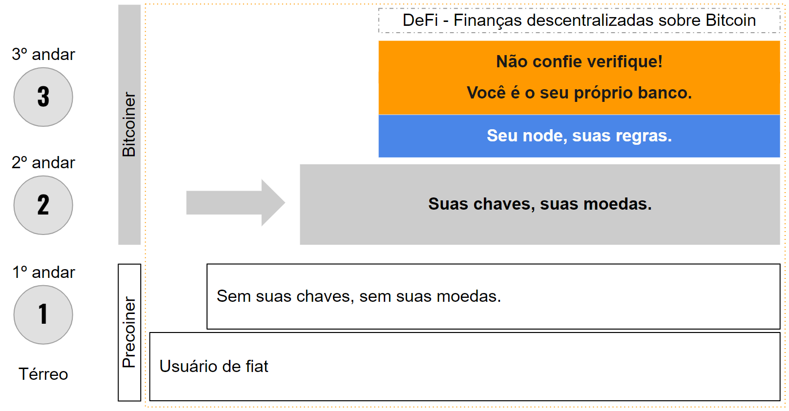

# A Escadaria da Soberania Financeira

> "Sem suas chaves, sem suas moedas." - **Andreas M. Antonopoulos**

Como você leu nos capítulos anteriores, a principal força do Bitcoin é sua não censura, o que lhe dá soberania financeira. Ou seja - além da oferta fixa de 21 milhões - o principal diferencial para todas as outras formas de dinheiro. Ele protege você de bail-ins como em Chipre em 2014 e da inflação desvalorizando seus fundos. Acaba com a financeirização forçada do seu dinheiro por meio de produtos bancários e financeiros. Ele lhe dá controle total sobre seus fundos, permite que você se mova globalmente enquanto traz seu dinheiro com você. É uma alternativa, um opt-out do sistema fiduciário - tudo o que você precisa são 12 palavras em inglês: sua frase de recuperação.

> "Bitcoin é incensurável e não inflável. Essas são suas propriedades mais importantes." - **Anita Posch**

Se você não tem essas palavras iniciais, você não tem os privilégios e a liberdade mencionados acima.

## Riscos das Carteiras de Custódia
É importante notar que há uma grande diferença entre carteiras custodiantes e carteiras não custodiantes. Você só obtém o controle da frase de recuperação quando usa uma carteira não custodial (auto-hospedada). Exchanges como Coinbase, Kraken, Binance, Bitpanda, etc., não fornecem as chaves privadas para suas próprias carteiras. Embora possa ser mais conveniente manter bitcoin em uma carteira em uma exchange centralizada, não é diferente de um banco. Você não possui o bitcoin em sua conta da exchange, o que pode ser um grande problema se a exchange for hackeada, algo que já aconteceu muitas vezes. Por exemplo, lembro de Mt. Gox, o maior hack até hoje que aconteceu em 2014. Não passa um dia sem casos de contas congeladas, ou sinalização de moedas contaminadas e, às vezes, a interrupção regulatória da negociação. Além disso, essas exchanges precisam que você se registre e cumpra todos os requisitos de identificação KYC (recomendações para conhecer seu cliente e anti-lavagem de dinheiro), o que é um obstáculo para bilhões de pessoas, excluindo-as dos bancos e agora do uso de exchanges de criptomoedas. também. Além disso, esses regulamentos KYC estão invadindo sua privacidade. Felizmente, o Bitcoin é construído para todos. Para mitigar os riscos de contraparte das carteiras de custódia, você deve pular essas exchanges e usar uma carteira não custodiante desde o início.

> "Esta ilusão de que o dinheiro no banco é mais seguro do que o dinheiro debaixo do colchão é de uma posição privilegiada." - **Andreas M. Antonopoulos**

Para pessoas fora do "mundo desenvolvido ocidental", não existe uma conta bancária segura. Isso é um privilégio. Você pode pensar que prefere deixar seu dinheiro na exchange porque não quer ter o incômodo e a responsabilidade de manter seu próprio dinheiro. Você pode fazer isso, mas não é o que Satoshi Nakamoto pretendia e isso o deixa vulnerável.

Depois de aprender e executar os passos para a liberdade financeira, você verá que não é tão difícil quanto pode parecer à primeira vista.

## 3 Passos para a Soberania Financeira

>"Com grande liberdade, vem grande responsabilidade." - **Dr. Stephanie Murphy**

Stephanie Murphy, co-apresentadora do podcast "Speaking of Bitcoin", enquadra o modelo de liberdade financeira como uma escada com diferentes níveis de soberania. Como o Bitcoin é uma tecnologia em desenvolvimento, o grau de liberdade que se pode alcançar está mudando o tempo todo. Este livro lhe dará orientação para alcançar o passo 2: o nível "Suas chaves, suas moedas". Alcançar o nível "Não confie, verifique" se tornará muito mais fácil nos próximos anos. Neste momento requer know-how técnico e um maior esforço de tempo e recursos, mas em princípio todos podem alcançá-lo.

*Representação* [^68]

**Térreo** Você é um pré-coiner, já que está lendo meu livro, deve estar interessado em Bitcoin, mas não possui nenhum.

**1º andar** Você está conhecendo o BTC com uma solução de custódia em uma exchange centralizada, mas não controla nenhuma das chaves. Você tem alguma independência porque está investido em uma criptomoeda e não mais apenas em moeda fiduciária. Mas não é muita independência porque você depende de um terceiro, que vem com os riscos de contraparte mencionados acima. Você está no nível **"sem suas chaves, sem suas moedas"**.

O ideal é pular o primeiro andar e ir para o segundo andar o mais rápido possível.

**2º andar** Você assume o controle de suas chaves e as armazena de forma segura em uma carteira sem custódia que lhe dá sua seed. Este é um grau muito maior de soberania financeira. Você pode fazer isso com uma carteira móvel em seu smartphone para pequenas quantias ou - a melhor maneira e altamente recomendada - com uma carteira de hardware para quantias maiores. Você atinge o nível **"suas chaves, suas moedas"**. Você atingiu um nível muito alto de independência.

A partir daqui, as etapas são para usuários experientes. Eles lhe dão ainda mais soberania, privacidade e controle sobre seu bitcoin.

**3º andar** Você obtém total soberania sobre seus fundos conectando sua carteira de hardware com seu próprio nó completo. Com essa configuração, você pode não apenas visualizar e receber informações sobre suas transações, mas também verificar blocos e transações minerados sem depender de terceiros. Você não precisa mais confiar em mais ninguém e tem um alto nível de privacidade e controle. **"Você é seu próprio banco"** e agora atingiu o nível **"Não confie, verifique"**.

Você pode levar essas medidas de segurança e independência ainda mais longe com soluções air-gapped, configurações multi-sig e muito mais.

No topo dessa escada, estão surgindo soluções financeiras descentralizadas, como empréstimos e empréstimos de bitcoin.

Em última análise, se tudo o que você quer fazer é se proteger contra a inflação e usar o Bitcoin como reserva de valor, **chegando ao 2º andar, "suas chaves, suas moedas" é o objetivo**. Mostrarei como alcançar esse nível de soberania nos próximos capítulos.

[^68]: Anita Posch
