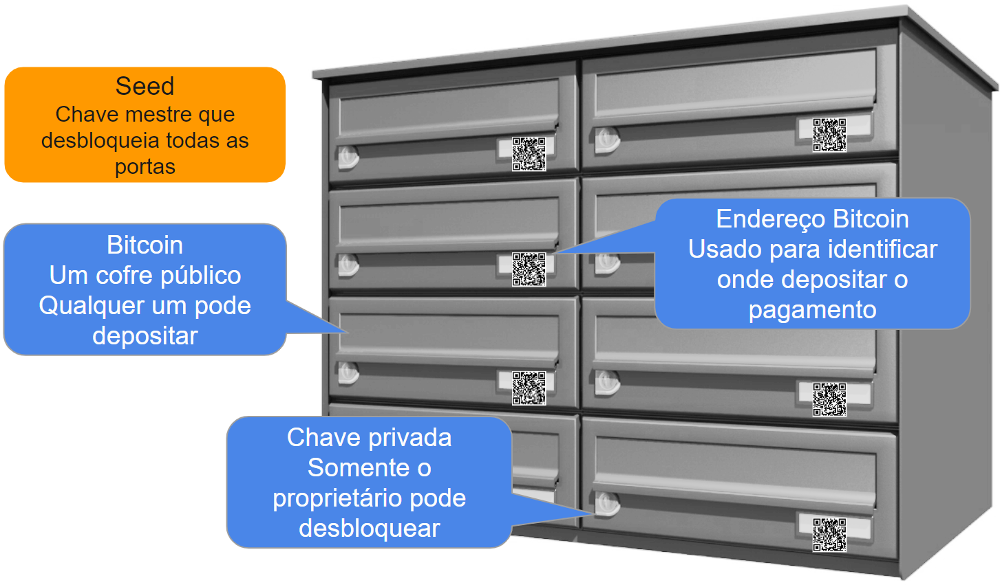

## Protegendo seus fundos

Como mencionado no capítulo anterior, nosso objetivo é atingir o nível "Suas chaves, suas moedas".

Para comprar, usar e armazenar bitcoin, você precisará de:

* Carteira Bitcoin = sua caixa de depósito de dinheiro digital. Uma analogia mais precisa é um chaveiro digital para seus cofres.
* Endereços Bitcoin = um ou mais endereços exclusivos para seus fundos em blockchain, seus endereços de recebimento (mais precisamente uma saída de transação não gasta UTXO)
* Seed = os dados de recuperação da sua carteira Bitcoin.

### Carteira Bitcoin
Pense em uma carteira como um cofre público com várias seções. Qualquer pessoa pode depositar dinheiro em cada uma das seções. Somente o proprietário das chaves privadas pode desbloquear uma seção e mover o dinheiro que ela detém. Sua carteira Bitcoin consiste em todas as seções e contém todas as chaves privadas para desbloqueá-las. Chaves privadas e endereços Bitcoin são gerados a partir da seed (semente). A seed é a raiz de todas as chaves e endereços, é como um balde no qual todas as suas chaves privadas são armazenadas.

*Representação* [^69]

A carteira é um aplicativo em seu telefone ou software em seu computador, que lida com tudo em segundo plano - suas chaves privadas, seus endereços e envio e recebimento de bitcoin.

As carteiras Bitcoin contêm chaves, não moedas. Cada usuário tem uma carteira contendo chaves. Carteiras são realmente apenas chaveiros contendo pares de chaves privadas/públicas. Seus fundos são registrados na blockchain Bitcoin.

### Endereço Bitcoin
Para receber bitcoin, você precisa de um endereço Bitcoin para o qual alguém possa lhe enviar bitcoin. O endereço Bitcoin consiste em uma longa série de dígitos e letras.

Um exemplo de endereço Bitcoin: 346n4apJCQPg2XAXU3bfNQTogz4PyTkrEf

Digitar 34 dígitos é obviamente muito impraticável, portanto, os códigos QR dos endereços são comumente usados e geralmente são criados automaticamente pela sua carteira.

Bitcoin é pseudônimo, o que significa que não é necessário conectar seu endereço de e-mail ou identificação pessoal a uma carteira. No entanto, a blockchain Bitcoin é transparente, o que significa que seus endereços Bitcoin podem ser vistos publicamente na Internet. Por exemplo, você pode procurá-lo no Blockcypher e ver todas as transações e valores atuais. Aqui está um link de exemplo: [https://anita.link/explorer](https://anita.link/explorer)

Portanto, por motivos de privacidade, não compartilhe seus endereços Bitcoin em conexão com sua identidade na internet. A privacidade também é a razão pela qual você não deve reutilizar endereços. A maioria das carteiras Bitcoin fornece automaticamente novos endereços para cada transação.

Vamos para a parte mais importante de proteger seu bitcoin: a seed.

### Seed e Chaves Privadas

Como a seed é a raiz de todas as chaves privadas, ninguém mais deve ter acesso a ela. A pessoa que conhece a seed tem o controle final sobre os fundos.

A seed (às vezes chamada de frase mnemônica, frase de recuperação ou frase de backup) é uma sequência de 12 ou 24 palavras que dá acesso às chaves privadas de seus endereços de carteira e, portanto, acesso às suas moedas. Isso significa que essa ordem de palavras deve permanecer em segredo. Qualquer pessoa que conheça a seed pode acessar e assumir suas moedas. Por quê?

Suas moedas não estão dentro de sua carteira digital, como elas estariam dentro de sua carteira física normal. Em vez disso, elas estão registradas no blockchain. Compare isso com um e-mail e uma carta. Você pode acessar sua conta de e-mail de qualquer lugar do mundo porque seus e-mails são armazenados online, enquanto sua caixa de correio está parada. Isso se aplica de forma semelhante ao Bitcoin.

O acesso mundial aos seus ativos é sempre possível com a semente, independentemente do fabricante da sua carteira. Ao selecionar sua carteira, procure o termo "carteira HD" (Determinístico Hierárquico). As carteiras HD permitem que você mude para a carteira HD de outro fabricante, pegue a seed e restaure suas moedas.

Suponha que seu smartphone seja corrompido, você não possa mais acessar seu aplicativo de carteira Bitcoin e precise mudar para um novo telefone. Você instala uma nova versão da sua carteira Bitcoin e importa a seed da sua primeira carteira. O acesso aos seus fundos é restaurado.

A seed é gerada pelo aplicativo de carteira durante a configuração inicial. A maioria das carteiras orienta você na configuração e instrui você a escrever as palavras iniciais em uma folha de papel. Se sua carteira não oferecer isso imediatamente, procure o recurso "Criar backup" ou "Backup" e siga as etapas. A criação da seed funciona de maneira oposta à criação de uma senha como você normalmente a conhece em sites. Não é você quem determina a senha, mas a própria carteira.

A ordem das palavras é IMPORTANTE! Você deve escrever as palavras exatamente na ordem em que aparecem.

> Exemplo de semente: cruise item paper slim vocal power like video snap museum mirror sun

Escreva a semente à mão em um pedaço de papel e guarde-a com segurança. Não faça uma captura de tela, não a armazene em seu telefone ou computador conectado à internet, pois todos esses lugares podem ser invadidos. Há mais informações sobre segurança no capítulo 5.

Como seus fundos não estão dentro de sua carteira, mas armazenados no blockchain, você pode se mover globalmente e levar seus fundos de bitcoin para onde quer que vá. Você só precisa lembrar as 12-24 palavras-semente na ordem correta. Depois de passar pela alfândega sem celular, você consegue uma nova carteira e importa a semente. Mágica.

[^69]: Anita Posch, inspirada em Andreas M. Antonopoulos
