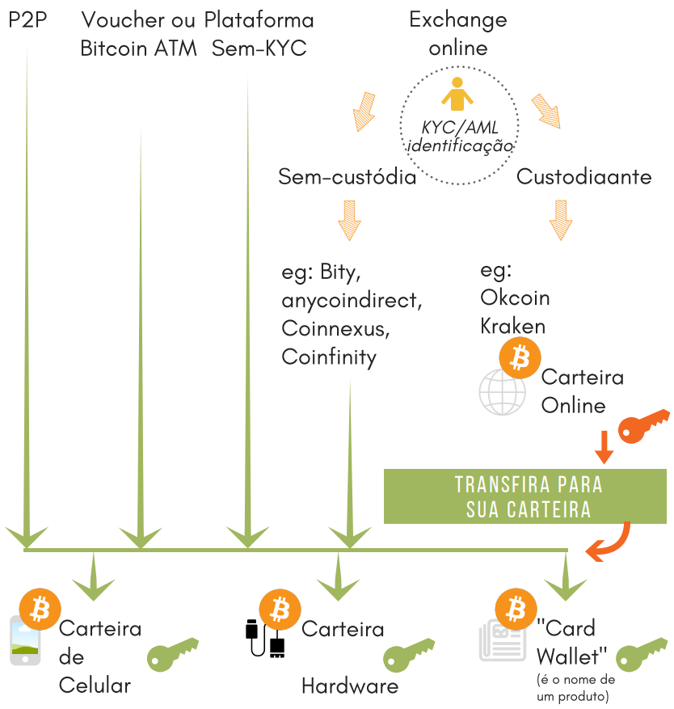

## Navegador de carteira
Há uma variedade de provedores de carteira e mais estão sendo lançados ao longo do tempo. Você tem que decidir se quer um que seja apenas para Bitcoin ou um para várias moedas. Cada carteira oferece diferentes funcionalidades, níveis de segurança e níveis de suporte para diferentes conjuntos de moedas. As perguntas a seguir ajudarão você a escolher o tipo básico de carteira que será adequado às suas necessidades. Você ainda precisará pesquisar qual fabricante suporta quais moedas.

### Etapa 1 - Selecione a carteira
**Gostaria de poder pagar com a carteira regularmente?**
Se você não usa celular nem computador e não deseja enviar pagamentos, pode usar a Card Wallet. Você pode enviar bitcoin ou ether para ela e salvá-los. Assim que você quiser pagar, você precisará instalar uma carteira. Se você deseja fazer pagamentos regulares, uma carteira de software, possivelmente em combinação com autenticação de hardware, como Trezor ou BitBox02, é mais apropriada.

**Deseja manter o software e um dispositivo atualizados?**
Não? Então, novamente, a Card Wallet é a escolha certa para você. Você não precisa se preocupar com a manutenção de um dispositivo.

**O valor que você planeja ter na carteira será...**
*Semelhante à carteira normal no seu bolso*: normalmente uma carteira móvel é suficiente. É gratuito e suficiente para pequenas quantidades.

*Semelhante à sua conta bancária*: use uma carteira de hardware. As carteiras de hardware são muito procuradas nas altas do Bitcoin e muitas vezes esgotadas (lembre-se disso em sua organização).

Existe um [ajudante estendido no site Bitcoin.org](https://bitcoin.org/en/choose-your-wallet), que você também pode usar. Ele o guiará pela seleção com base no sistema operacional (móvel, desktop, carteira de hardware) que você escolher.

### Etapa 2 - Faça um backup de suas chaves
Anote a seed mnemônica - 12 a 24 palavras em inglês, o nome, tipo e versão do software de sua carteira e guarde-os em um local seguro (capítulo 5.3).

### Passo 3 - Compre Bitcoin
A maioria das carteiras inclui a capacidade de comprar bitcoin diretamente em sua interface. Os fabricantes de carteiras estão cooperando com as exchanges, que em troca pagam uma comissão. Se eu precisar usar uma exchange, prefiro selecionar uma anterior e externamente da carteira. Dessa forma, fico independente do tipo de carteira, posso usar essa exchange para enviar bitcoin para todas as minhas diferentes carteiras e só tenho que deixar meus dados KYC nessa troca, reduzindo o risco de violações de dados. Usar métodos não custodiais e sem KYC (capítulo 7.3) é ainda melhor.

 [^72]

[^72]: Anita Posch
