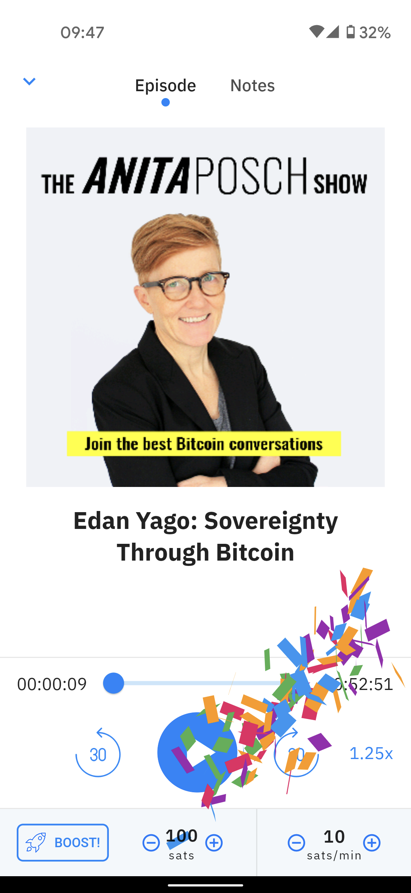

# Ganhe Bitcoin
Ganhar Bitcoin é realmente a melhor maneira de adquiri-lo: registro limitado ou sem registro, verificação de identidade KYC limitada ou sem taxas de negociação. Alguns desses serviços estão disponíveis apenas nos EUA ou em outras regiões específicas do mundo. Como o espaço Bitcoin está em rápido desenvolvimento, este capítulo pode ser apenas uma observação para o que está por vir.

## Quadros de empregos Bitcoin
Encontre um emprego ou um cliente para ganhar Bitcoin pelo seu trabalho.
* [BitGigs](https://bitgigs.com/)
* [Coinality](https://coinality.com/)
* [CanWork](https://www.canwork.io/)
* [Freelance For Coins](https://freelanceforcoins.com/projects)
* [Trabalhando para Bitcoin](https://workingforbitcoins.com/)

## Tarefas Online
Ganhe satoshis concluindo pequenas tarefas.
* [Stakwork](https://stakwork.com)
* [Microlancer](https://microlancer.io/)
* [Sats 4 Likes](https://kriptode.com/satsforlikes/index.html)

## Converta seu salário
* [Bitwage](https://www.bitwage.com/) como funcionário ou freelancer, você pode ganhar seu salário em bitcoin em vez de fiduciário. Os empregadores também podem usar este serviço para pagar sua equipe em bitcoin. [Entrevista com o fundador Jonathan Chester](https://anita.link/106).

## Recebendo Doações ou Pagamentos
Como organização sem fins lucrativos, blogueiro ou podcaster, você pode receber facilmente dicas em bitcoin/satoshis com estes serviços:

* [Tippin.me](https://tippin.me/) permite que você receba gorjetas de bitcoin lightning em seu site e Twitter sem taxas
* [Tallyco.in](https://tallyco.in/) é uma plataforma de crowdfunding construída sobre o blockchain do Bitcoin. Você pode receber pagamentos em BTC e micropagamentos através do Lightning com taxas zero
* [Lightning Gifts](https://lightning.gifts/) crie vales-presente de bitcoin sem taxas para compartilhar com amigos, familiares e seu público

## Criadores de Conteúdo e Podcasting 2.0
Com o advento da Lightning Network, um novo método verdadeiramente inovador de enviar valor e pagar por conteúdo na Internet foi inventado. Streaming money, termo cunhado por Andreas M. Antonopoulos, permite que músicos, criadores de vídeo e podcasters ganhem dinheiro em tempo real, sem intermediários. Você só precisa de uma carteira que tenha podcasts integrados, um pouco de bitcoin e pode começar a ouvir pagando por minuto. O objetivo do Podcasting 2.0 e do dinheiro do streaming é liberar os criadores de conteúdo e o público de anúncios, censura e vigilância. O pagamento é voluntário, sem taxas de assinatura e sem pré-pagamento. Esteja ciente de que, no momento da redação, todos esses serviços estão em constante desenvolvimento. Mais sobre o [fundo do podcasting 2.0 em uma entrevista](https://anita.link/pod2) comigo.

*Representação* [^78]
{height: "70%"}

{height: "70%"}

* [Breez](https://breez.technology/) Uma carteira relâmpago sem custódia para ouvir podcasts
* [PodFriend](https://web.podfriend.com/) Leitor de podcast
* Extensão do navegador [Podstation](https://podstation.github.io/) para podcasts
* [Sphinx Chat](https://sphinx.chat/) Aplicativo de bate-papo e podcasting para ouvintes e podcasters com seu próprio nó
* [Satoshis.stream](https://satoshis.stream/) configuração fácil para podcasters sem nó próprio
* [LN Cast](https://lncast.com/) podcasts da Lightning Network, pague uma pequena quantia de satoshis e doe para ouvir seu podcast favorito
* [LN Pay](https://lnpay.co/) Configure paywalls para seu conteúdo, pagáveis ​​com lightning
* [WordPress Lightning Paywall](https://lightning-paywall.coincharge.io/)
* [Scarce.City](https://scarce.city/) Leilões lightning de bens e arte Bitcoin - [Entrevista com o fundador Chris Tramount](https://anita.link/91)
* [Sparkshot](https://sparkshot.io/) Artistas podem vender seus trabalhos por bitcoin

## Comércio
* [Breez](https://breez.technology/#business) aplicativo de ponto de venda fácil de usar para comerciantes, restaurantes, cafés... para começar a aceitar pagamentos em bitcoin.
* [BTC Pay Server](https://btcpayserver.org/) é um processador de pagamento de criptomoeda de código aberto auto-hospedado para comércio eletrônico. É seguro, privado, resistente à censura e gratuito. Você pode conectá-lo à sua loja online, gerar faturas para sua contabilidade e ganhar bitcoins por meio de lightning. Com integrações para WooCommerce, Shopify, Drupal, Magento, PrestaShop, Shopware.
* [Confirmo](https://confirmo.net/) aceita pagamentos com plugins para lojas online populares.
* [Globee](https://globee.com/) aceita bitcoin com GloBee, eles oferecem plugins de código aberto para todas as principais plataformas de comércio eletrônico por uma comissão (custodial).
* [OpenNode](https://www.opennode.com/) pagamentos em bitcoin para empresas, plugins de comércio eletrônico, páginas de pagamento hospedadas (custodial).

## Cashback e Faucets
* [Fold](https://foldapp.com/) ganhe bitcoin em cada compra com seu cartão VISA
* [Lolli](https://www.lolli.com/) ganhe bitcoin ao comprar em mais de 1.000 lojas
* [Pei](https://getpei.com/) link para quase qualquer cartão de débito ou crédito
* [Satsback](https://satsback.com/en) ganhe sats de volta em lojas online
* [LN Pay](https://lnpay.co/faucets/) crie seus próprios faucets e pague seu público em bitcoin.
* [Purse](https://purse.io) use bitcoin para comprar na Amazon e ganhe desconto
* [Satsy](https://satsy.com/) ganhe sats enquanto faz compras online, responde a pesquisas e joga

## Jogos
* [Thndr Games](https://thndr.games/games) ganhe prêmios em bitcoin enquanto joga
* [Zebedee](https://zebedee.io/) com a Carteira ZEBEDEE você pode jogar com bitcoin, enviar pagamentos dentro de aplicativos de mensagens, coletar doações em sua transmissão ao vivo e muito mais
* [Bitcoin Bounty Hunt](https://bitcoinbountyhunt.com/) um jogo de tiro, onde você pode ganhar satoshis
* Plataformas de jogos [Satoshis Games](https://satoshis.games/) e um mercado NFT para artistas

## Ganhe através de investimento
* [SunExchange](https://thesunexchange.com/) compense sua pegada de carbono, compre células solares e ganhe bitcoin - [Entrevista com o fundador Abe Cambridge](https://anita.link/104)
* [Blockstream Mining Note, STOKR](https://blockstream.com/finance/bmn/) participa da mineração Bitcoin comprando o token de segurança STOKR

## Mineração
Esteja ciente, existem muitos golpes de mineração por aí. Até eu me apaixonei por um há alguns anos. É por isso que eu nunca toquei nessa possibilidade novamente. Agora, mais negócios legítimos estão sendo lançados nesse espaço.

* [Compass](https://compassmining.io/) Um serviço que ajuda a comprar, instalar e hospedar hardware de mineração
* [Blockstream Mining](https://blockstream.com/mining/) hospede suas plataformas de mineração com as instalações e gerenciamento de mineração de classe empresarial da Blockstream

## Empréstimos
* [DeFi Rate](https://defirate.com/) Visão geral das taxas de empréstimo

**Custodia**
* [BlockFi](https://blockfi.com/)
* [Celsius](https://celsius.network/borrow-dollars-using-crypto-as-collateral/)
* [Coinloan](https://coinloan.io/)
* [Coinrabbit](https://coinrabbit.io/)
* [Crypto.com](https://crypto.com/earn)
* [Nexo](https://nexo.io/borrow)
* [SpectroCoin](https://spectrocoin.com/)

**Sem custódia**
* [LEND at Hodl Hodl](https://lend.hodlhodl.com/) Plataforma de empréstimo não custodial global P2P apoiada por Bitcoin
* [Sovryn](https://sovryn.app) é um sistema baseado em contrato inteligente sem custódia e sem permissão para empréstimos e negociação de margem de Bitcoin.

[^78]: Capturas de tela de Anita Posch, recuperadas em março de 2021, carteira Breez
