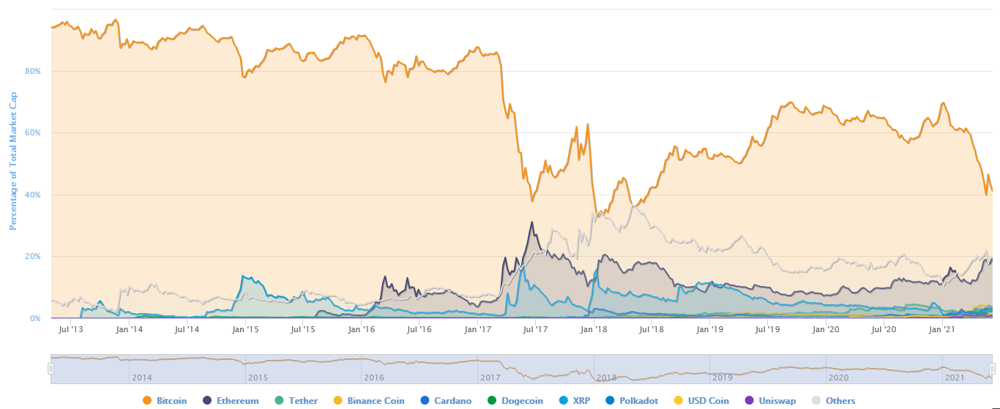

## Arguments Against Bitcoin

### Volatility

_Bitcoin is volatile, you cannot use it as a medium of exchange._

Yes, bitcoin price is volatile, it can lose or gain a lot of value in a single day. If you want to pay for something in bitcoin, you can still do so. Just exchange the same amount you have spent from fiat back to bitcoin on the same day. No volatility, no loss or gain.

### Price Development
_Bitcoin is not a store of value due to its price changes._

View bitcoin as a long term investment, it has been the best performing store of value of all asset classes over the last decade. 

 [^27]

There is of course no guarantee that this performance will continue forever.

At the time of writing bitcoin was in a bull run, which started in the last quarter of 2020. This means that the price appreciated for a period of weeks and months with little setbacks in between. In May 2021 a significant drop occurred, which many interpreted as a healthy setback in an overheated market. The last bull run started in 2017 and ended at the beginning of 2018. Since then the price has moved relatively sideways - as it is called in traders terms - meaning that no particular large up or downwards movement in price. 

[^28]

Bitcoin price development is following the halving cycles. Approximately every 4 years the amount of minted bitcoin is reduced by 50%. This means that the growth of available bitcoin on the market is shrinking. Even if the demand for bitcoin only remains at the same level, the price will increase. 

### Digital Scarcity
The total bitcoin supply is limited to 21 million, 18.7 million of which are already on the market. Every four years (exactly 210,000 blocks), the amount of bitcoin that is minted is reduced by half. Currently, the mining process generates 6.25 bitcoin every 10 minutes, which is 900 bitcoin per day and 328,500 per year. From 2024, there will only be 450 bitcoin minted per day, as only 3.125 bitcoin will be issued for each block generated. This means that the amount available every day decreases and supply becomes scarcer. If interest increases at the same time, the price rises exponentially.

As of May 2021, around 36 million USD (number of daily minted bitcoin * price) must flow into the Bitcoin market every day to keep the current price of 40,000 USD stable. Whenever the price drops, fewer bitcoin were exchanged than were available on that day and vice versa.

The dates of these halvings are annotated in the chart below. The price follows similar patterns before and after each halving. In this chart, the top of bitcoin is predicted to be in September 2021, after which the price is expected to fall again as you can see on the "Low" marked grid lines. Of course, this is just a prediction based on a few historic events and numbers. We cannot take this as a given occurrence in the future. 

 [^29]

Since Bitcoin's launch in 2009, there have been several price crashes. Be prepared that this will happen again. The question is how low will it go because on a logarithmic scale you can see that, over time, bitcoin has only gained value in the long term.

  [^30]

>Don't try to outsmart the market, don't trade. Just hold your bitcoin. At least for five years. 

In the case of a bear market, when the price of bitcoin inevitably goes down, you will lose value in fiat money terms. However, your stack of bitcoin remains the same. If you hold 0.3 bitcoin in a bull market, you hold 0.3 bitcoin in a bear market too. Your losses are in your perception only, depending on what currency or asset you compare your bitcoin to on a given day. Be patient, wait, don't sell - history indicates that long-term holding is a sure way of protecting your value.

>Only put as much money into bitcoin as you are willing to lose. If you can't sleep in times of depreciation, then you might hold too much of a risky asset like bitcoin.

### No Recourse
  
_If you send bitcoin to the wrong address, they are lost. You can't get them back._

Triple-check the address before you send bitcoin. You can't reverse a payment. As with fiat money, if you buy something at an online store and return the product, it's the store's business responsibility to handle the bitcoin and send it back to you. However, a simple mistyping of an address should result in an error rather than lost funds, as addresses include integrity checks.

### No Safety Net

_In developed regions of the world, bank account deposits (in Europe up to 100,000 euro) are insured. This is not the case with bitcoin._

That's correct. If you self-custody your bitcoin, then you are solely responsible. There is no insurance. But be aware that, in case of a big financial crisis, these fiat insurances might not be able to pay you back anyhow. During the financial crisis in Cyprus in 2013, 47.5% of all bank deposits above 100,000 euro were seized. If you self-custody - nobody can seize your bitcoin.

If we open our eyes and think of the rest of the world, where 2 billion people are unbanked and 80% of the world's population live in authoritarian states, the case for an uncensorable money such as bitcoin, where you are in control and not a bank, makes logical sense again. In those countries, where people have no safety net at all, the Bitcoin network can give security. 

###  I Can't Afford to Invest
_I can't buy one bitcoin, it's too expensive._

That's ok, you don't have to. There is no minimum budget you need to use bitcoin. A bitcoin is divisible into extremely small units, much smaller than a cent. You can buy a fraction of a bitcoin and start to play around with 20 USD or less.

You can also earn bitcoin, but more about that in chapter 9 "Earn Bitcoin".

### Bitcoin Will Fail Like the First Internet Companies

_Bitcoin is a new technology. It is the first of its kind. When we compare this with the first computer companies in the 1980s or the internet platforms of the dot com boom, almost none survived. Bitcoin was the first blockchain on the market, it might go the same route._
    
Bitcoin has been the world's most widely used cryptocurrency since it originated in 2009. I agree, there are no assurances that it will continue that way. The market dominance of Bitcoin was over 80% until 2017. Meaning that, of all the thousands of cryptocurrencies on the market, over 80% of all investments were held in Bitcoin. This changed in 2017-18 when there was a "war" between different ideas around how Bitcoin as a technology should go forward. The block-size debate ended with a hard-fork, where the Bitcoin blockchain split into two forks: Bitcoin (BTC) and Bitcoin Cash (BCH). At that time, other crypto projects like Ethereum gained importance. Four years later, BCH has steadily declined into insignificance compared to BTC. Bitcoin held its dominance with over 60% until the current bull run, where it dropped to 40% by the time of writing. A bull run results in more mainstream attention, which leads to many uninformed media articles and, when certain billionaires add rumors and speculation to the mix, Altcoins are lifted into focus. 

 [^31]

The resurgence of Bitcoin's dominance after the critical time of the hard-fork in 2017 was a sign of strength for many experts like macro-economist Lyn Alden and US investor Michael Saylor, which led them to believe in the future potential of Bitcoin as the winner-takes-all cryptocurrency. And even if there were technological innovations in Altcoins that would propel them in front of Bitcoin, there is no doubt that the Bitcoin developers would implement them too.

### Bitcoin Has Failed

_There are only a few Bitcoin users. After 12 years of existence, many more people should use Bitcoin. Bitcoin has failed._

Since the use of Bitcoin is, in principle, not tied to identities, it is not statistically possible to know how many people really use Bitcoin. Also, the number of Bitcoin addresses gives us no idea how many people use it. One person can have millions of addresses, or in the case of bitcoin on centralized exchanges, thousands of people can be managed by one large custodial address only.

Those centralized exchanges have to verify your identity before you are allowed to change fiat into bitcoin. The following statistic shows that over 101 million people around the world have an account at such an exchange. The people who managed to get some bitcoin in the early days, or operate outside the bounds of centralized exchanges go unaccounted for.

 [^32]

Around 1.3% of the world's population had an account at a cryptocurrency exchange at the end of 2020, a growth of nearly 190% between 2018 and 2020. Still, one could argue that this is not much. However, for a completely new asset class and money that originated as a grassroots movement without a company or marketing behind it, Bitcoin has developed itself to the point where it is widely known, discussed and used by over at least 100 million people worldwide.

 [^33]

This is the result of a survey in selected countries showing that 32% of the Nigerian population has used or owns cryptocurrency. Keep in mind, the Nigerian population is on average 19 years old, compared to the US figure of 38 and Germany's median age of 44 years. They are young, want to work, are tech-savvy and value cryptocurrencies, despite their volatility because their own national currency Naira is losing 25% of its value per year.

Want to know more about Bitcoin in Nigeria, open your browser and go to: anita.link/88, anita.link/66 and anita.link/63

### Bitcoin's Transaction Limit
_The Bitcoin network is only capable of processing seven transactions per second. That is not enough to maintain a global payment network. If all people were using Bitcoin, the network would be overburdened._

The Lightning Network has been in development since the beginning of 2018. This is a protocol that is located one level above the Bitcoin blockchain. The Lightning Network is expected to handle thousands of micro-payments per second in a few years and has already shown a good degree of success for instant cross-continent payments. The Bitcoin blockchain will be used as the base settlement layer for large transactions, while small payments for a coffee, for instance, will take place on the Lightning Network. As the user, you do not need to know how this works. Most of us do not know how Netflix or sending an email works and yet we do it every day.

### Mining Pool Concentration
A mining pool is a structure that "pools" together computational resources provided by connected hashers (pool contributors) to increase the likelihood of finding a new block, which results in more bitcoin reward pay-outs.

While it is true that mining pools can become concentrated in specific areas or jurisdictions, like in China before their authoritarian government outlawed Bitcoin mining in June 2021, they still have less influence than you may first think. Firstly, mining pools consist of thousands of individual miners. Just because a mining pool is located in China does not mean that the individual miner has to be located in China. Hashers want to ensure that the pool they contribute to is engaging in behavior that is aligned to the Bitcoin philosophy. In an event of disagreement, miners are free to switch pools. In 2013, the Bitcoin mining pool GHash.io reached more than 50% of the total Bitcoin hashrate for a short period, which prompted hashers to proactively point their hashpower to other pools in order to avoid potentially harmful concentration. The low cost of switching pools acts as a system of checks and balances on the self-regulating behavior of miners. [^^C2-6]

 [^34]

The 2017 hard-fork split between Bitcoin and Bitcoin Cash is a second example of how Bitcoin is self-regulating. Miners and big exchanges wanted to increase the block size of each Bitcoin block to achieve a higher transaction output per block. The community of node operators and Bitcoin users did not want to change the block size because people with lower bandwidth would have been disadvantaged. Instead, they opted for 2nd layer solutions like the Lightning Network to address this problem. This resulted in the "Blocksize war", where miners and big companies tried to force the changes upon the network. This resulted in a hard-fork: Bitcoin split into Bitcoin and Bitcoin Cash. Four years later, Bitcoin Cash is almost forgotten, while Bitcoin is the largest cryptocurrency. It shows that miners do not have more power than other users.

[^27]: [Source Charlie Bilello](https://twitter.com/charliebilello/status/1370722188739891202/photo/1)
[^28]: [Source CoinGecko](https://www.coingecko.com/en/coins/bitcoin/usd), June 7, 2021
[^29]: [Source Pladizow](https://twitter.com/Pladizow/status/1358545292782497792/photo/1)
[^30]: [Source CoinGecko](https://www.coingecko.com/en/coins/bitcoin/usd), June 7, 2021
[^31]: [Source CoinMarketCap](https://coinmarketcap.com/charts/) June 7, 2021
[^32]: [Source Cambridge Center for Alternative Finance, 3rd Global Cryptoasset Benchmarking Study, Fig. 34, Illustration: Anita Posch](https://www.jbs.cam.ac.uk/faculty-research/centres/alternative-finance/publications/3rd-global-cryptoasset-benchmarking-study)
[^33]: [Source Statista](https://www.statista.com/chart/18345/crypto-currency-adoption/)
[^34]: [Source CoinShares, Bitcoin Mining, Dec. 2019](https://coinshares.com/de/research/bitcoin-mining-network-december-2019)
